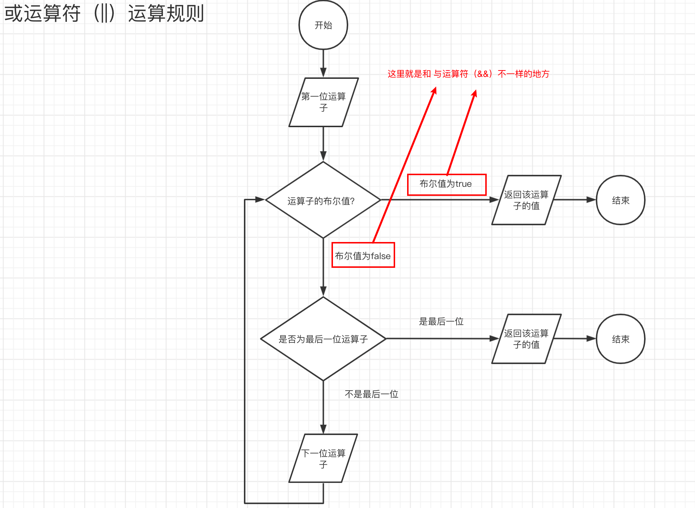

# JavaScript教程

> 阮一峰老师的JavaScript教程
> 地址: https://wangdoc.com/javascript/index.html
> 学习笔记，会省略一些基础的内容，以及补充一些内容

## 运算符

### 1. 算数运算符

#### 1.1 概述

JavaScript 共提供10个算术运算符，用来完成基本的算术运算。

- **加法运算符**：`x + y`
- **减法运算符**： `x - y`
- **乘法运算符**： `x * y`
- **除法运算符**：`x / y`
- **指数运算符**：`x ** y`
- **余数运算符**：`x % y`
- **自增运算符**：`++x` 或者 `x++`
- **自减运算符**：`--x` 或者 `x--`
- **数值运算符**： `+x`
- **负数值运算符**：`-x`


#### 1.2 加法运算符

##### 1.2.1 基本规则

数学规则是一致的

```js
1 + 1 = 2;
```

并且JavaScript允许非数值相加

```js
1 + true = 2;
```


==**加法运算符的重载问题**==

如果说两个字符串相加，此时加法运算符会变成连接运算符，并且返回一个新的字符串

```js
console.log(1 + 1);                 // 2
console.log(1 + true);              // 2

// 重载 overload

console.log('a' + 'b');             // ab
console.log(1 + '2');               // 12 (注意这里是字符型的)
console.log(typeof (1 + '2'));      // string
```

除了加法运算符，其他算术运算符（比如减法、除法和乘法）都不会发生重载。它们的规则是：所有运算子一律转为数值，再进行相应的数学运算。

```js
console.log('3' - '1'); // 2

console.log(-'1');      // -1
console.log(typeof (-'1'));     // number
```


**转换规则**

1. 如果至少有一个操作数是对象，会被转换成原始值（字符串，数字或布尔）；
2. 转换之后，如果至少有一个操作数是字符串类型，第二个操作数会被转换成字符串，并且会执行连接。
3. 在其他的情况下，两个操作数都会转换成数字并执行算数加法运算。

如果两个操作数都是原始类型，运算符会检查是否至少有一个是字符串类型，如果是就执行连接操作。其他情况就都转换为数字并求合。


> 什么是重载？
>
> 简单的说：运算子的不同，导致了不同的语法行为，这种现象称为“重载”（overload）。
>
> [运算符重载——wiki百科](https://zh.wikipedia.org/wiki/%E8%BF%90%E7%AE%97%E7%AC%A6%E9%87%8D%E8%BD%BD)
>
> * 在JavaScript中没有重载，但是我们可以使用语法实现重载
>
> [JavaScript中的函数重载——掘金](https://juejin.cn/post/6844903636154187790)


##### 1.2.2 对象相加


**对象转换为原始类型的规则**

- 如果对象类型是Date，会调用该对象的`toString()`；
- 其他情况下，如果`valueOf()`返回的是原始类型，会调用对象的`valueOf()`；
- 其他情况下（如果`valueOf()`不存在或没有返回原始类型），会调用`toString()`方法，大部分情况下是用的这种转换。


当数组转换为原始类型，JavaScript会使用它的`join(',')`方法，例如[1,5,6]就是"1,5,6"。普通JavaScript对像{}的原始类型是"[object Object]"。


例子：

```js
let obj = { p: 1, };

console.log(obj + '1');     // [object Object]1
```

1. 运算子出现了对象。

2. 将对象转换为原始类型。

   1. 不是`Date`类型。

   2. `valueof`返回的不是原始类型。

      ```js
      console.log(obj.valueOf());                // { p: 1 }
      console.log(typeof (obj.valueOf()));       // object
      ```

   3. 调用`toString()`方法。

      ```js
      console.log(obj.toString());                // [object Object]
      console.log(typeof (obj.toString()));       // string
      ```

3. 两个运算子皆为字符，使用加法运算符进行连接。


> 扩展：
>
> [细述JavaScript的加法运算符](https://segmentfault.com/a/1190000020739429)


**我们可以利用这个特性自己定义`toString`方法或`valueOf`方法**

```js
let obj = {

    toString: function () {
        return 1;
    },

    valueOf: function () {
        return 2;
    }

}

console.log(obj + '1');         // 21
console.log(typeof (obj + '1'));// string
```

分析：

1. 运算子出现对象
2. 将对象转换为原始类型（String，Number，Boolean）
   1. 对象不是`Date`类型
   2. 对象使用`valueOf`方法返回的是一个原始值（数字`2`）
3. 转换后运算子中出现了字符，所以将两个运算子转换为字符，然后拼接。


#### 1.3 余数运算符

余数运算符（`%`）返回前一个运算子被后一个运算子除，所得的余数。

```js
12 % 5 // 2
```

需要注意的是，运算结果的正负号由第一个运算子的正负号决定。

```js
-1 % 2 // -1
1 % -2 // 1
```

所以，为了得到负数的正确余数值，可以先使用绝对值函数。

```js
// 错误的写法
function isOdd(n) {
  return n % 2 === 1;
}
isOdd(-5) // false
isOdd(-4) // false

// 正确的写法
function isOdd(n) {
  return Math.abs(n % 2) === 1;
}
isOdd(-5) // true
isOdd(-4) // false
```

余数运算符还可以用于浮点数的运算。但是，由于浮点数不是精确的值，无法得到完全准确的结果。

```js
6.5 % 2.1
// 0.19999999999999973
```


负数取余拓展。


#### 1.4 自增自减运算符

自增和自减运算符是仅有的两个具有副作用的运算符，其他运算符都不会改变变量的值。


* 自增自减只能用于变量，用于常量将会报错

* 前置形式和后置形式

  前置：先自加、再返回值（返回新的值）

  后置：先返回值，再自加（返回旧的值）

  ```js
  //前置
  let count = 0;
  alert(++count);//打印出的值是1;
  
  //后置
  alert(count++);//打印出的值是1;
  
  alert(count);//此时打印出的值是2；
  ```

* 优先级比绝大多数的运算符等级要高


#### 1.5 数值运算符，负数值运算符


数值运算符`+`同样使用加号，但它是一元运算符（只需要一个操作数），而加法运算符是二元运算符（需要两个操作数）。


数值运算符的作用在于可以将任何的值转换为数值

* `Number`转型函数作用相同

```js
+true;	// 1
+[];		// 0
+{};		// NaN
```


负数值运算符（`-`），也同样具有将一个值转为数值的功能，只不过得到的值正负相反。连用两个负数值运算符，等同于数值运算符。

```js
var x = 1;
-x // -1
-(-x) // 1
```

上面代码最后一行的圆括号不可少，否则会变成自减运算符。


>  数值运算符号和负数值运算符，都会返回一个新的值，而不会改变原始变量的值。
>
> * 没有副作用


#### 1.6 指数运算符

指数运算符（`**`）完成指数运算，前一个运算子是底数，后一个运算子是指数。

```js
2 ** 4 // 16
```

以上的代码等同于 $2^4$


注意，指数运算符是右结合，而不是左结合。即多个指数运算符连用时，先进行最右边的计算。

```js
// 相当于 2 ** (3 ** 2)
2 ** 3 ** 2
// 512
```

等同于  $3^2 = 9$ 然后 $2^9 = 512$ 。

上面代码中，由于指数运算符是右结合，所以先计算第二个指数运算符，而不是第一个。


#### 1.7 赋值运算符

赋值运算符（Assignment Operators）用于给变量赋值。

最常见的赋值运算符，当然就是等号（`=`）。

```js
// 将 1 赋值给变量 x
var x = 1;

// 将变量 y 的值赋值给变量 x
var x = y;
```

赋值运算符还可以与其他运算符结合，形成变体。下面是与算术运算符的结合。

```js
// 等同于 x = x + y
x += y

// 等同于 x = x - y
x -= y

// 等同于 x = x * y
x *= y

// 等同于 x = x / y
x /= y

// 等同于 x = x % y
x %= y

// 等同于 x = x ** y
x **= y
```

* 这些运算符都是先进行指定的运算，然后才将得到的值返回给左边的变量。


### 2. 比较运算符

#### 2.1 概述

**所有比较运算符均返回布尔值**

>  比较运算符可以比较各种类型的值，不仅仅是数值。

JavaScript 一共提供了8个比较运算符。

- `>` 大于运算符
- `<` 小于运算符
- `<=` 小于或等于运算符
- `>=` 大于或等于运算符
- `==` 相等运算符
- `===` 严格相等运算符
- `!=` 不相等运算符
- `!==` 严格不相等运算符


这八个比较运算符分为两类，相等比较和非相等比较。**两者的规则不一样。**

* 对于非相等比较

  1. 判断两个运算子是否为字符串（有一个不是就是第二种情况）

     * 是字符串。

       1. 首先比较两个字符串第一位的大小，如果不一样则接着比较下一位，直到比较出不同字符为止。
       2. 如果说两个字符串的字符同时比较完则相等，如果有一个比较完了那么没有比较完的值更大。
       3. 值的大小是根据Unicode的索引值大小排列的。

     * 不是字符串。

       1. 将两个运算子都转换成数值
       2. 比较数值的大小。

       > **注意：**同类型的不会转换成number类型的，比如说`'2'`和`'11'` 这两个字符串类型做比较按照Unicode索引值应该是`'2'` 比`'11' `大。
       >
       > ```js
       > alert( '2' > 1 ); // true，字符串 '2' 会被转化为数字 2
       > alert( '01' == 1 ); // true，字符串 '01' 会被转化为数字 1
       > ```
       >
       > 对于布尔类型值，`true` 会被转化为 `1`、`false` 转化为 `0`。


#### 2.2 非相等运算符：字符串的比较

1. 首先比较两个字符串第一位的大小，如果不一样则接着比较下一位，直到比较出不同字符为止。
2. 如果说两个字符串的字符同时比较完则相等，如果有一个比较完了那么没有比较完的值更大。
3. 值的大小是根据Unicode的索引值大小排列的。

#### 2.3 非相等运算符：非字符串的比较

如果两个运算子之中，至少有一个不是字符串，需要分成以下两种情况。

1. **原始类型值**

   如果两个运算子都是原始类型的值，则是先转换为数值，再比较。

   ```js
   5 > '4' // true
   // 等同于 5 > Number('4')
   // 即 5 > 4
   
   true > false // true
   // 等同于 Number(true) > Number(false)
   // 即 1 > 0
   
   2 > true // true
   // 等同于
   2 > Number(true)
   // 即 2 > 1
   ```

   > `NaN`与任何值比较，包括自身所返回的值都是`false`

2. **对象**

   如果运算子是对象，那么会转为原始类型的值，再比较。

   和加法那边的规则一样(除了`Date`这条规则)：

   > * 如果`valueOf()`返回的是原始类型，会调用对象的`valueOf()`；
   >
   > - （如果`valueOf()`不存在或没有返回原始类型），会调用`toString()`方法，大部分情况下是用的这种转换。

   ```js
   var x = [2];
   x > '11' // true
   // 等同于 [2].valueOf().toString() > '11'
   // 即 '2' > '11'
   
   x.valueOf = function () { return '1' };
   x > '11' // false
   // 等同于 [2].valueOf() > '11'
   // 即 '1' > '11'
   ```

   两个对象之间的比较也也是如此：

   ```js
   [2] > [1] // true
   // 等同于 [2].valueOf().toString() > [1].valueOf().toString()
   // 即 '2' > '1'
   
   [2] > [11] // true
   // 等同于 [2].valueOf().toString() > [11].valueOf().toString()
   // 即 '2' > '11'
   
   { x: 2 } >= { x: 1 } // true
   // 等同于 { x: 2 }.valueOf().toString() >= { x: 1 }.valueOf().toString()
   // 即 '[object Object]' >= '[object Object]'
   ```

   出现`Date`对象的情况

   ```js
   let obj = new Date();
   
   obj.valueOf = function () { return '1' };
   obj.toString = function () { return '2' };
   
   console.log(obj > '11');        // false
   
   console.log(+obj);							// 1
   ```

   也就是说`Date`的这种情况是出现在两个数相加中的，当`+`号作为加法运算符的时候才有第一条规则。（即使是数值运算符都不存在`Date`的特殊情况）。

   

#### 2.4 严格相等运算符

严格相等不会进行类型转换。


1. 不同类型的值：返回`false`

2. 同一类型的原始类型值：相同就返回`true`，不同就返回`false`。

   1. `NaN`与任何值都不相等
   2. `+0`和`-0`是相等的

3. 复合类型值（对象，数组，函数）

   严格相等运算比较的是，它们是否引用同一个内存地址。

   如果引用的是同一个地址则相同。

   > 注意，对于两个对象的比较，严格相等运算符比较的是地址，而大于或小于运算符比较的是值。

4. `undefined`和`null`与自身严格相等。

#### 2.5 严格不相等运算符

严格相等运算符有一个对应的“严格不相等运算符”（`!==`），它的算法就是先求严格相等运算符的结果，然后返回相反值。

```js
1 !== '1' // true
// 等同于
!(1 === '1')
```

上面代码中，感叹号`!`是求出后面表达式的相反值。

#### 2.6 相等运算符

相等运算符用来比较相同类型的数据时，与严格相等运算符完全一样。

```js
1 == 1.0
// 等同于
1 === 1.0
```

比较不同类型的数据时，相等运算符会先将数据进行类型转换，然后再用严格相等运算符比较。

1. 原始类型值：转换为数值（使用`Number`转型函数）再进行比较

   ```js
   1 == true // true
   // 等同于 1 === Number(true)
   
   0 == false // true
   // 等同于 0 === Number(false)
   
   2 == true // false
   // 等同于 2 === Number(true)
   
   2 == false // false
   // 等同于 2 === Number(false)
   
   'true' == true // false
   // 等同于 Number('true') === Number(true)
   // 等同于 NaN === 1
   
   '' == 0 // true
   // 等同于 Number('') === 0
   // 等同于 0 === 0
   
   '' == false  // true
   // 等同于 Number('') === Number(false)
   // 等同于 0 === 0
   
   '1' == true  // true
   // 等同于 Number('1') === Number(true)
   // 等同于 1 === 1
   
   '\n  123  \t' == 123 // true
   // 因为字符串转为数字时，省略前置和后置的空格
   ```

2. 对象与原始类型值比较

   对象（这里指广义的对象，包括数组和函数）与原始类型的值比较时，对象转换成原始类型的值，再进行比较。

   转换规则和上面非相等运算符的规则是一样的

   > * 如果`valueOf()`返回的是原始类型，会调用对象的`valueOf()`；
   >
   > - （如果`valueOf()`不存在或没有返回原始类型），会调用`toString()`方法，大部分情况下是用的这种转换。

3. **undefined 和 null**：只与自身或者相互比较才会返回`true`

4. **相等运算符的缺点**

   相等运算符隐藏的类型转换，会带来一些违反直觉的结果。

   ```js
   0 == ''             // true
   0 == '0'            // true
   
   2 == true           // false
   2 == false          // false
   
   false == 'false'    // false
   false == '0'        // true
   
   false == undefined  // false
   false == null       // false
   null == undefined   // true
   
   ' \t\r\n ' == 0     // true
   ```

   上面这些表达式都不同于直觉，很容易出错。因此建议不要使用相等运算符（`==`），最好只使用严格相等运算符（`===`）。

#### 2.7 不相等运算符

相等运算符有一个对应的“不相等运算符”（`!=`），它的算法就是先求相等运算符的结果，然后返回相反值。

```js
1 != '1' // false

// 等同于
!(1 == '1')
```


### 3. 布尔运算符

#### 3.1 概述

布尔运算符用于将表达式转为布尔值，一共包含四个运算符。

- 取反运算符：`!`
- 且运算符：`&&`
- 或运算符：`||`
- 三元运算符：`?:`


JavaScript 里有三个逻辑运算符：`||`（或），`&&`（与），`!`（非）。

虽然它们被称为“逻辑”运算符，但这些**运算符却可以被应用于任意类型的值**，而不**仅仅是布尔值**。它们的**结果也同样可以是任意类型**。


#### 3.2 取反运算符(!)

对于非布尔值，取反运算符会将其转为布尔值。可以这样记忆，以下六个值取反后为`true`，其他值都为`false`。

- `undefined`
- `null`
- `false`
- `0`
- `NaN`
- 空字符串（`''`）


如果对一个值连续做两次取反运算，等于将其转为对应的布尔值，与`Boolean`函数的作用相同。这是一种常用的类型转换的写法。

```js
!!x
// 等同于
Boolean(x)
```


#### 3.3 且运算符(&&)

首先必须要了解的一个事情是——使用了且运算符的表达式，其返回的值不一定是布尔类型。


**运算规则：**

1. 判断第一个数的布尔值（这个数可能是其他类型的，js自动将其转换为布尔值）
   * 如果布尔值是`false`，那么直接返回这个数的数值（如果说这个数本来就是布尔类型，那么返回布尔值）
   * 如果布尔值是`true`
     1. 判断后一个数的布尔值
        * 如果布尔值是`false`，直接返回这个数的数值
        * 如果布尔值是true（继续判断）
          1. .........
             * 一直递归下去，直到找到一个布尔值是`false`的数值
             * 如果已经没有运算子了，那么直接返回最后一个数的数值。


我们直接来看例子：

```js
console.log(1 && 1 && 1 && 0 && 2);       // 0
console.log(true && true && false);       // false
console.log((1 + 1) && true && '' && 1);  // ''
```

* 第一个例子

  第一个数的布尔值是`true`

  第二个数的布尔值是`true`

  ....

  第四个数的布尔值是`false`  

  所以返回第四个数的数值：0

* 第二个例子

  第一个数的布尔值是`true`

  ...

  第三个数的布尔值是`false`

  所以返回第三个数的数值：`false`

* 第三个例子

  第一个数的布尔值是`true`

  ...

  第三个数的布尔值是`false`

  所以返回第三个数的数值：`''`


**`&&`运算符有短路机制。**

从左往右，如果现在有一个运算子的布尔值是`false`，那么就直接返回值，不会计算后面的值。


利用这种机制，我们可以模拟出`if`结构

```js
if (i) {
  doSomething();
}

// 等价于

i && doSomething();
```


#### 3.4 或运算符(||)

和`&&`的运算法则只有一个区别，就是或运算符是当运算子的布尔值为`true`的时候返回数值。



短路也是有的。我们一般使用`||`运算符的短路实现为一个变量设置默认值。

```js
function saveText(text) {
    
    text = text || '';
    //...
}

// 或者写成

saveText(this.text || '')
```

上面代码表示，如果函数调用时，没有提供参数，则该参数默认设置为空字符串。

#### 3.5 三元运算符(? :)

三元条件运算符由问号（?）和冒号（:）组成，分隔三个表达式。它是 JavaScript 语言唯一一个需要三个运算子的运算符。如果第一个表达式的布尔值为`true`，则返回第二个表达式的值，否则返回第三个表达式的值。

```js
't' ? 'hello' : 'world' // "hello"
0 ? 'hello' : 'world' // "world"
```

上面代码的`t`和`0`的布尔值分别为`true`和`false`，所以分别返回第二个和第三个表达式的值。

通常来说，三元条件表达式与`if...else`语句具有同样表达效果，前者可以表达的，后者也能表达。但是两者具有一个重大差别，`if...else`是语句，没有返回值；三元条件表达式是表达式，具有返回值。所以，在需要返回值的场合，只能使用三元条件表达式，而不能使用`if..else`。

```js
console.log(true ? 'T' : 'F');
```

上面代码中，`console.log`方法的参数必须是一个表达式，这时就只能使用三元条件表达式。如果要用`if...else`语句，就必须改变整个代码写法了。


### 4. 二进制位运算符

留个坑


### 5. 其他运算符，运算顺序

#### 5.1 void运算符

`void`运算符的作用是执行一个表达式，然后不返回任何值，或者说返回`undefined`

```js
void 0 // undefined
void(0) // undefined
```

建议使用第二种，因为`void`运算符的优先级很高，容易造成错误。


这个运算符的主要用途是浏览器的书签工具（Bookmarklet），以及在超级链接中插入代码防止网页跳转。


#### 5.2 逗号运算符

逗号运算符用于对两个表达式求值，并返回后一个表达式的值。

```js
'a', 'b' // "b"

var x = 0;
var y = (x++, 10);
x // 1
y // 10
```

逗号运算符的一个用途是，在返回一个值之前，进行一些辅助操作。

```js
var value = (console.log('Hi!'), true);
// Hi!

value // true
```

上面代码中，先执行逗号之前的操作，然后返回逗号后面的值。

#### 5.3 运算顺序

##### 5.3.1 优先级

JavaScript 各种运算符的优先级别（Operator Precedence）是不一样的。优先级高的运算符先执行，优先级低的运算符后执行。


没必要记住所有的优先级，直接使用括号来辅助。

##### 5.3.2 圆括号的作用

圆括号（`()`）可以用来提高运算的优先级，因为它的优先级是最高的，即圆括号中的表达式会第一个运算。

```js
(4 + 5) * 6 // 54
```


运算符的优先级别十分繁杂，且都是硬性规定，因此建议总是使用圆括号，保证运算顺序清晰可读，这对代码的维护和除错至关重要。


圆括号不是运算符，而是一种语法结构

* 将**表达式**放在圆括号之中，提升运算优先级。
* 放在函数后面，表示调用该函数。


> 圆括号内只能放表达式，将语句放在括号内会报错。
>
> ```js
> (function () {
>     let temp = newData;
>     func1(temp);
>     func2(temp);
> }());
> ```
>
> 这里直接调用了这个函数，也就是说这是一个表达式（立即调用的函数表达式）。


##### 5.3.3 左结合与右结合

对于优先级别相同的运算符，同时出现的时候，就会有计算顺序的问题。

```js
a OP b OP c
```

上面代码中，`OP`表示运算符。它可以有两种解释方式。

```js
// 方式一
(a OP b) OP c

// 方式二
a OP (b OP c)
```

上面的两种方式，得到的计算结果往往是不一样的。方式一是将左侧两个运算数结合在一起，采用这种解释方式的运算符，称为“左结合”（left-to-right associativity）运算符；方式二是将右侧两个运算数结合在一起，这样的运算符称为“右结合”运算符（right-to-left associativity）。


右结合的运算符：

* `=`  赋值运算符
* `? :` 三目运算符
* `**`  指数运算符

