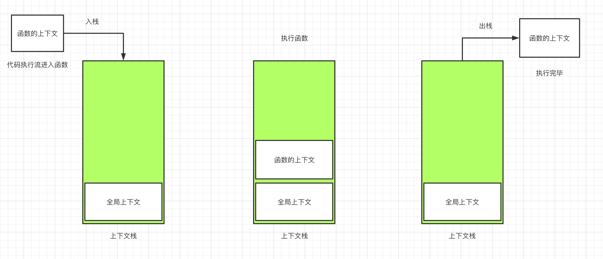
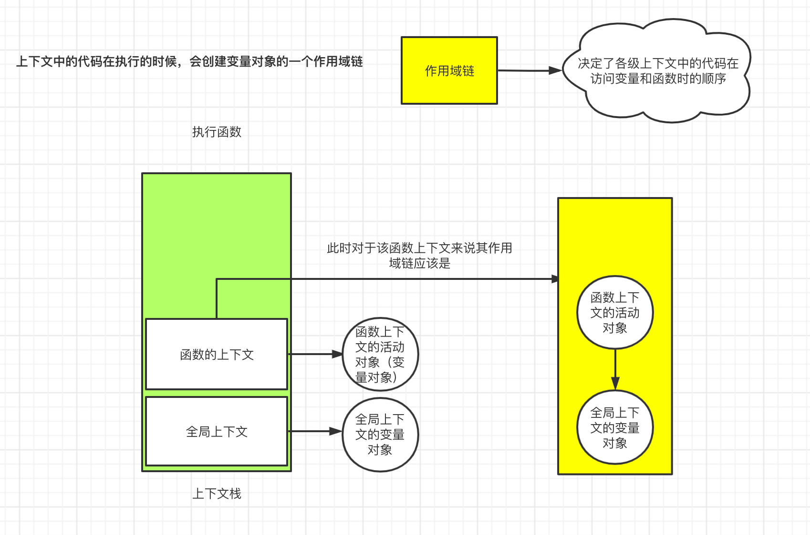

> 我的这一篇博客是按照下面两篇博客的思路来的
>
> [语雀/不知非攻/JavaScript核心进阶/2. 作用域与作用域链](https://www.yuque.com/coreadvance/kagkke/ql729x#H2wAd)
>
> [简书/csRyan/彻底理解JS的作用域链](https://www.jianshu.com/p/e2c72357ed12)

---


# 作用域链

要了解作用域链，我们首先要了解什么是执行上下文以及什么是变量对象。

## 什么是执行上下文

执行上下文（Execution Context）是非常重要的一种**对象**。

它保存着函数执行所需要的重要信息，其中有三个属性：

* 变量对象
* 作用域链
* this指针


> 每个函数调用都有自己的上下文。当代码执行流进入函数时，函数的上下文被推到一个**上下文栈**上。在函数执行完之后，上下文栈会弹出该函数上下文，将控制权返还给之前的执行上下文。ECMAScript程序的执行流就是通过这个上下文栈进行控制的。
>
> ——JavaScript高级程序设计第四版




* 我们可以看出，正在执行的函数上下文总是在上下文栈的栈顶
* 在代码开始执行的时候，栈顶会先放入一个全局上下文。


## 什么是变量对象

在创建上下文对象的时候，就会创建一个非常重要的属性——**变量对象**

> 每一个上下文对象都有一个关联的**变量对象**，而**这个上下文中**定义的所有变量和函数都会存在于这个对象上。虽然无法通过代码访问变量对象，但是后台处理数据的时候会使用到他。


看一个例子：

```js
let a = 1;

function foo() {

    
    let a = 2;
    let b = 3;

}

foo();

```

这里有两个上下文对象：

* 全局上下文对象
* foo这个函数的上下文对象

对应着这两个上下文对象，有两个对应的变量对象

* 全局上下文中的变量对象，其中包含着变量`a`
* `foo`函数的上下文中的变量对象，其中包含着变量`a`（注意这里的变量`a`和上面的不是一个）和变量`b`。


讨论完这两个就可以讨论作用域链了

## 什么是作用域链

简单且快速的理解，作用域链其实就是变量对象的数组（其实不完全是，还有活动对象这个说法）。

> 上下文中的代码在执行的时候，会创建变量对象的一个作用域链（scope chain）。这个作用域链决定了各级上下文中的代码在访问变量和函数时的顺序。代码正在执行的上下文的变量对象始终位于作用域链的最前端。如果上下文是函数，则其**活动对象**（activation object）用作变量对象。
>
> ——JavaScript高级程序设计第四版





代码执行时的标识符解析是通过沿作用域链逐级搜索标识符名称完成的。搜索过程始终从作用域链的最前端（也就是当前上下文的变量对象）开始，然后逐级往后，直到找到标识符。（如果没有找到标识符，那么通常会报错。）


## [[Scopes]]属性

每一个函数都有一个[[Scopes]]属性，它是由一些列对象组成的数组。

详细解析看这[这里](https://www.yuque.com/coreadvance/kagkke/ql729x#H2wAd)。从作用域链把后面的看完就行。


### 后面的思考题

函数`innerTest`的完整作用域链如下：local -> Closure(test) -> Script -> Global

* local：c:10,
* Closure(test)：b:30, innerTest: innerTest()
* Script: a:20,
*  Global: 

## 总结

* 作用域链决定了各级上下文中的代码在访问变量和函数时的顺序。代码正在执行的上下文的变量对象始终位于作用域

  链的最前端。

* 每一级的上下文都有作用域链。作用域链是一个数组，其第一位是当前上下文的活动对象，剩下的是其包含上下文（也就是父亲，父亲的父亲，祖先）的变量对象。

  * 作用域链数组的第一位是：local对象，也称为活动对象
  * 作用域链数组后面的内容是：[[Scopes]]属性
    * 该属性包含三个对象
      * Global全局对象：不会做优化，包含着全局对象中所有的属性和方法
      * Script对象：在全局环境下，由`let`和`const`声明的变量对象
      * Closure对象：闭包对象，由嵌套函数生成，仅保存当前作用域能够访问的变量属性


