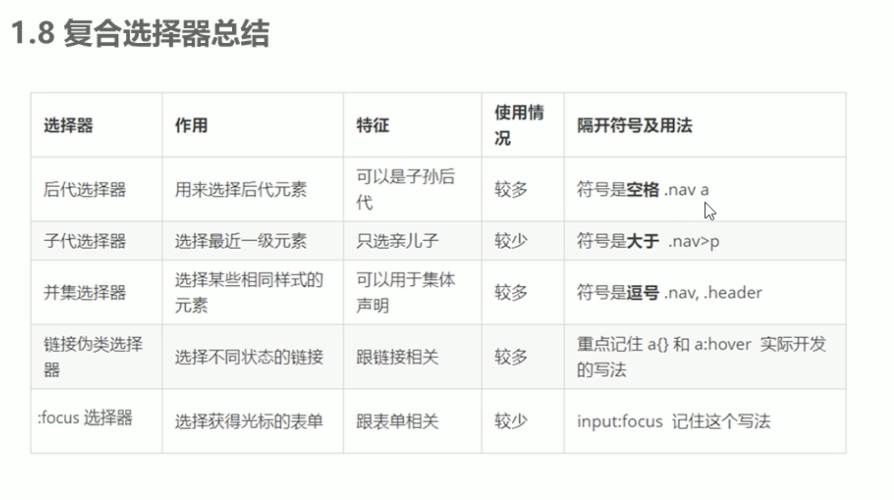
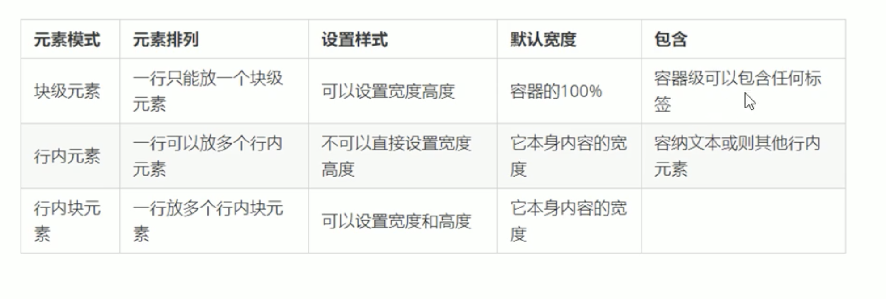
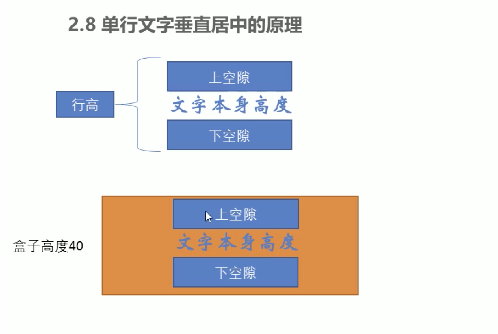
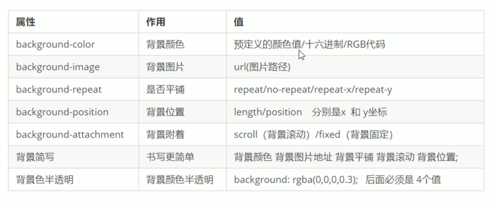
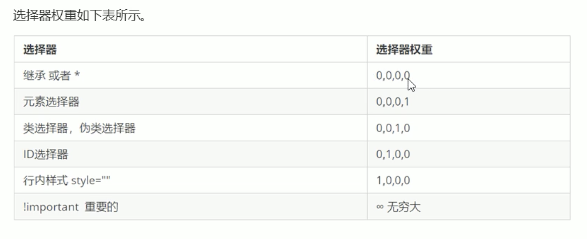
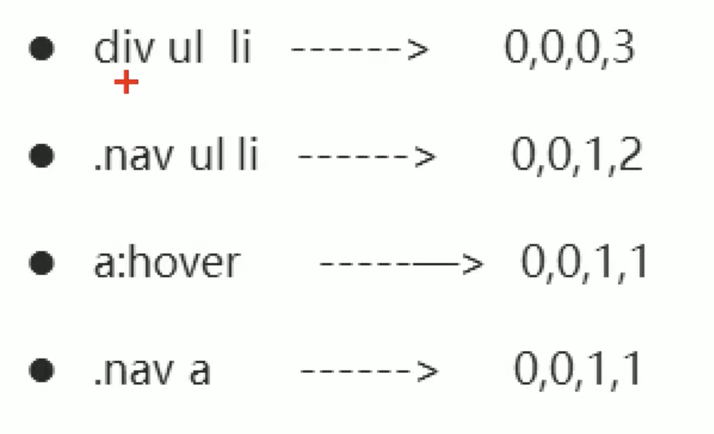

# CSS

## 简介

### CSS 层叠样式表（cascading Style SheetsF）

 设置文本内容，外形，版面布局和外观显示样式

## CSS基础选择器

### 基础选择器

标签选择器

- 标签选择器（元素选择器）是指用 HTML 标签名称作为选择器，按标签名称分类，为页面中某一类标签指定统一的 CSS 样式。
- 标签选择器可以把某一类标签全部选择出来，比如所有的 <div> 标签和所有的 <span> 标签。

类选择器

- 语法

  ````css
  .类名 { 
  属性1: 属性值1; 
  ... 
}
	````
	
	- 在html中调用在标签中写属性 class = ‘类名’

id选择器

- id 属性只能在每个 HTML 文档中出现一次。口诀: 样式#定义,结构id调用, 只能调用一次, 别人切勿使用.

	- id 选择器可以为标有特定 id 的 HTML 元素指定特定的样式。
	- HTML 元素以 id 属性来设置 id 选择器，CSS 中 id 选择器以“#" 来定义。

通配符选择器

### 复合选择器

## CSS fonts

 字体属性用于定义字体的系列，大小，粗细，文字样式

### font-family

 文字字体系列

### font-size

用于定义文字的大小

- px为单位，意为像素
- 谷歌浏览器默认大小为16px
- 不同的浏览器可以能大小字号不一样，不要使用默认的效果
- 可以给body指定整个页面的文字大小
- 在CSS中后面写的样式会覆盖前面写的样式，所以说body可以写在最前面，有需要特殊的样式的时候写在后面就会覆盖。

### font-weight

 设置文字字体的粗细

- normal：默认值（不加粗）
- bold：定义粗体（加粗的）
- 100-900： 400等于normal，700等于bold，数字之后不跟单位
- 学会让粗标签不加粗

### font-style

设置文本的风格

- normal：默认值显示标准的字体样式
- italic：浏览器会显示斜体的字体样式
- 需要给斜体标签给成不倾斜的字体

### font

 字体的复合属性

- 格式：font-style    font-weight    font-size/font-height     font family 
- 使用font属性的时候，必须要按照上面语法格式中的顺序书写，不能更换顺序，每个属性用空格隔开
- 不需要设置的属性可以忽略，必须保留font-size和font-family

## CSS text

文本属性可以定义文本的外观，比如说文本的颜色，对齐文本，装饰文本，文本缩进，行间距。

### color

用于定义文本的颜色

- 预定义的颜色值

	- red， green

- 十六进制码

	- #FF0000，#888

- RGB代码

	- rgb(1，1，1)

### text-align

对齐文本，用于设置元素内文本内容的水平对齐方式

- left：左对齐
- center：居中对齐
- right：右对齐

### text-decoration

装饰文本，给文本添加下划线，删除线，上划线等等

- none：默认无样式
- underline：下划线
- overline：上划线
- line-through：删除线

### text-indent

文本缩进，指定文本第一行的缩进，通常是段落的首行进行缩进。

- 可以使用像素。px
- 可以使用相对单位，em，就是当前元素一个文字的大小，如果没有设置大小则会按照父元素的一个文字大小

### line-height

行间距，可以控制文字行与行之间的具体

- 这个距离怎么算的？包括文字所占据的像素，再加上上下空白，就是整个的行间距

## CSS引入方式

### 内部样式表

放在html文件当中，在head标签中单独新建在style标签，将css代码放进来

### 行内样式表

在元素标签内部的style属性中设置css样式

### 外部样式表

用过link引入

## Emmet标签

Emmet语法的的前身是Zen coding，它使用缩写来提高html/css的编写速度，vscode中已经集成了这个语法

- 作用： 

  - 快速生成html结构语法

  

  生成标签，输入标签名输入tab就行了

  如果想要生成多个相同的标签，添加*后面接一个数字就可以了，比如 ``div * 3 ``表示生成3个div标签

  如果有父子级关系的标签，使用”>“ 比如：``ul>li``

  如果是兄弟级关系的标签，使用"+" 比如说： ``<p> + <div>``

  如果生成带有类名或者id名字的，直接写``.demo`` 或者 ``#two`` 然后tab键就行

  如果生成的div类名是有顺序的，可以使用自增符号$

  我们想要生成的标签里面默认显示几个文字，使用标签名{默认文字}就行了

  

  - 快速生成CSS样式语法
    - 每个单词的第一个字母，然后按tab就行了

## CSS的复合选择器

在CSS中，可以根据选择器类型把选择器分为基础选择器和复合选择器，复合选择器是建立在基础选择器之上的，对基本选择器进行组合形成的

- 复合选择器可以更准确，高效的选择元素（标签）
- 复合选择器是由两个或者多个基础选择器，通过不同的方式组合而成的

### 常用的复合选择器

**后代选择器（重要）**

- 又称为包含选择器，可以选择父元素中的子元素

	- 用空格分隔开来

- 任何基础选择器都可以作为后代选择器

**子选择器**

- 只能选择儿子，不能选择孙子。。

	- 两个选择器之间使用>来进行连接

**并集选择器**

- 并集选择器可以选择多组标签，同时为她们定义相同的样式

	- 两个选择器之间使用英文逗号进行连接

- 任何选择器都可以作为并集选择器

**伪类选择器**

- 作用：用于向某些选择器添加特殊的效果，比如给连接添加特殊效果，或选择第一个或者第n个元素
- 链接伪类选择器

	- a:link

		- 选择没有被访问的连接

	- a:visited

		- 选择所有已经被访问的链接

	- a:hover

		- 选择鼠标指针位于其上的链接

	- a:active

		- 选择活动链接（鼠标下按未弹起）

	- 代码、例子: 
	- 注意点：为了确保能够正确的用伪类选择器，必须要LVHA的循顺序声明：             
:link -:visited-:hover - :active
	- 注意点2：a链接在浏览器中具有默认样式，所以我们实际工作中都需要给链接单独指定样式

- focus伪类选择器

	- :focus伪类选择器用于选取获得焦点的表单元素
	- 焦点就是光标，一般情况<input>类表单元素才能获取，因此这个选择器也主要针对于表单元素来说
	- 源码，例子

- 源码，例子
- 总结：

	- 

## CSS的元素显示模式

### 1. 什么是元素的显示模式

- 元素的显示模式就是元素（标签）以什么方式进行显示，比如说``<div>``自己占一行
- 作用：网页的标签非常多，在不同的地方会用到不同类型的标签，了解他们的特点可以帮助我们更好的布局

### 2. 元素显示模式的分类

HTML元素一般分为**块元素**和**行内元素**

- 常见的块元素

  - ``<h1> - <h6>``
  - ``<p>``
  - ``<div>`` 这是最经典的块元素

  - ``<ul>``
  - ``<ol>``
  - ``<li>``

- 块元素的特点

	- 自己独占一行
	- 高度，宽度，外边距，以及内边距都可以控制
	- 宽度默认是容器（父级宽度）的100%
	- 是一个容器及盒子，里面可以放行内或者块级元素
	- 文字类的元素内不能使用块级元素，``<p>``标签主要用于存放文字，因此``<p>``里面不能放块级元素，特别是不能放``<div>``

- 常见的行内元素

  - ``<a>``
  - 链接里面不能再放链接
  	- 特殊情况a里面可以放块级元素，但是``<a>``转换下一块级模式最安全
  	
  - ``<strong>``
  - ``<b>``
  - ``<em>``
  - ``<i>``
  - ``<del>``
  - ``<s>``
  - ``<ins``
  - ``<u>``
  - ``<span>``  这是最经典的行内元素

- 行内元素的特点

	- 相邻行内元素在一行上，一行可以显示多个
	- 高，宽直接设置是无效的
	- 默认宽度就是它本身内容的宽度
	- 行内元素只能容纳文本或者其他行内元素

		- 不允许使用块元素

- 行内块元素

	- 在行内元素中有几个特殊的标签——`` `` ``<input/>`` `` <td>``，他们同时具有块元素和行内元素的特点，有些资料称他们为行内块元素
	- 行内块元素的特点

		- 和相邻行内元素（行内块）在一行上，但是他们之间会有空白间隙，一行可以显示多个
		- 默认宽度就是他本身内容的宽度
		- 高度，行高，外边距以及内边距是可以控制的

- 总结

	- 

### 3. 元素显示模式的转换

特殊情况下，我们需要元素模式的转换，简单理解成一个模式的元素需要另一种模式的特性

比如说想要增加链接``<a>``的触发范围

- 转换为块级元素

	- display: block

- 转换为行级元素

	- display: inline

- 转换为行内块元素

	- display:inline-block

- 源码，例子

### 4. 小技巧

CSS中没有给我们提供文字垂直居中代码，我们可以使用一个小技巧来实现

解决方案：让文字的行高等于盒子的高度就可以让文字在当前盒子内垂直居中




* 如果行高小于和盒子的高度，文字会偏上，如果行高大于盒子的高度，文字会偏下


## CSS的背景

### 背景颜色：

``background-color: ``

- 默认值为：transparent

### 背景图片：

``background-image:``

- background-image属性描述了元素的背景图像。实际开发中常见于logo或者一些装饰性的小图片或者是超大的背景图片，优点是非常便于控制位置（精灵图也是一种运用场景）

	- 超大背景图片

		- 源码，例子

### 背景平铺：

``background-repeat: ``

- 默认值：repeat

	- 不重复：no-repeat
	- 沿着x轴平铺：x-repeat
	- 沿着y轴平铺：y-repeat

- 可以对背景图像进行平铺

### 背景图片的位置：

``background-position:x y``

- 参数值：

	- 意思是x坐标和y坐标

		- 方位名词

			- center
			- top
			- bottom
			- left
			- right

		- 精确单位

			- 第一个必须是x坐标，第二个必须是y坐标
			- 如果第二个省略那个第二个就默认垂直居中

		- 混合使用

			- 第一个值必须是x坐标，第二个必须是y坐标

- 利用该属性可以改变图片在背景中的位置

### 背景图像固定

``background-attachment``

- 参数值

	- scroll

		- 默认值，随着对象内容滚动

	- fixed

		- 背景固定

- 设置背景图片是否固定或者是随着页面的其余部分滚动

### 背景的复合写法

- 我们可以将背景属性合并简写在同一个属性background当中从而节约代码量
- 当使用背景简写属性的时候没有特定的书写顺序
- 但是我们一般约定为：background: 背景颜色 背景图片地址 背景平铺 背景图像滚动 背景图片位置

### 背景颜色半透明

CSS3中为我们提供了背景半透明色

- rgba:(r, g, b, a)

	- 其中a是alhpa透明度，取值范围在0-1之间

### 总结



## CSS的三大特征

### 层叠性

- 给相同的选择器设置了相同的样式
- 此时样式就会覆盖另一个冲突的样式（就近原则）

### 继承性

子标签会集成父标签中的某些属性

- text-
- font-
- line-
- color

- 特殊：行高的继承

	- 行高本身可以不加单位，此时的数字代表font-size的多少倍
	- 比如在body里面设置了行高为1.5 

		- 此时子标签div中的行高为font-size * 1.5
		- 此时子标签p中的行高为font-size* 1.5

	- 这种写法的优势是子元素可以根据自己文字大小自动调节行高
	- 源码，例子

### 优先级

当同一个元素指定多个选择器，就会有优先级的产生

- 选择器相同

	- 执行层叠性

- 选择器不相同

  - 根据选择器权重执行

    - 
    - 等级判断从左到右，某一位数值相同则比较下一位
    - 权重叠加

      - 复合选择器会有权重叠加的问题

        


