# CSS的技巧和CSS3HTML5

## CSS高级技巧

### 精灵图

#### 为什么使用精灵图

- 一个网页中常常会使用很多的背景图片
- 当图片过多的时候服务器就会频繁的接收和发送图片导致服务器压力过大
- 为了有效的减小服务器收发的次数，提高页面的加载速度，出现了精灵图

#### 使用精灵图的核心

将网页中一些小的背景图片，整合到一张大的图片

移动背景图片的位置，此时可以使用``background-position``

移动的距离就是这个目标图片的x和y坐标。网页中xy坐标有所不同

- x轴由左到右，y轴由上至下
- 所以说向上想做移动就是负值，一般来说精灵图的position都是负值

#### 使用方法

-  在页面中创建一个盒子
-  给该盒子一个背景图片（精灵图）``background-image``
-  利用坐标移动精灵图

   - 坐标轴的原点是精灵图的左上角

#### 精灵图何时使用，缺点是什么

- 一般来说精灵图是作为背景图片出现的
- 精灵图的缺点

	- 精灵图比较大
	- 本身图片的缩放会使图像失真
	- 一旦图片制作完毕，更换成本高

### 字体图标

#### 什么是字体图标

主要用于显示网页中通用的、常用的一些小图标

- 其本质其实是文字

- 优点

  - 轻量级

    一个图标字体要比一系列图像要小，一旦字体加载了，图标就会马上渲染出来，减少了服务器请求

  - 灵活性 

    本质是文字，可以随意的更改颜色，产生阴影，透明效果，旋转等等

  - 兼容性

    几乎支持所有的浏览器

#### 何时使用字体图标

- 如果结构样式比较简单使用字体图标
- 如果结构样式比较复杂使用精灵图

#### 字体图标的下载网址

-  icomoon
- 阿里iconfont

#### 如何引入字体图标的引入

- 将下载包里面的font文件放到工程文件夹里面
- 找到下载包里面的style.css文件，复制第一块的内容到css中粘贴
- 需要引入的时候在样式中写入 `font-family`
- 在html中就可以直接使用字体图标了

- 字体图标的追加

	- 把压缩包中的selection.json重新上传，然后选中自己想要的图标，重新下载压缩包，并替换原来的文件就可以了

### （技巧）如何利用css制作一个三角形

- 设置一个宽度和高度都是0px的盒子
- 然后将其border的像素设置大一点比如10px
- 将四个边都设置成透明的
- 最后再将一个边设置成有颜色的

### CSS用户界面样式

#### 更改样式的鼠标样式

- 鼠标样式：`cursor`

  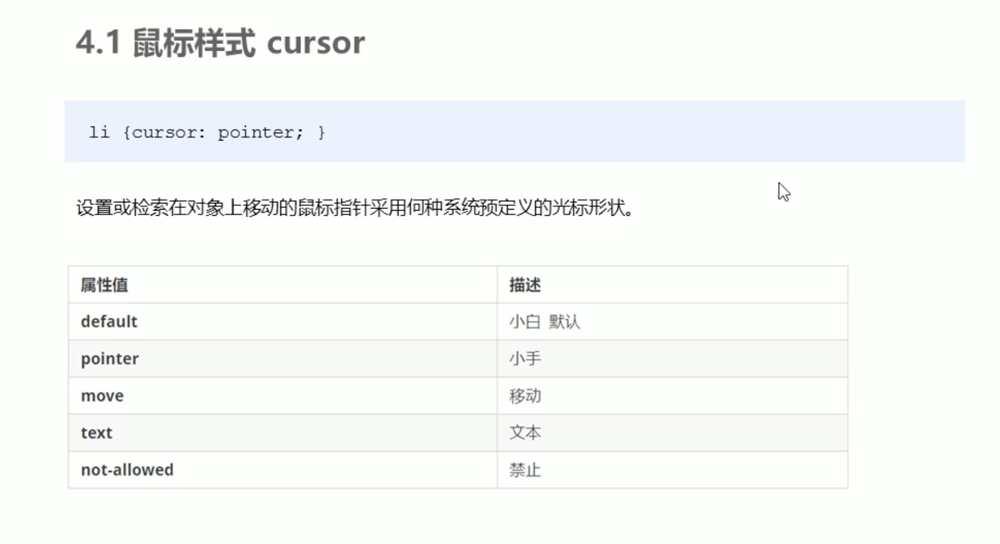

#### 更改表单轮廓线

- 给表单添加``outline: none;``

#### 防止文本的拖拽

- 给文本域添加 ``resize: none;``

  小细节：文本域一般都放在一行写~中间不要有空格，有空格的话，文本域可能默认会有空格

### vertical-align

CSS中经常使用这个属性设置图片或者表单（行内块元素）和文字对齐

官方解释

- 用于设置一个元素的垂直对齐方式，但是它只针对行内元素或者是行内块元素才有效

  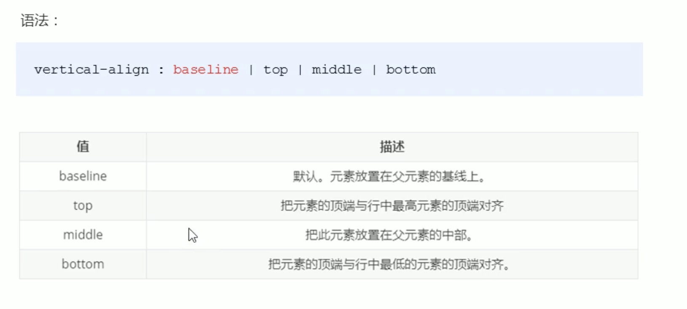

  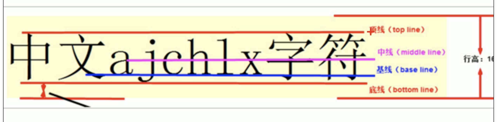

- 默认的情况下，图片其实是和文字的基线对齐的

	- 所以为了实现居中的效果，我们可以让图片与文字的中线对齐

#### 解决图片底部默认空白缝隙的问题

* 出现的原因

  因为行内块元素会和文字的基线对齐

* 解决的方法

  给图片添加vertical-align: middle | top | bottom

  将图片转换为块级元素 （不推荐）

### 单行文本溢出的文字省略号显示

必须满足三个条件

- 强制一行内显示文本

	- ``white-space: nowrap``
- 默认的方式是normal 自动换行
	
- 超出的部分隐藏

	- overflow: hidden

- 文字用省略号代替超出的部分

	- text-overflow:ellipsis

### 多行文本溢出的文字省略号显示

- 溢出部分隐藏
- 文字用省略号代替超出的部分
- 弹性伸缩盒子模型显示

	- display: -webkit-box;

- 限制一个块元素显示的文本的行数

	- -webkit-line-clamp: 2;

- 设置或检索伸缩盒对象的子元素的排列方式

	- -webkit-box-orient: vertical;

### 常见的布局技巧

#### margin负值的应用

举例：ul>li*3 然后将li浮动，此时每一个li都会挨在一起，此时如果给li一个1px的boder 那么两个挨在一起的边会变成2px

- 我们可以通过margin取负值来实现边为1px

- 拓展：鼠标经过li的时候边框变色，由于后面的li会盖住前一个li的右边，因此我们有两种方法解决这个问题

	- 如果没有定位的话，添加相对定位就可以

		- position: relative

	- 如果有定位的电话，提高盒子的层级就行

		- z-index

#### 文字围绕浮动元素

举例：当我们在一个盒子里面左边是图片右边是文字，我们可以不用左边左浮动，右边右浮动这种做法

- 我们给图片设置大小，然后添加浮动。右边的文字就会自己环绕图片~其实float本身就是做文字浮动的

#### 行内块的巧妙运用

两个行内块元素之间默认存在间隙，所以你可以直接用这个间隙来布局

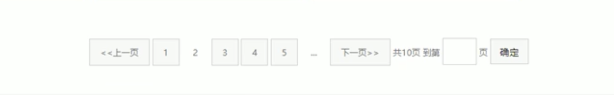

#### CSS三角强化

使用css画出一个直角三角形

- 分析

	- 我们之前可以用CSS设置出一个等边三角形，方法就是改变边框的粗细
	- 我们只需要把border的bottom，left改成0，将top改成透明就可以了

### CSS初始化

不同的浏览器对有些标签的默认值是不同的，为了消除不同的浏览器对于HTML文本呈现的差异，照顾浏览器的兼容，我们需要对CSS初始化

- 简单理解：CSS初始化是指重新设置浏览器的样式 (也称为CSS reset)

- 每个网页都必须进行CSS初始化
- 初始化的代码

## HTML5（部分）

### HTML5新增加的特性（部分）

- 新的标签
- 新的表单
- 新的表单属性

### HTML5新增的语义化标签

- `<header>` 头部标签
- `<nav>`导航标签
- `<article>`内容标签
- `<section>`定义文档的某个区域
- `<aside>`侧边栏标签
- `<footer>`尾部标签

### HTML5新增的多媒体标签

- 音频：`<audio>`

  支持的格式

  - mp3
  - Wav
  - ogg

语法：`<audio src = "文件地址">`

* 常见属性：

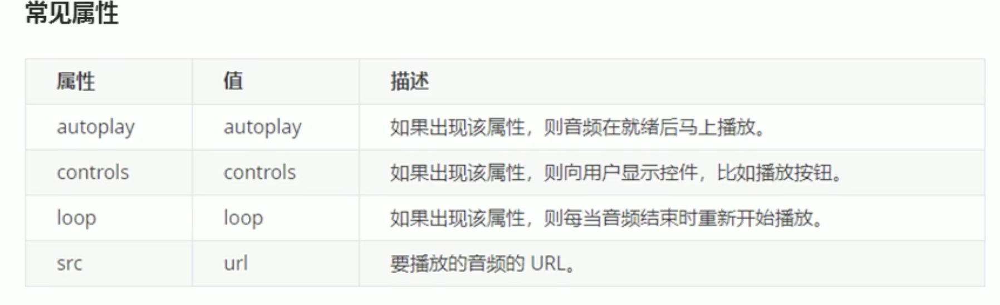

注意点：谷歌把音频和视频自动播放都禁止了

- 视频：

  - `<video>`

    支出的格式

    - mp4
    - ogg
    - webM

语法：`<video src = "文件地址" controls = "controls"></video>`

* 常见的属性:

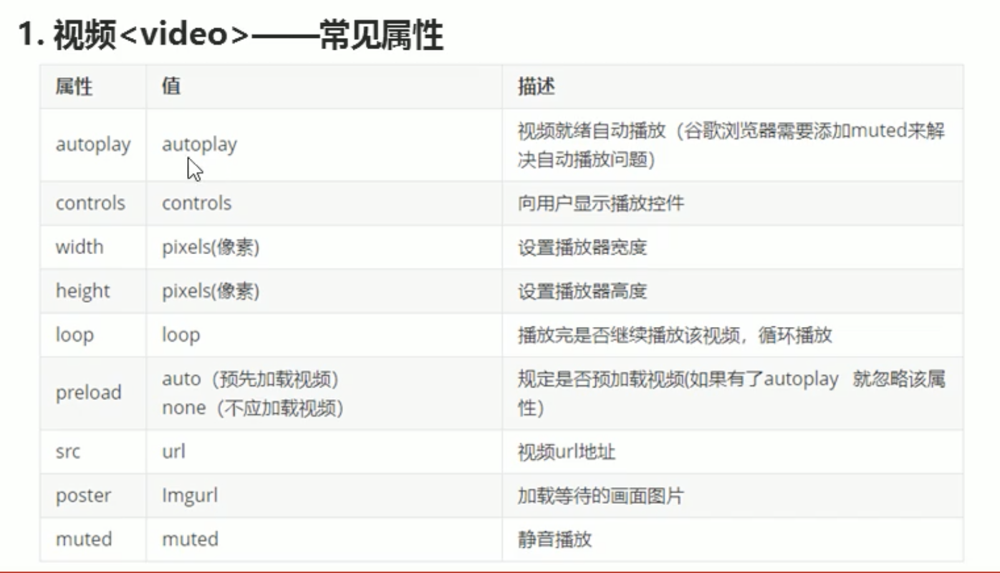

#### 多媒体标签总结

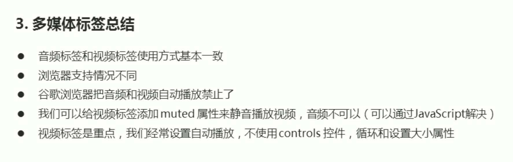

### HTML5新增的input类型

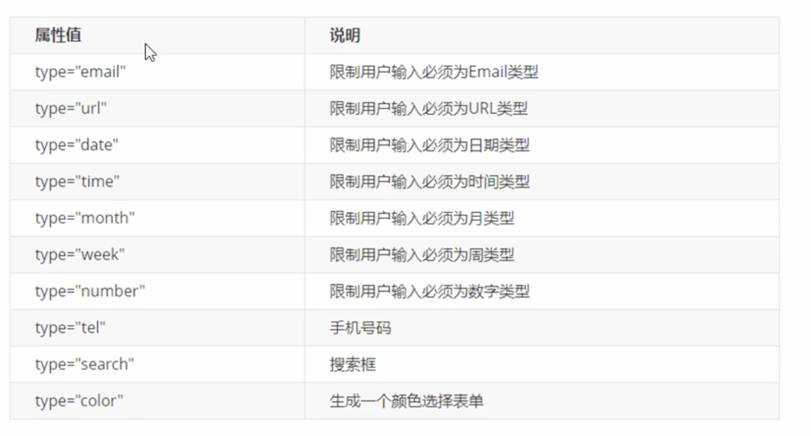

### HTML5新增的表单

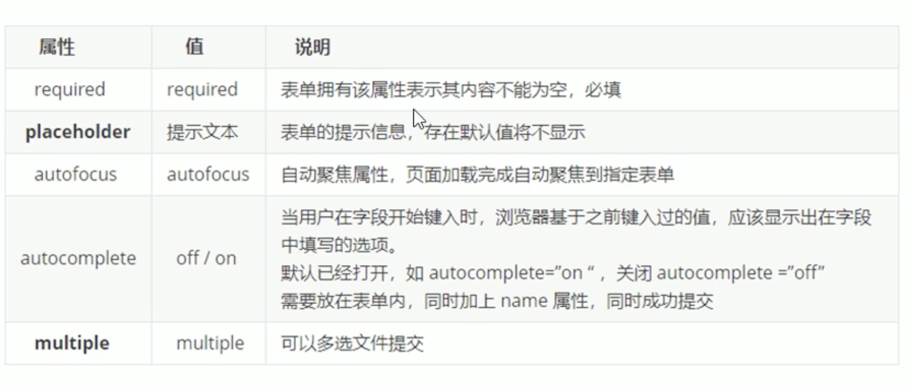

## CSS3

### CSS3新增加的特性

#### CSS3的现状

- CSS3特性有兼容性问题，ie9以上才支持
- 移动端支持优于PC端
- 不断改进中
- 应用相对广泛
- 现阶段主要学习：新增选择器和盒子模型以及其他的特性

### CSS3新增的选择器

#### 属性选择器

可以根据元素特定的属性来选择元素

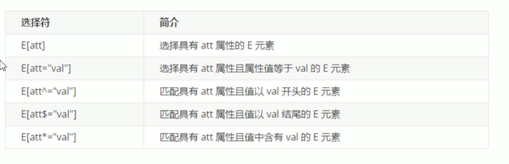

**类选择器，属性选择器和伪类选择器 权重都是10**

#### 结构伪类选择器

结构伪类选择器主要根据文档结构来选择元素，常用于根据父级选择器里面的子元素

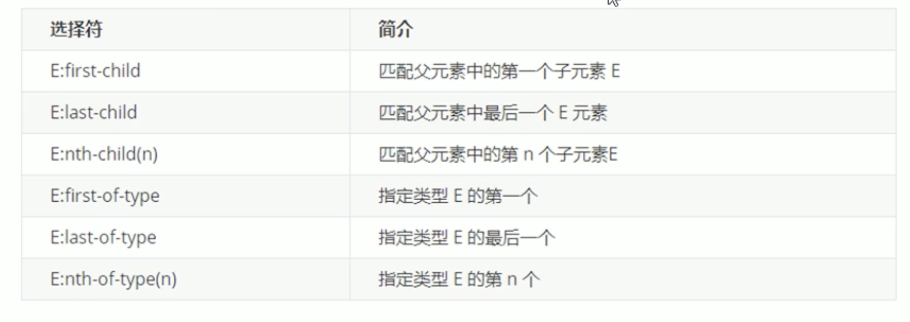

- 其中nth-child(n)

	- n可以使数字，关键字和公式
	- n如果是数字，就是选择第n个元素，里面数字从1开始
	- n可以是关键字，even偶数，odd奇数
	- n可以是公式

		- 如果只有n的话其实就是遍历一遍

	- 执行的时候先看 选中的孩子，然后再去看前面的东西，比如说：div:nth-child(1)

		- 此时先把child(1)选择出来，然后再看是不是属于div，如果属于div那么就选中
- 其中nth-of-type(n)

	- 其他的和nth-child(n)一样
	- 这个是先看类型复合条件的选出来，然后再通过n来选择

		- 先满足指定的元素，再看孩子

区别：

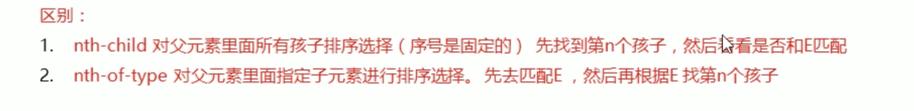

#### 选择器总结

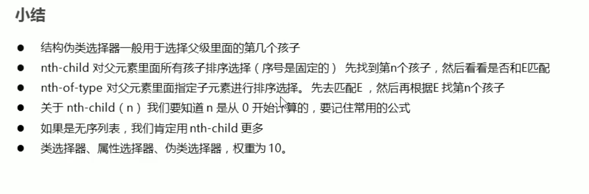

#### 伪元素选择器

可以利用CSS创建一个标签元素，而不需要HTML标签，从而简化html结构

- ::before

	- 在元素内部的前面插入内容

- ::after

	- 在元素内部的后面插入内容

- 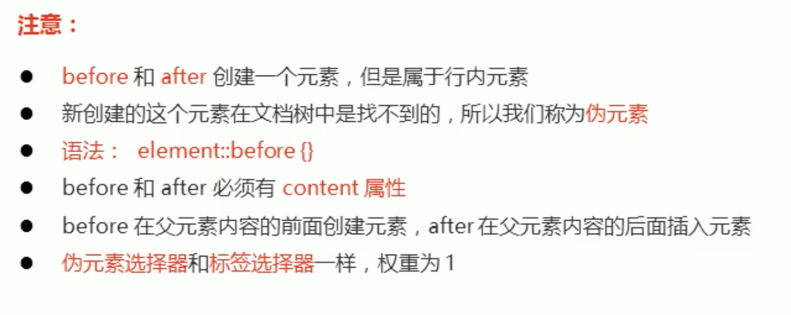

  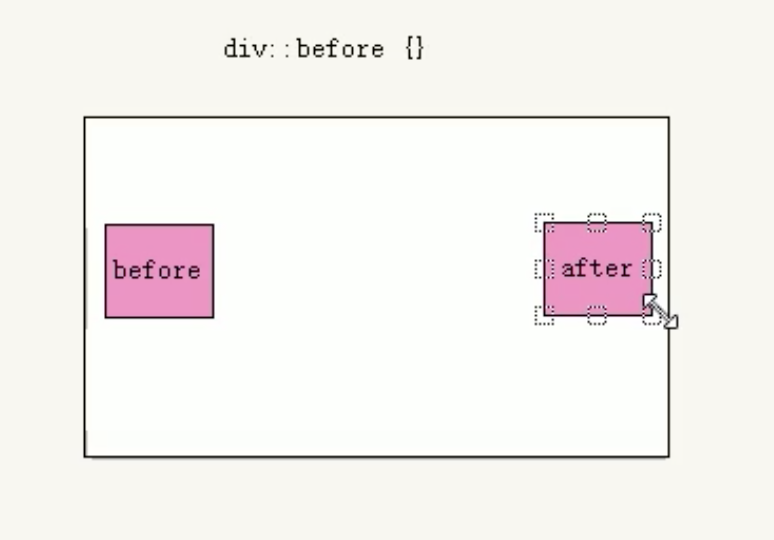

### 盒子模型

- CSS3 可以通过box-sizing来指定盒子模型。有两个值

  - content-box (默认)

    - width+padding+border = content

  - border-box

  	- 这种情况就不会把盒子撑开

  		- 前提是padding和border不会超过width宽度

### CSS3 的其他特性

#### CSS3滤镜

- filter

	- 用于将模糊或者颜色偏移等图形效果应用于元素
	- 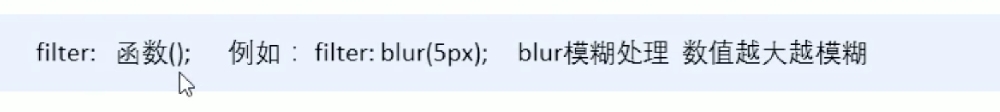

#### CSS

- calc计算

  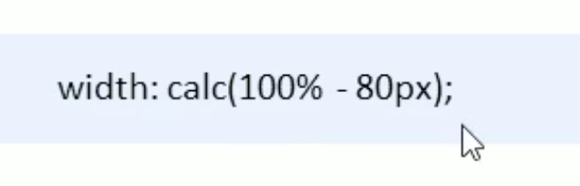

#### 过渡

transition是CSS3中最具有颠覆性的特征之一，我们可以不适用动画或者是js的情况下使元素从一种样式变成另一种样式是为元素添加效果

- 从一个状态慢慢的过渡到另一个状态

  - 一般和hover一起配合使用

  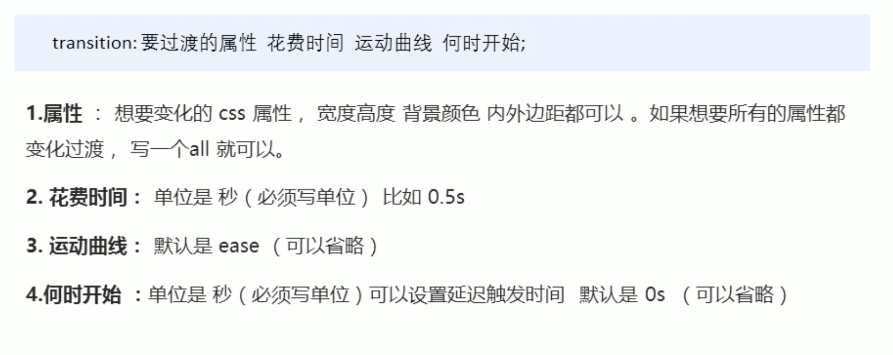

  运动曲线

  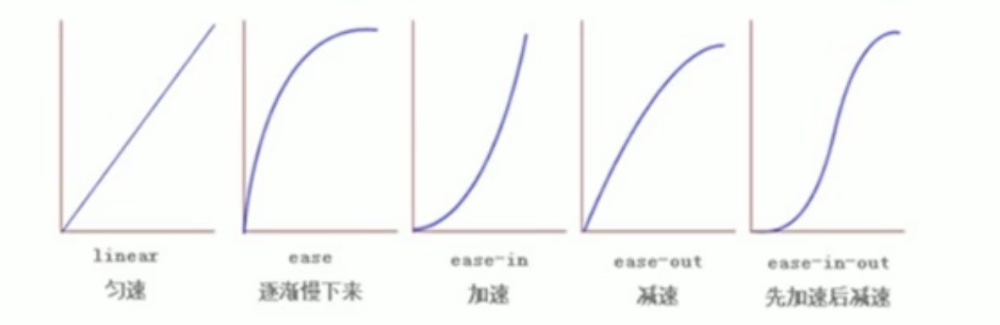

  

谁来过度给谁加transition

如果写多个属性的话，加逗号。当然，你也可以写all

