# 基本网页布局入门

## 盒子模型

### 网页布局本质

1. 准备好盒子
2. 利用css设置位置
3. 往盒子里面装内容

**网页布局的核心本质就是利用css摆放盒子**

### 盒子模型的组成

把HTML页面中的布局元素看做一个矩形的盒子，也就是一个盛装内容的容器

CSS本质就是一个盒子，封装着周围的html元素，包括边框，外边距，内边距，实际内容

- border边框
- content内容
- padding 内边距
- margin 内边距

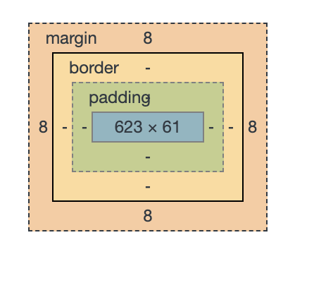

**boder**

- border-width

	- 定义边框的粗细，单位是px

- border-style

  - 定义边框的样式

    - solid 实线边框

    - dashed 虚线边框

    - dotted 点线边框

- border-color

	- 定义变宽的颜色

- 边框属性的复合属性

	- border: 1px solid red;

		- 没有相关顺序

**content**

默认的情况下，div中content是没有内边距的，所以里面的内容会紧贴着border不好看，可以调节内边距padding解决这个问题

**padding**

- padding-top
- padding-bottom
- padding-left
- padding-right
- 内边距的复合属性
  - 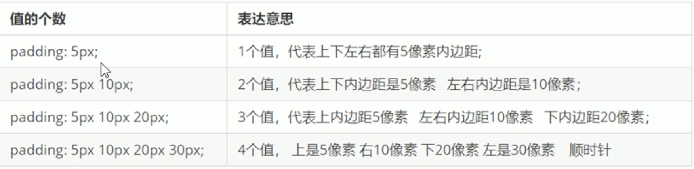

**问题：盒子大小问题**

css中控制的长度宽度是contend的长度和宽度

而border和粗细和padding的大小都会影响盒子的大小

因此我们需要更改width和height才能保持盒子不变

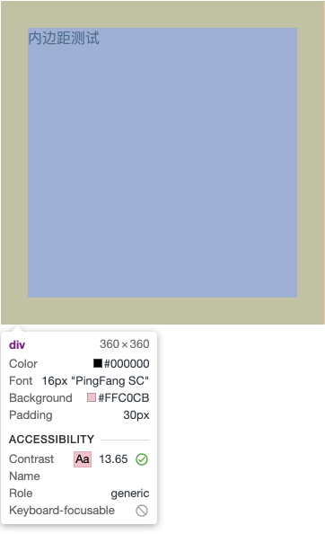


**margin**

- margin-top
- margin-bottom
- margin-left
- margin-right
- 外边距的复合属性

	- 和padding是一样的

**外边距的典型应用**

- 使块级盒子水平居中显示

	- 条件1 盒子必须指定宽度
	- 条件2 盒子左右的外边距都设置为auto
	- 常见写法是: margin: 0 auto

- 小技巧：使行内元素或者是行内块元素水平居中显示

  ​	我们只需要在其父元素添加text-align: center 就行了

**外间距的问题**

- 嵌套块元素垂直外边距的塌陷问题

  - 对于两个嵌套关系的快元素，父元素有上边距同时子元素也有上边距，此时父元素会塌陷较大的外边距值。
  - 解决方式

    - 给父元素定义上边框

      ``border: 1px solid transparent``

    - 给父元素定义内边距
    - 为父元素添加overflow:hidden
    - 浮动的盒子不存在外边距合并

**清除内外边距**

​	``* {margin : 0; padding: 0;}``

**CSS3的特殊属性**

圆角边框

``border-radius:length``

- length代表圆的大小

	- px
	- 百分比

- 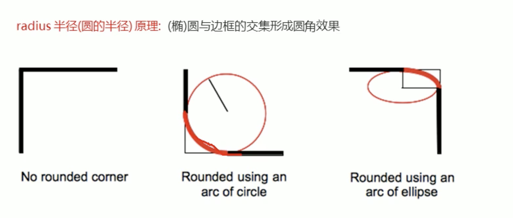

盒子阴影

- box-shadow

  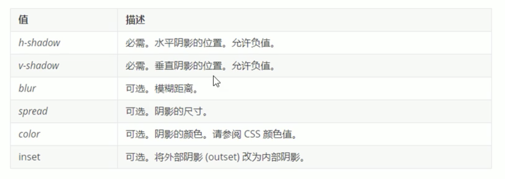

文字阴影

``text-shadow``

和box-shadow差不多缺少了尺寸和inset

## 标准流

标签按照默认好的方式进行排列

## 浮动

 浮动可以改变元素标签默认的排列方式

 浮动最典型的应用：可以让多个块级元素一行内排列显示

### 网页布局第一准则

 **多个块级元素纵向排列使用标准流**，多个块级元素横向排列使用浮动

### 浮动的情况

 浮动元素用于创建浮动框，将其移动到一边，直到左边缘或右边缘触及包括块或另一个浮动框的边缘

语法：``float: 属性值``

- none
- left
- right

### 浮动的特性

**浮动元素会脱离标准流（脱标）**

脱离标准普通流控制，移动到指定位置，俗称脱标

- 浮动的盒子不再保留原先的位置

	- 原先的位置会被其他的标准流占据
- 标准流会占据浮动的盒子，然后占据
	- 浮动的盒子会向上浮动一层

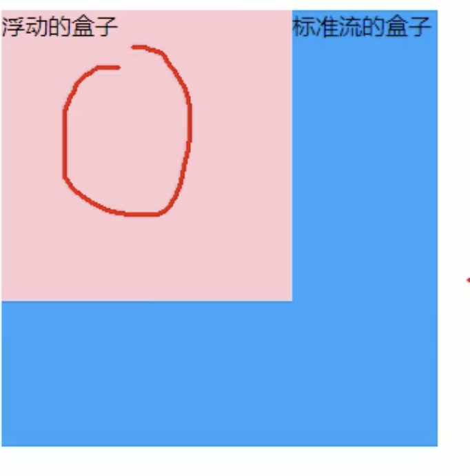

**浮动的元素会一行内显示并且元素顶部对齐**

- 如果说一行内显示不下的话就换行
- 浮动的元素是相互贴在一起的，中间不会有空隙，行内块之间会有空隙

**浮动的元素会具有行内块元素的特性**

比如说你对一个行内元素或者块元素设置浮动，那么这个行内元素就会具有行内块元素的特点

- 如果块级盒子没有设置宽度，默认宽度和父级一样宽，**但是添加了浮动之后他的大小根据内容来决定**
- 浮动的盒子中间是没有缝隙的，是挨在一起的（行内块元素之间有缝隙）
- 行内元素同理
- tips

  ​	浮动的两个元素之间不会有空隙

  ​	如果行内元素有了浮动，那么我们就不需要改成行内块元素才能给高度宽度

### 浮动元素经常和标准流父级搭配使用

为了约束浮动元素位置，我们网页布局一般采取的策略是

先使用标准流的父元素排列上下位置，之后内部子元素采取浮动排列左右位置，符合网页布局第一准则

### 浮动布局需要注意的地方

浮动和标准流的父盒子搭配

- 先用标准流的父元素排列上下位置，之后内部子元素采取浮动排列左右

一个元素浮动了，理论上其余的兄弟元素也要浮动

1. 为了防止出现问题
2. 浮动的盒子只会影响浮动盒子后面的标准流，不会影响前面的标准流

### 清除浮动

为什么我们要清除浮动

当我们没有设置父盒子高度的时候，子盒子浮动之后，导致父标签高度塌陷，影响布局

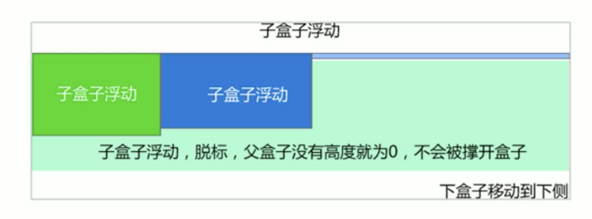

清除浮动之后，父级就会根据浮动的子盒子自动检测高度，父级有了高度，就不会有影响下面的标准流了

**语法：**

- ``选择器{clear: 属性值}``

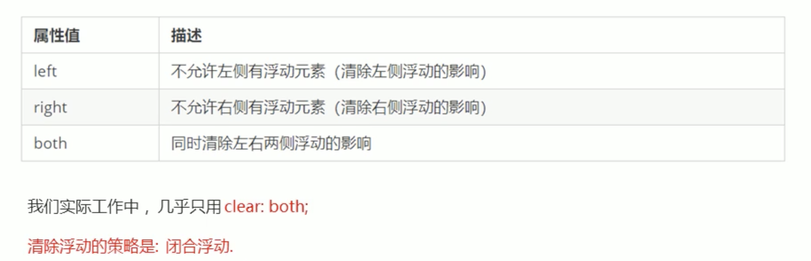

#### 清除浮动的方法

闭合浮动

- 只让浮动在父盒子内部影响，不影响父盒子外面的其他盒子

**额外标签法**

- 也称为隔墙法，是w3c推荐的做法
- 额外标签法会在浮动元素的末尾添加一个空的标签。例如``<div style = " clear:both"></div>``或者其他标签如``<br/>``
- 优点：通俗易懂
- 缺点：结构性差
- 注意：要求这个新的空标签闭必须块级元素

**为父级添加：overflow**

- 将值设置为

	- hidden
	- auto
	- scroll

- 缺点

	- 无法显示溢出的部分

**::after伪元素法**

是额外标签法的升级版，也是给父元素添加

````css
.clearfix::after {
	content: "";
  display: block;
  height: 0;
  clear: both;
  visibility: hidden;
}

.claerfix { /*IE6,7专有*/
  *zoom:1
}
````


**双伪元素清除浮动**

也是给父元素添加

````css
.clearfix::before, .clearfix:after {
  content:"";
  display:table;
}
.clearfix::after {
  clear:both;
}
.clearfix {
  *zoom: 1;
}
````


## 定位

### 为什么需要定位

可以使某个元素自由的在盒子里面移动，并且可以压住盒子

有的元素在滚动的时候可以固定在屏幕上面

### 定位的组成

定位就是把盒子定在某一个位置

**定位 = 定位模式 + 边偏移**

- 定位模式用于指定一个元素在文档中的定位方式。

  通过CSS的``position``属性来设置

  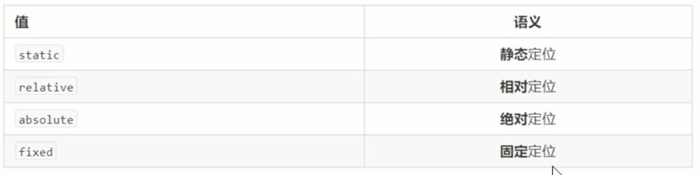

- 边偏移则确定了该元素的最终位置

  盒子移动的最终位置

  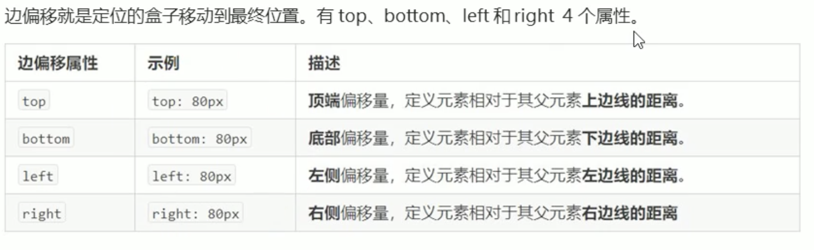

#### 静态定位static

静态定位是元素的默认定位方式，无定位的意思

- 按照标准流的特性摆放位置，没有边偏移
- 所以一般不会用这个东西

#### 相对定位relative

相对定位是元素在移动位置的时候，相对于它原来的位置来说的（自恋型）

- 它不以浏览器的body也不一定父元素为准，只会根据自己坐标原来的位置进行移动
- 原来在标准流的位置继续占有，后面的盒子仍然以标准流的方式对待它

	- 不脱标，保持原来的位置

#### 绝对定位absolute

绝对定位是元素在移动位置的时候，是相对于它祖元素来说的

- 如果没有祖先元素或者是祖先元素没有定位，则是以浏览器为准定位（document文档）
- 如果祖先元素有定位（静态定位不算），那么以最近一级的有定位祖先元素为参考点移动位置
- 脱离标准流，不会再占有原先的位置

#### 子绝父相

- 源码，例子:

#### 固定定位fixed

固定定位是元素固定于浏览器可视区域的位置

- 使用场景：可以再浏览器页面滚动时元素的位置不会改变
- 以浏览器的可视窗口作为参照
- 不占有原先的位置

	- 脱标

#### 粘性定位 

相对定位和固定定位的混合

- 特点

	- 以浏览器的可视窗口为参照点移动的元素

		- 固定定位的特点

	- 粘性定位占有原来的位置

		- 相对定位的特点

	- 必须添加top，bottom，left，right其中的一个才会有效果

		- 当元素到达指定位置的时候就会固定在窗口上不动~但是不会脱标~

### 总结

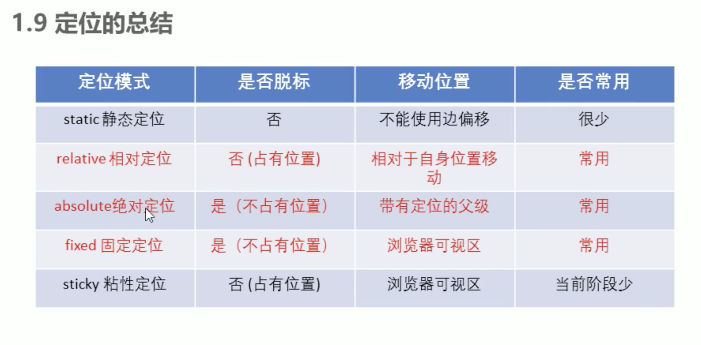


### 定位的叠放次序

使用定位布局时，可能会出现盒子重叠的情况。此时可以使用z-index来控制盒子的前后次序

语法

- 选择器``{z-index: 1;}``

	- 数值可以是正整数，负整数0，默认是0，数字越大谁优先级高
	- 属性值相同，按照书写顺序，后来居上
	- 数字后面不能加单位
	- 只有定位的盒子才有z-index属性

### 绝对定位的盒子居中

加了绝对定位的盒子不能通过margin: 0 auto; 水平居中

- 方法：

	- left: 50%
	- margin-left: 负该盒子的一半

### 定位特殊特性

绝对定位和固定定位也和浮动类似

- 行内元素添加绝对或者固定定位，可以直接设置高度和宽度
- 块级元素添加绝对或者固定定位，如果不给宽度或者高度，默认大小是内容的大小
- 脱标的盒子不会触发外边距合并

### 绝对定位/固定定位会完全压住盒子

- 浮动元素不同，只会压住下面标准流的盒子，但是不会压住下面标准流盒子里面的文字（图片）

	- 因为浮动出现的原因是为了做文字环绕效果的。。所以不会盖住

- 绝对定位会压住标准流下面的东西，包括图片和文字
