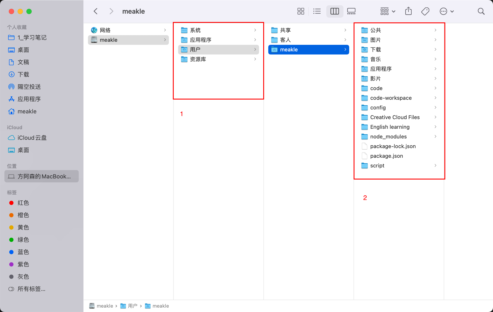
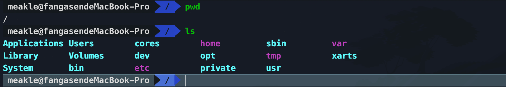
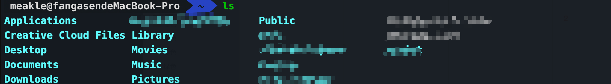
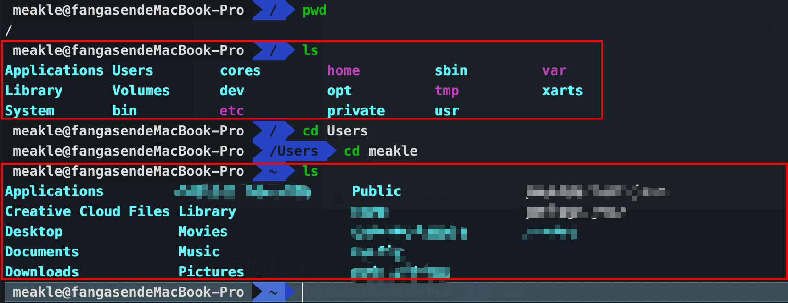

# 02 命令行入门操作

## 英语小课堂

* recursive 递归的
* directory 目录/文件夹
* echo 回声，重复（问就是守望先锋）

编程英语和常用的英语是有出入的。

## 命令行缩写

| 英文      | 对应的缩写命令 | 英文      | 对应的缩写命令 |
| --------- | -------------- | --------- | -------------- |
| file      |                | link      | ln             |
| make      | mk             | find      | find           |
| move      | mv             | echo      | echo           |
| remove    | rm             | touch     | touch          |
| copy      | cp             | change    | cd中的c        |
| list      | ls             | directory | cd中的d        |
| recursive |                | force     |                |

* 注意空格问题
* 注意使用英文字符（`control + 空格`切换）
* 中断问题，使用`control + c`

### 查：查看文件或者目录

* 查看当前目录绝对路径

  `pwd`（process working directory 进程工作目录）

* 查看当前目录内容

  `ls`

* 查看指定目录内容

  `ls path`

* 查看文件内容

  * `cat path`    全部都展示
  * `head path`  默认只展示前10行
    * `head patn -n 你想要的x行数  `  展示前x行
  * `tail path`  默认只展示后10行
    * `tail path -n 你想要的x行数` 展示后x行
  * `less path` 会发生滚动，不会把所有的内容都显示出来。 会进入vim模式，上面的几个都是在终端显示显示。

### 增：创建文件或者目录

* 创建一个文件

  * `touch file_name`
  * echo
  * `echo "file_content" > file_name ` 将文件内容写入文件名中(会覆盖之前的内容)
  * `echo -e "file_content" > file_name` 加上`-e`之后支持了转义字符
  * `echo "file_content" >> file_name` 不会覆盖之前的内容

* 一次创建多个文件

  * `touch 1.md 2.md 3.md`

* 创建目录

  `mkdir dir_name`

* 创建多层级目录

  `mkdir -p a/b/c`

* 一次创建多个目录

  `mkdir a b c d`

拷贝文件

* 将文件1创建一个副本（文件2）
  * `cp file1 file2` 注意一下这里，是复制file1然后创建了file2在该目录下。
* 将目录复制一份
  * `cp -r dir1 dir2` 与上面同样。

### 删：删除文件和目录

* 删除文件

  `rm file_name`

* 删除文件夹

  * `rm -r dir_name`
  * `rm -rf dir_name` (强制删除，别问我问题)

### 改：修改文件的相关属性或者目录

修改文件内容

* `echo`
* `open`打开
* `code`打开
* `vim`打开

移动文件与重命名文件

* mv

  * 移动文件到目标文件夹：`mv file_name target_dir`
  * 移动文件到当前文件夹：`mv ~/path/file_name .`
  * 重命名：`mv file_name new_name`

  

更新时间

`touch file_name`

## 用户目录以及系统根目录

1. 系统根目录

   

2. 用户目录（也是默认的目录）

   

我们也可以通过终端来查看完整的路径

我们在选择路径的时候，如果写`~/`就代表着我们从当前用户目录开始，如果写`/`就代表着我们从系统根目录开始。

解释一下：

1. 从用户目录进入到`~/code`这个目录
2. 从`~/code`这个目录进入`~/Downloads`这个目录
3. 再从`~/Downloads`这个目录进入`~`目录（也就是用户目录）

## 绝对路径和相对路径

相对路径：简单说就是以当前目录为起点，去往目标目录的路径（path），换句话就是当前目录**相对于**目标目录的路径。

绝对路径：从系统根目录开始`/`的路径，当然也包括了`~/`，因为`~/`实际上是`/Users/meakle`。

## 命令的组合

### `&&`命令

和JavaScript里面的`&&`运算符很像，如果运算子出现了false就返回，后面的短路。如果都是true就返回最后一个。

### `;`命令

不管前面的指令是对是错，都会执行。

## 脚本文件

添加执行权限： `chmod +x createDemo`

