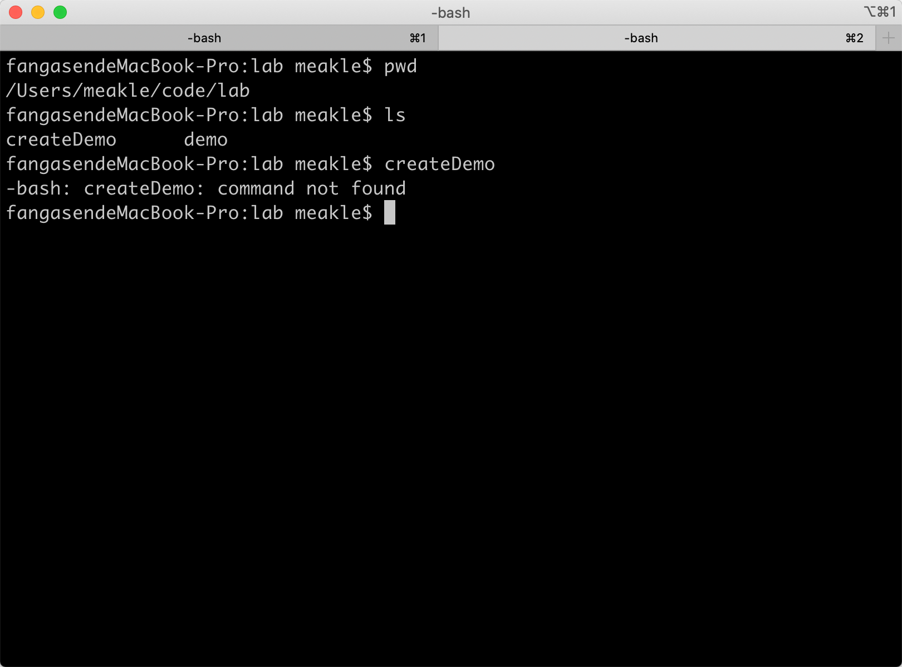
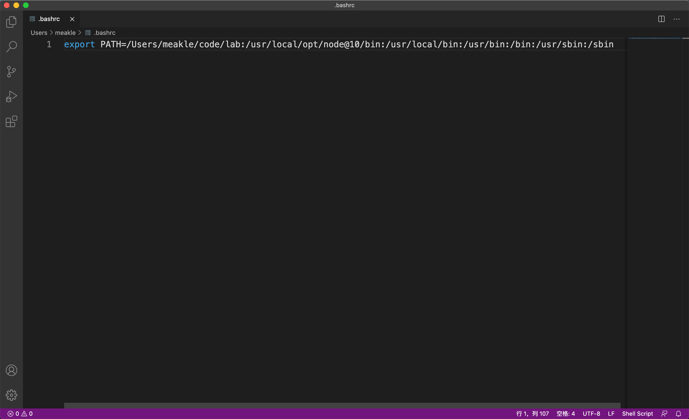
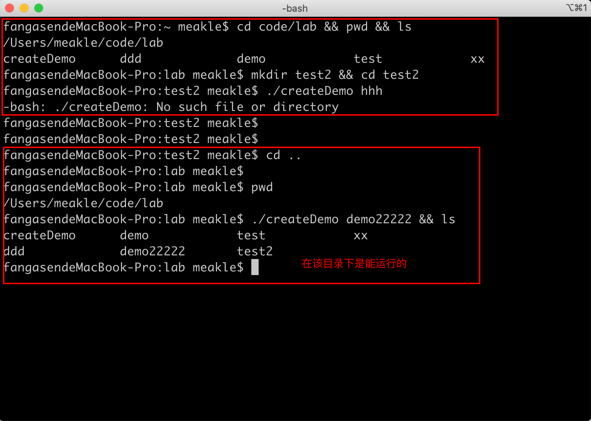

# 关于任务六——脚本文件的相关问题

问题一：脚本文件加上了`shebang`也不能直接调用

问题二：无法把脚本文件所在的目录放入环境变量中


> 运行环境：
>
> macOS 10.15.7
>
> shell：bash


## 问题一：脚本文件加上了`shebang`也不能直接调用

### 问题描述

在脚本文件中加入`shebang`，但是在终端中不能直接使用还是需要加上`./`或者`sh`才能使用



脚本内容如下：

```bash
#!/usr/bin/env sh

mkdir $1
cd $1

touch index.html
touch style.css

echo -e "<!DOCTYPE>\n <h1>head</h1>" >> index.html
```


### 期望效果

能够直接在终端中输入`cerateDemo`就能执行脚本文件中的相关指令


## 问题二：无法把脚本文件所在的目录放入环境变量中

按照如下[教程](https://xiedaimala.com/tasks/bdeeede8-0b3c-4915-9d9a-4fe039dead37/text_tutorials/9d173da0-b87a-463f-bd43-7837ebedbd3f)

> 在`~`路径下操作的

```bash
touch ~/.bashrc

echo -e "export PATH="/Users/meakle/code/lab:$PATH"" >> .bashrc
```


创建的的文件：




终端中的错误表现：




### 期望效果

能够在任意的位置使用`createDemo`这个可执行文件

