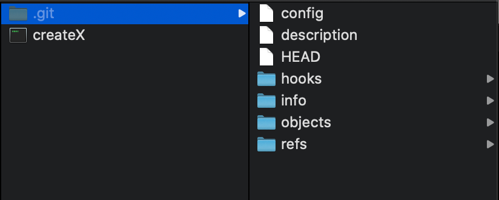

# 03_git的基本操作


```bash
git config --global user.name 你的英文名
git config --global user.email 你的邮箱
git config --global push.default simple
git config --global core.quotepath false
git config --global core.editor "code --wait"
git config --global core.autocrlf input
```

* 如果邮箱和github的邮箱不一样的话，`push`代码是没有反应的。


## 初始化

* `git init`

  将当前目录初始化为一个git仓库，并且生成一个`.git`目录

  

  目录里面会存储代码快照

* `git add`

  添加命令，将选中的文件，添加到暂存区

  ```bash
  git add index.html
  ```

* `.gitignore`

  将不提交的文件放进这个文件夹中。

  

  常见的文件有：

  * `node_modules`
  * `.DS_Store`
  * `.idea`
  * .`vscode`

* `git commit -m "xxx"`

  将暂存区的文件提交


