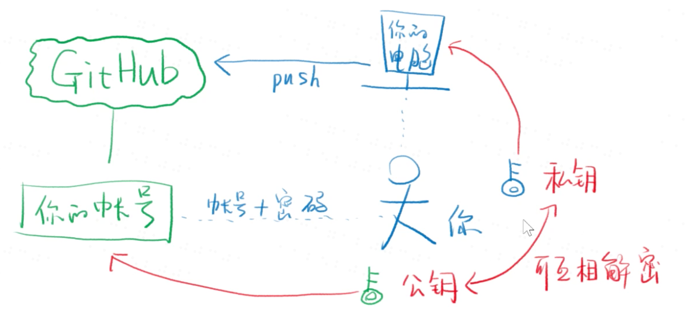
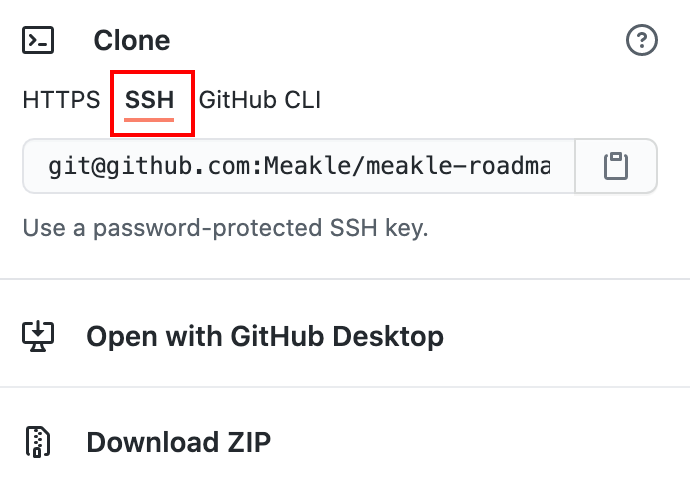
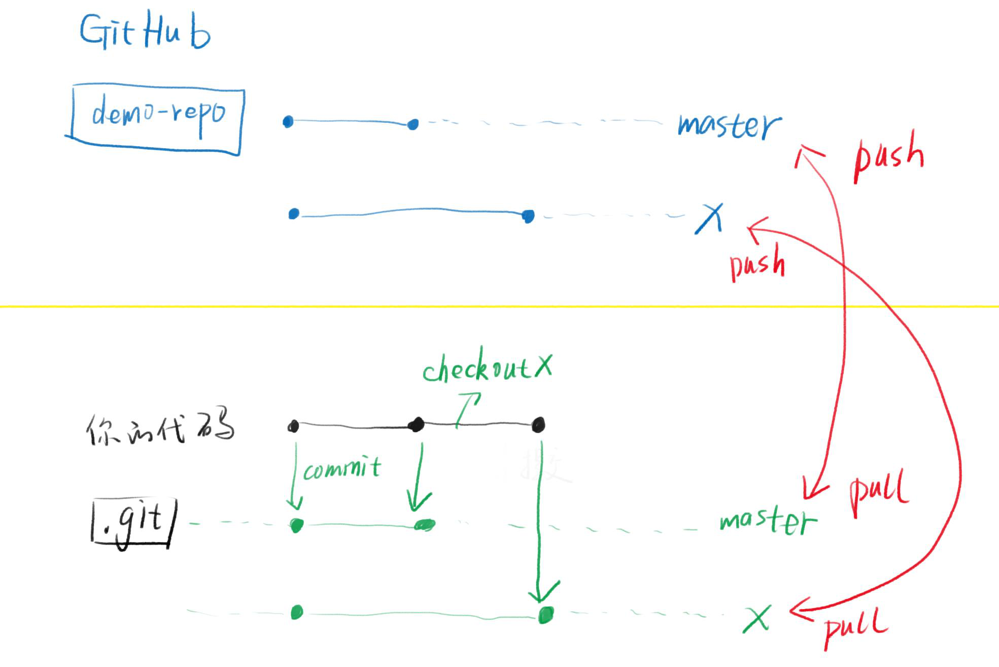

# 05_配置GitHub

> 示意图来自于[饥人谷](https://xiedaimala.com/courses/16644d89-6b17-4c2f-ac15-dabb994b7696/random/d6c7b79e0d#/common)

## 为什么GitHub能知道你的身份？

* SSH key 验证身份




## 设置SSH Key

GitHub上连接已有仓库时的认证，是通过使用SSH的公开密钥认证的方式进行的。
在终端中执行第一行

``` zsh
$ ssh-keygen -t rsa -C "your_email@example.com"
Generating public/private rsa key pair.
Enter file in which to save the key
(/Users/your_user_directory/.ssh/id_rsa):  //按回车键
Enter passphrase (empty for no passphrase): //输入密码
Enter same passphrase again: //再次输入密码
```

`id_rsa`文件是私有密钥，`id_rsa.pub`是公开密钥


### 添加公开密钥

在GitHub中添加公开密钥，以后就可以使用私有密钥进行认证了。

* 查看公共密钥
  在路径`.ssh/id_rsa.pub`中，直接复制里面的内容就行
* GitHub设置
  在setting中找到SSH and GPG keys这个选项
  然后添加SSH就行，把赋值的内容粘贴进去

添加完成后会发邮件确认

### 使用私人密钥与GitHub进行认证和通信

在终端中输入`ssh -T git@github.com`

然后回车，yes，输入你设置的密码，最后出现一下结果就是成功了

```
Hi hirocastest! You'vesuccessfully authenticated, but GitHub does not provide shell access.
```


## 上传代码

### 在本地添加远程仓库地址

`git remote add origin git @xxxx`

* `origin`是远程仓库的默认名字，可以换

* `git @xxx`是ssh，如下图

  


### 推送本地master分支到远程origin的master分支

`git push -u origin master`

* `-u origin master`的意思是设置上游分支
* 第一次使用需要这个东西，以后就直接`git push`或者`git pull`
* 使用`git pull`将远程分支合并到本地对应的分支


**原理图：**



### 如何上传其它分支

第一步：`git chectout x`

第二步：`git push -u origin x`


## 下载代码


如果是自己的项目，那么使用ssh下载，如果是别人的使用http下载。


### `git clone`的三种情况

1. `git clone git@?/xxx.git`

   在当前目录下，创建一个名为xxx的文件夹，并将仓库放入xxx文件夹中

2. `git clone git@?/xxx.git jjj`

   在当前目录下，创建一个名为jjj的文件夹，并将仓库放入jjj文件夹中

3. `git clone git@?/xxx.git . 

   直接将仓库放在当前文件夹中。


## 上传到两个不同的云端仓库

1. `git remote add repo2 git@xxx`
2. `git push -u repo2 master`


