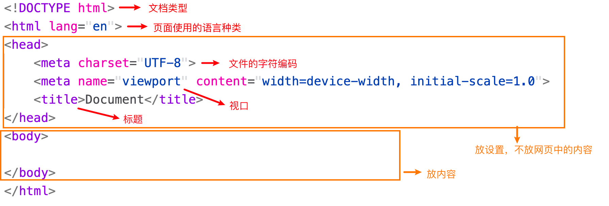
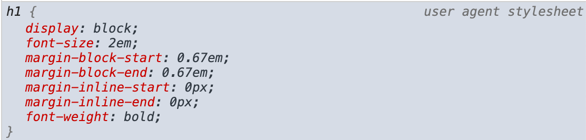

# HTML标签


| 英文      | 翻译           | 英文        | 翻译       |
| --------- | -------------- | ----------- | ---------- |
| heading   | 标题           | order       | 顺序，秩序 |
| body      | 正文           | ordered     | 有顺序的   |
| paragraph | 段落           | unordered   | 无顺序的   |
| section   | 章             | description | 描述       |
| article   | 一篇文章       | term        | 术语       |
| main      | 主要           | data        | 数据       |
| aside     | 旁边的         | quote       | 引用       |
| anchor    | 锚点（超连接） | block       | 块         |
| strong    | 重要，强壮     | inline      | 行内，内联 |
| emphasis  | 强调，重读     | break       | 打断       |


## HTML5是谁发明的

Berners-Lee 李爵士


## 起手式

* 使用`!` +`TAB`


**vscode自己生成的代码的含义：**




## 标签

### 表示章节的标签

* 标题`h1-h6`
* 章节`section`
* 文章`article`
* 段落`p`
* 页头`header`
* 页脚`footer`
* 主要内容`main`
* 旁支内容`aside`
* 划分`div`

### 表示内容的标签

* `ol + li` 

  order list

* `ul + li`

  unorder list

* `dl + dt + dd`  描述列表

  dl: description list

  dt: description term

  dd: description data

* `per`  

  想要保留文本中的空格，回车之类的，将文本放在`per`标签中

  一般`per`要包含在一个标签里面

* `hr`

  水平分割线

* `br`

  break 换行

* `a`

  anchor 锚点 超连接

* `em`

  emphasis 语气强调，默认斜体

* `strong`

  本质强调

* `code`

  提供等宽的默认样式

* `quote`

  表示引用，内联

* `blockquote`

  块级的引用


## 全局属性

**也就是所有标签都有的属性**

* class
* contenteditable
* hidden
* id
* style
* tabindex
* title


**class**

使用类选择器选择样式的时候，一般使用`.className`。

还可以使用这种方法：

```html
<body>
    <div class="demo">
        123
    </div>
</body>
```

```css
 <style>
     [class = "demo"]{
         background-color: pink;
     }
 </style>
```

但是这种方法也有缺点：

```html
<body>
    <div class="demo demo2">
        123
    </div>
</body>
```

```css
<style>
    [class = "demo"]{
        background-color: pink;
    }

    [class = "demo2"]{
        border: 1px solid red;
    }
</style>
```

如果是以上这种情况，有多个类出现在一个元素上，那么我们就只能使用`.`选择器


**contenteditable**

可编辑的。

>  我们可以将`style`标签放到`body`中。然后将`style`的`display`属性改成`block`。
>
> 这样就可以在页面中显示`style`里面的内容了。通过中方式，我们可以在页面上直接修改css。


**hidden**

隐藏元素


**id**

id在页面中只能有一个，但是就算有多个也不会报错，所以最好不要用id


**style**

在这里，这是一个标签的属性，不是样式，只不过里面的内容是样式。

行内样式能覆盖`style标签`的内容。（换句话说，一般情况下他的优先级是最高的）


**tabindex**

使用tab可以选择相关的元素。


`tabindex = xx`

xx是数字，表现为按下tab键访问的顺序，从小到大访问


特殊情况：

当`tabindex = 0`的时候，将会最后访问

当`tabindex = -1`的时候，永远不会访问


**title**

`title = "xxx"`

鼠标放到元素上的时候显示xxx


## 默认样式

浏览器自己定义的样式。


Chrome中`h1`的默认样式



* user agent（用户代理）在这里就是Chrome浏览器
* 语法很可能不属于CSS，但是问题不大，Chrome自己懂就行


**CSS reset**

现代人看来浏览器的默认属性并不好看。所有一般来说我们需要重新设置CSS。

我们可以直接抄一波大厂的代码，然后放入`reset.css`这个文件中。


