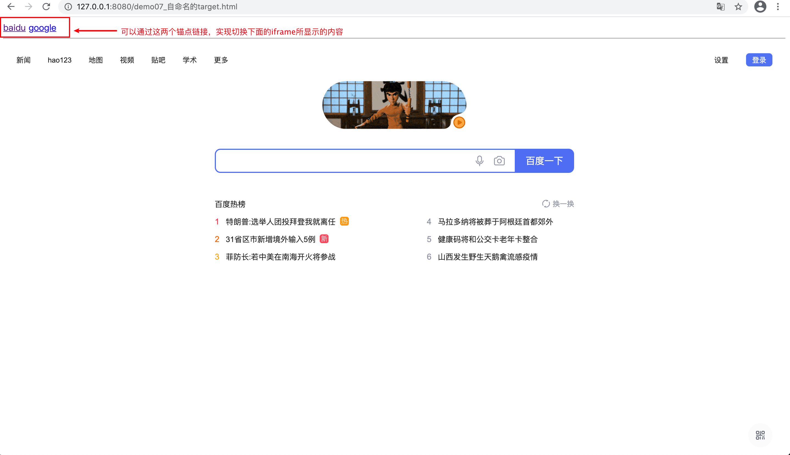

# html标签2

| 英语      | 翻译       | 英语   | 翻译     |
| --------- | ---------- | ------ | -------- |
| hyper     | 超级       | blank  | 空白     |
| target    | 目标       | parent | 父母之一 |
| reference | 引用       | self   | 自己     |
| frame     | 边框，框架 | load   | 加载     |
| error     | 错误       | canvas | 画布     |


## 如何打开本地的html文件

使用`http-server`

1. 安装`http-server`

```bash
yarn global add http-server
# 或者
npm install http-server -g
```

2. 使用

```sh
http-server . -c-1
```

`-c-1`：意思是不要缓存


## a标签

### 属性

* `href` 

  hyper + reference 超链接

* `targe`

  指定在哪一个窗口打开，比如说新标签页，还是当前页

* `download`

  下载该网页，但是一般用不了

* `rel = noonpener`


**herf的取值**

* 网址

  * 网址要写全。一定要有`//`
  * `https://xxx.com`或者`http://xxx.com`
  * `//xxx.com` 无协议，这种方式既可以访问`https`也可以访问`http`

* 路径

  这里的路径是相对于当前项目的根目录

  * 绝对路径`/a/b/c`
  * 相对路径`./a/b/c` 或者`a/b/c`

* 伪协议

  * `javascript:代码`

    使用场景：点击一个空链接的时候不发生任何事

    ```html
    <a href="javascript:">233</a>
    ```

    此时不会有任何变化

    如果给`href = ""`那么该页面会刷新

  * `mailto:mail` 发送邮件

  * `tel:phone_number` 打电话

* id

  跳转到当前页面中有着相应id的元素处

  ```html
  ...
  <p id="20">20</p>
  ...
  
  <a href="#20">233</a>
  ```

  点击锚点标签（a标签）会自动跳转到id为20的段落标签（p标签）处


**target的取值**

* `_blank` 在新的空白标签页打开
* `_top` 在当前页面最上层打开
* `_parent` 在当前页的父级页面中打开
* `_self` 在自身中打开。
* `xxx` 程序员自己命名的，名为`xxx`的标签页。


**要想让`_top`和`_parent`出现效果，我们需要使用`ifram`标签。**

* demo06_target取值

html :

```html
<body>
   
    <div>
        <!-- 相当于在当前页面,又塞了一个页面进去,相对于当前页面,iframe是当前页面的子页面 -->
        <iframe src="demo06_target的取值2.html" frameborder="0">
        </iframe>
    </div>
   
</body>
```

css:

```css
<style>
    div{
        height: 500px;
        width: 500px;
    }
    iframe{
        width: 100%;
        height: 100%;
    }
</style>
```

* `demo06_target的取值2`

html:

```html
<div>
      <a href="http://www.baidu.com" target="_self">baidu</a>
</div>
```


在`demo06_target的取值2`中anchor标签的`target`属性的值是`_self` 也就是在自身中打开。

所以说表现在`demo06_target的取值`就是在`iframe`区域显示出百度的主页


**自命名的target与ifram**

html:

```html
<body>
    
    <a href="//baidu.com" target="xxx">baidu</a>
    <a href="http://www.google.com"target = "xxx">google</a>
    <hr>
    <iframe src="" frameborder="0" name="xxx"></iframe>
    
</body>
```

css：

```css
<style>
    iframe{
        height: 800px;
        width: 100%;
    }
</style>
```

实现的效果如下：



### 作用

* 跳转外部链接
* 跳转内部链接
* 跳转到邮箱或者电话


## iframe标签

内嵌窗口


## table标签


table标签中只能嵌套三个标签

* `thead`
* `tbody`
* `tfoot`

>  如果说你没有这三个标签直接`tr`了那么浏览器会自动加到`tbody`里面

这三个标签中只能嵌套

`tr`：table row 表行

表行中可以嵌套

* `th`：table head 表示表头（表头的话浏览器会加默认样式，也更方便我们自己修改表头的样式，所以要和`td`作区别）
* `td`：table data  表示数据

```html
    <table>
        <!--   table head      -->
        <thead>
            <tr>
                <th></th>
                <th></th>
            </tr>
        </thead>
        <!-- table body -->
        <tbody>
            <tr>
                <td></td>
                <td></td>
            </tr>
        </tbody>
        <!-- table foot -->
        <tfoot>
            <tr>
                <td></td>
                <td></td>
            </tr>
        </tfoot>
    </table>
```


**相关属性**

* `table-layout`
* `border-collapse`
* `border-spacing`


## img标签

**作用：**

发出get请求，展示一张图片

**属性：**

* `alt`：可选的，替换的
* `height`：高度
* `width`：宽度
* `src`：source

**事件**

监听是否成功

* `onload`
* `onerror`

**响应式**

`max-widht = 100%`：

**可替换元素**

现在没讲，可替换元素就是可以通过标签的属性选择不同的元素的一种元素。

比如`img`可以通过`src`显示不同的图片

比如`input`可以通过不同的`type`显示不用的样子


## form标签

**作用**

发送get或者post请求，然后刷新页面

**属性**

* `action` 处理表单提交的 URL
* `method` 选择请求方式, get或者是post
* `autocomplete` 会自动弹出候选项
* `target` 标记要刷新的页面

**事件**

`onsumbit`

一个form表单一定要有一个`type`为`submit`的`input`或者是`button`


> `input`标签和`button`标签有什么区别？
>
> `button`里面还能有标签，但是`input`没有


## input标签

**作用**

让用户输入内容

**常见属性**

* `button`
* `checkbox`多选
* `radio`单选
* `name` 一般使用这个属性进行`radio`和`checkout`
* `hidden` 隐藏的input，一般用于让js自动提交一些数据

**事件**

* `onchange`
* `onfocus`
* `onblur`


**注意事项：**

* 一般不监听`input`里面的`click`事件
* `form`里面的`input`要有`name`
* `form`里面要放一个`type=submit`才能触发`submit`事件


