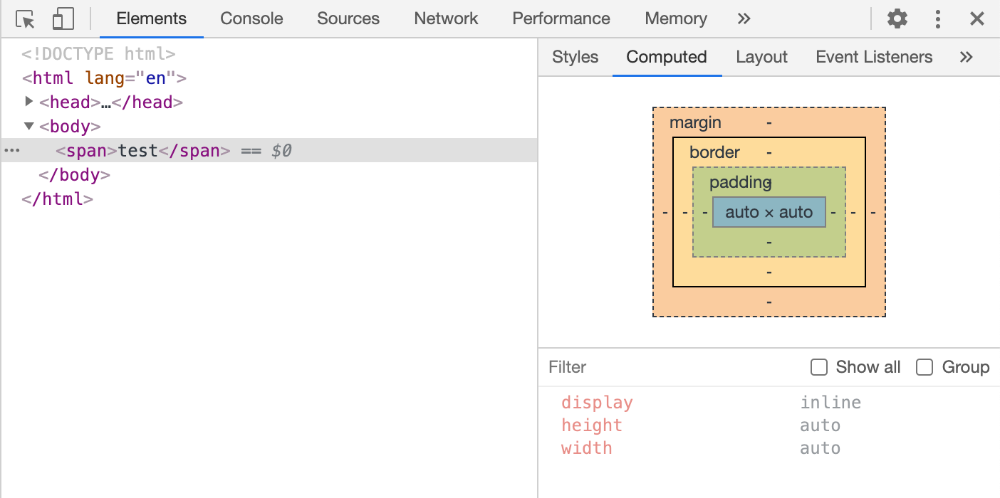
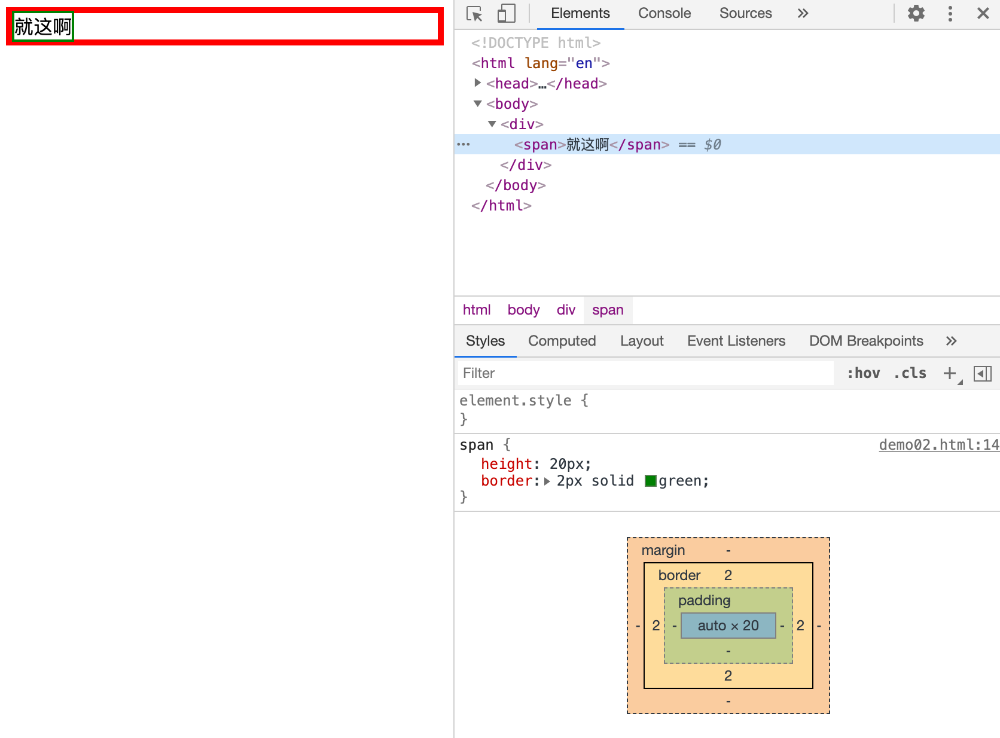
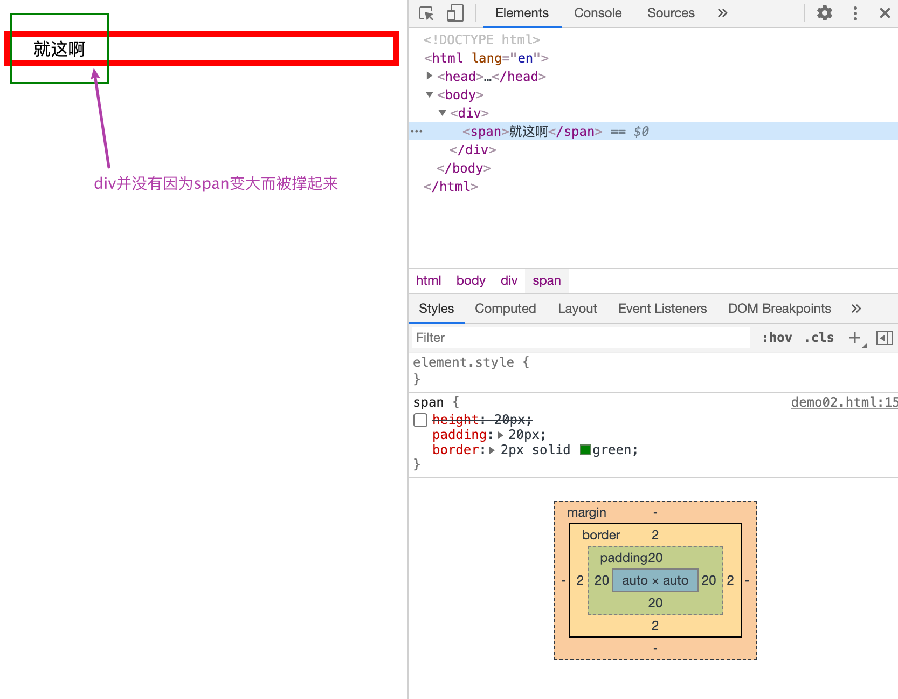
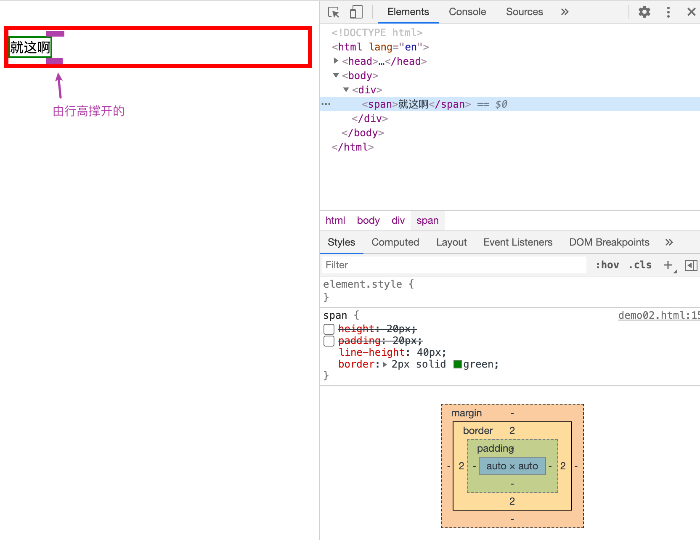
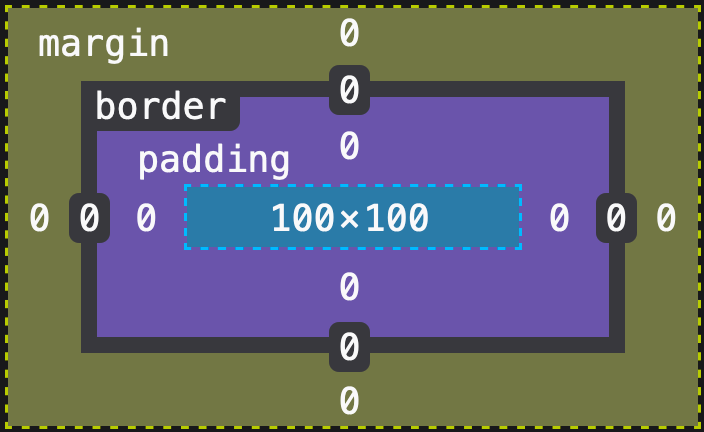
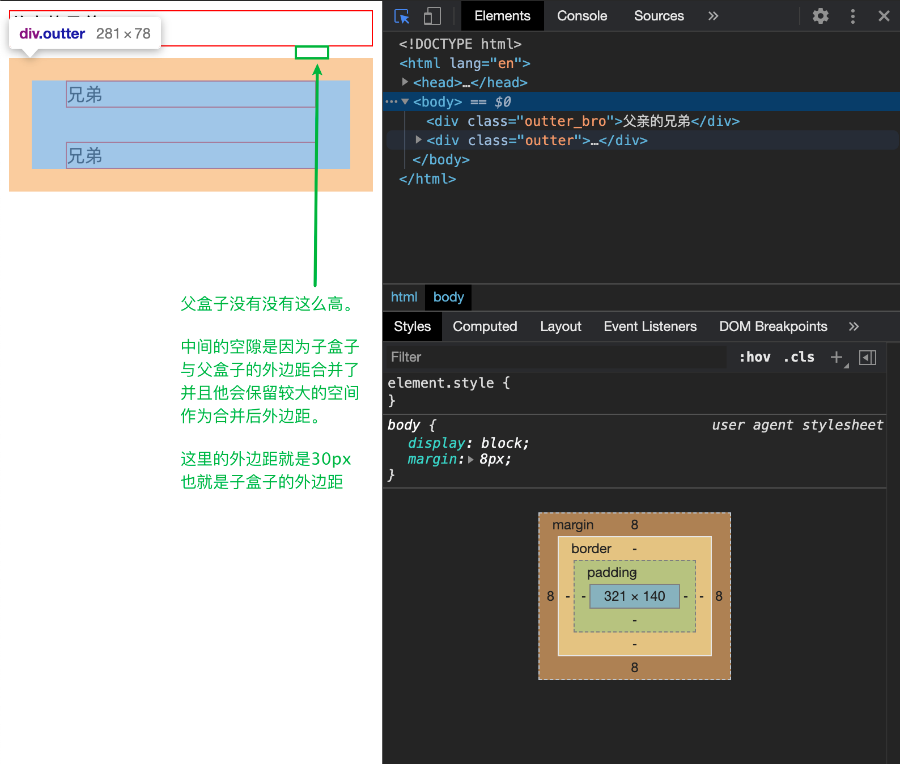
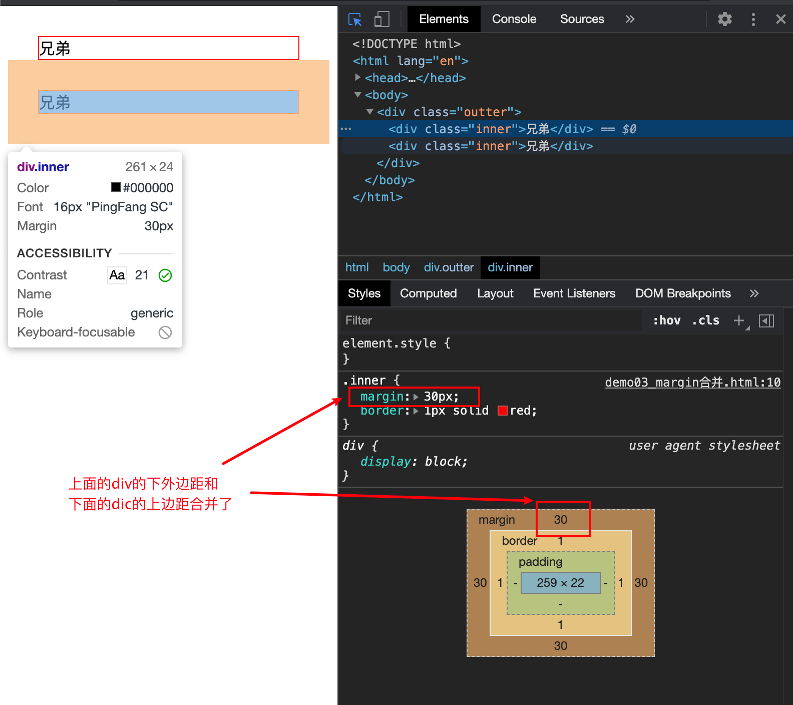

# css基础

### css的版本

* css2.1 是使用最广泛的版本
* css3 开始分模块了，是现在的版本

### 如何知道css中的某个属性是否可用

* 一个浏览器一个浏览器的试
* 使用caniuse.com查看CSS的某个属性是否可用


## CSS基础概念

### 层叠

* 样式层叠
* 选择器层叠
* 文件层叠

### 语法

**语法一：**

```css
选择器 {
    
    属性名： 属性值;
    /*注释*/
}
```

* 区分大小写
* 没有`//`注释
* 最后一个属性的分号可以省略，但是建议不要去

**语法二——at语法**

```css
@charset "UTF-8";
@import url(2.css);
@media (min-width:100px) and (max-widthL 200px) {
    语法一
}
```

* `@charset`必须放在第一行

* 前两个at语句必须以分号结尾

* charset是字符集的意思，但是UTF-8是字符编码encoding，这是历史遗留问题

  * > `charset "UTF-8"`是指定字符编码，并不是字符集


### 文档流 Normal Flow

文档流的默认排版方式是从左到右，从上到下

* 内联元素从左到右依次排开
* 块级元素独占一行

> 实际上，对于某一个标签来说，现在不会分这个标签为块级元素，另一个标签是内联元素
>
> 因为所有的标签都是通过`display`属性来确实这个标签是什么类型的元素的
>
> 只是浏览器的默认样式中会让一些元素成为内联元素或者块级元素
>
> 
>
> 在这里浏览器将`span`标签的`display`属性值默认设置成了`inline`


* **inline**

  **流动方向**

  默认从左到右，到达最右边会换行

  **宽度问题**

  `display`值为`inline`的元素不能控制其宽度。

  元素里面的内容就是其宽度

  **高度问题**

  `inline`的高度由`line-height`间接确定（还与字体类型有关系），**与`height`或者`padding`无关**

  

  甚至和`padding`也是无关的, 这里的`padding`只影响视觉，实际上并没有影响真正的盒子

  

  `inline`的高度主要受到行高的影响，还与字体类型有关系（不演示了）

  

  > 注意： 不能在`inline`里面加`block`，会产生莫名其妙的错误

* **block**

  **流动方向**

  从上到下，每一个都会另起一行

  **宽度问题**

  块级元素默认`width`值是`auto`，不是`100%`

  我们也可以指定宽度

  **高度问题**

  由内部文档流元素决定

  可以指定高度

  > 不要给width设置成100%
  >
  > 如果说内部并没有文档流元素，那么高度为0

* **inline-block**

  对于`inline-block`盒子来说，它结合了`inline`和`block` 两者的特点

  

  **流动方向**

  从左到右

  **宽度问题**

  宽度为内部元素的和，可以指定宽度

  **高度问题**

  由文档流内部元素决定，可以指定高度

  

  表现形式上来说像`inline` ——从上到下,从左到右排列,不会单独占一行

  样式控制上来说像`block` ——可以设置高度宽度

  > `inline-block`元素在发现剩下的空间无法在一行内放完时，会另起一行
  >
  > 

  

  

### overflow 溢出

当内容大于容器的时候会发生溢出

可以用overflow来设置是否显示滚动条

**属性：**

* `auto`：灵活设置
* `scroll`：永远显示滚动条
* `hidden`：直接隐藏溢出部分
* `visible`：直接显示溢出部分
* `overflow`：
  * `overflow-x`
  * `overflow-y`


### 脱离文档流

脱离文档流的方法：

* `float`
* `position:absolute/fixed`


首先回顾一下`display` 属性为`block`的元素的概念。

这种元素的高度是由内部文档流来确定的。

如果说现在内部某一个元素脱离了文档流，那么这个时候内部文档流就为空了

因此，这个时候外部`display` 属性为`block`的元素的高度将为0


### 盒子模型

* `content-box` 内容盒子——内容才是盒子的边界
* `border-box`边框盒子——边框才是盒子的边界（这种直观上更好理解）


**计算公式**

* content-box width = 内容宽度
* border-box width = 内容宽度 + padding + border


>  面试问题：请说一下css中的盒子模型
>
> 回答：CSS中盒子模型分为两种，一种是content-box 一种是border-box，
>
> 他们的区别是content-box的宽高只包含了content，
>
> border-box的宽高包含了content，border，padding


> 引用以前自己写的博客作为补充
>
> # 盒子模型
>
> > 当对一个文档进行布局（lay out）的时候，浏览器的渲染引擎会根据标准之一的 **CSS 基础框盒模型**（**CSS basic box model**），将所有元素表示为一个个矩形的盒子（box）。CSS 决定这些盒子的大小、位置以及属性（例如颜色、背景、边框尺寸…）。
> >
> > ——[MDN](https://developer.mozilla.org/zh-CN/docs/Web/CSS/CSS_Box_Model/Introduction_to_the_CSS_box_model)
>
> 
>
> ## 1. 盒子模型的组成
>
> 盒子模型由以下几个部o分（四种盒子）组成：
>
> * content  box
> * padding  box
> * border  box
> * margin  box
>
> 
>
> 这四种盒子分别对应着盒子中的四个区域：
>
> * content area
> * padding area
> * border area
> * margin area
>
> 
>
> ## 2. 盒子模型中的关键四个属性
>
> content area，padding area、border area和margin area都有相应的属性，并且通过相应的属性能够调节对应部分在盒子中所占的大小。
>
> #### 2.1 内容 content
>
> 内容区域用于显示内容。大小可以通过`width`和`height`设置。
>
> ```css
> div {
>     width: 100px;
>     height: 100px;
> }
> ```
>
> 
>
> #### 2.2 外边距 margin
>
> 一般使用外边距将两个相邻的盒子分开。可以通过`margin`属性来控制。
>
> ```css
> div {
>     width: 100px;
>     height: 100px;
> 
>     margin: 20px;/* 将margin的上下左右都设置20px */
> }
> ```
>
> 实际上简写`margin`属性还有以下几种
>
> > * 四个值：上，右，下，左。 （从顶部开始顺时针旋转）
> > * 三个值：上，左右，下。
> > * 两个值：上下，左右。
> > * 一个值：上下左右。              （上面例子给出的情况）
> >
> > `margin`值都是从上开始的。
>
> 
>
> 如果只想控制某一边的外边距我们可以使用`margin-top`、`margin-right`、`margin-bottom`、`margin-left`
>
> ```css
> div {
>     width: 100px;
>     height: 100px;
> 
> 		margin-top: 20px;/* 只将上外边距（上面的margin）设置20px */
> }
> ```
>
> #### 2.3 边框 border
>
> 边框区域扩展自内边距区域，是容纳边框的区域。
>
> **控制尺寸**的语法和`margin`是一样的。（`border`属性还可以控制边框颜色，框线样式，但是这里不讨论）
>
> ```CSS
> div {
>     width: 100px;
>     height: 100px;
> 
> 		boder-top: 20px;/* 只讲上边框设置20px */
> }
> ```
>
> #### 2.4 内边距 padding
>
> 内边距区域由内边距边界限制，扩展自内容区域，负责延伸内容区域的背景，填空元素中内容与边框的间距。
>
> **控制尺寸**的语法和margin是一样的。
>
> ```css
> div {
>     width: 100px;
>     height: 100px;
> 
> 		boder-top: 20px;/* 只讲上边框设置20px */
> }
> ```
>
> 
>
> 
>
> ## 3. 两种盒子
>
> 
>
> 在CSS中盒子分为两种。
>
> * 标准盒子模型
> * IE盒子模型
>
> 而这两种盒子的区别是对`width`和`height`这两种属性的解释。
>
> #### 3.1 概述
>
> * 标准盒子模型（默认）
>
>   `width`和`height`只控制content，也就是说改变标准盒子模型的`width`和`height`属性只会改变content area。
>
>   ```html
>   <body>
>       <div>
>   
>       </div>
>   </body>
>   ```
>
>   ```css
>   div {
>       width: 100px;
>       height: 100px;
>   }
>   ```
>
>   Firefox中盒子如下：
>
>   
>
>   中间蓝色的部分是content area，大小为100*100。
>
> * IE盒子模型
>
>   在IE盒子中，`width`和`height`属性控制的是content area、padding area和border area三块区域之和。而标准盒子的长宽属性只能控制content area。
>
>   ```html
>   <body>
>       <div>
>   
>       </div>
>   </body>
>   ```
>
>   ```css
>   div {
>       box-sizing: border-box;
>       width: 100px;
>       height: 100px;
>   
>       padding: 20px;
>   }
>   ```
>
>   Firefox中盒子如下：
>
>   
>
>   当我们给外边距属性`padding`设置`20px`的时候，由于IE盒子的`width`和`height`属性控制的是content，padding，border三个区域的大小，所以原本应该是content的长和宽分了一部分给padding。
>
>   
>
> **注意：在标准盒子中，如果你给border或者是padding添加了大小，那么将会撑大盒子。**
>
> 
>
> #### 3.2 使用
>
> 浏览器默认使用标准盒模型。我们可以通过CSS来设置是使用标准盒子还是使用IE盒子
>
> ```css
> div {
>     box-sizing: border-box;/* 使用IE盒子 */
> 		box-sizing: content-box;/* 使用标准盒子 */
> }
> ```
>
> >  理解记忆一下：
> >
> >  两种盒子的不同其实就是计算`width`和`height`的方式不同，在标准盒子中只计算content area，而IE盒子中计算的是border area里面包含的padding area和content area。
> >
> >  这个时候我们再看`box-sizing`，换成中文可以理解成盒子的大小。而对应的两种属性，一个是`content-box`，理解为内容盒子，也就是说盒子的大小是内容盒子的大小，另一个是`border-box`，理解为以边框作为边界的盒子，也就是说盒子的大小是以边框为边界的盒子的大小。
>


### 上下外边距合并

**出现合并的情况**

* 父子margin合并

  css

  ```css
      <style>
  
          .inner{
              margin: 30px;
              border: 1px solid red;
          }
  
          .outter {
  
              margin: 20px;
              /* border: 1px solid green; */
  
          }
  
      </style>    
  ```

  

* 兄弟margin合并

  

  


**如何阻止合并**

* 父子合并
  * `padding/border` 如果你在两个边距之中加了点东西隔起来，那么肯定就不会合并了
  * `overflow: hidden`  
  * `display: flex`
* 兄弟合并
  * 可以使用`inline-block`来消除 。 别问，问就是这样的。


### 基本单位

**长度单位**

* px 像素
* em  `font-seiz * em = px`
* 百分数
* 整数
* rem
* vw和vh

**颜色**

* 十六进制 #FF6600 或者  #F60
* RGBA颜色 `rgb(0, 0, 0)`或者`rgba(0, 0, 0, 1)`
* hsl颜色`hsl(360, 100%, 100%)`


## 学习方法

### 调试方法 

* 使用vscode
* 使用webstrom
* Chrome开发者工具


**border调试法**

`border: 1px solid red`

* 有打log那个味了


### 查资料

* MDN
* CSS tricks（英文）
* 张鑫旭的博客

### 练习资料

**PSD**

* 365PSD里面的UI套件

**效果图**

* dribbble.com 顶级设计师社区
* 用肉眼模仿

**商业网站**

* 直接模仿商业网站

### 标准制定者规范

* css spec

可以了解下css2.1 的中文版


