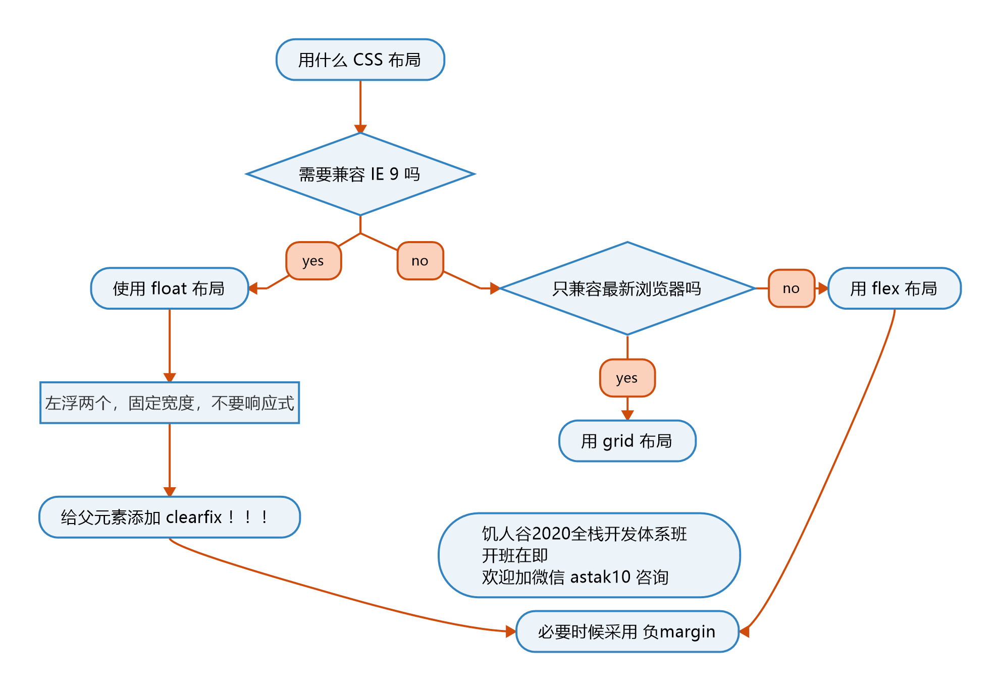
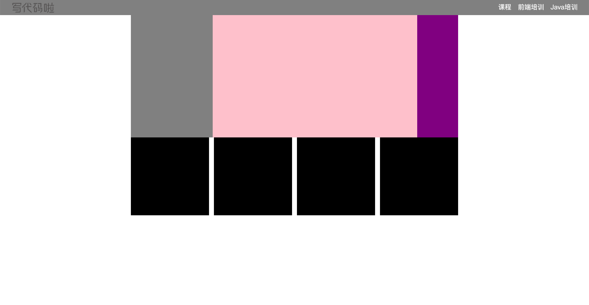

# CSS布局

## 布局分类

**固定宽度布局**

* 一般宽度为960/1000/1024px

**不固定宽度布局**

* 主要依靠文档流的原理来进行布局
* 文档流本身就是自适应的

**响应式布局**

* 在pc上固定宽度，在手机上不固定宽度
* 也就是一种混合布局

## 布局的思路

* 从大到小
* 从小到大（新手）

## 三种布局属性



>  示意图来自于[饥人谷](https://xiedaimala.com/courses/16644d89-6b17-4c2f-ac15-dabb994b7696/random/d6c7b79e0d#/common)


## float布局

* 在子元素上加`float: left`和`width` 

* 在父元素上加`.clearfix` 清除浮动

  ```css
  .claerfix:after{
      content: '';
      display: block;
      clear: both;
  }
  ```


**经验之谈：**

* 一行内最后一个盒子会留一些空间或者最后一个不设置`width`

* 不需要做响应式，因为手机上没有IE，而这个布局是专门为IE准备的

* IE6/7会出现双倍`margin`的情况

  ```css
  margin-left: 10px
  _margin-left: 5px;
  /*IE6/7能识别后面这个属性，由于层叠性，后面会覆盖前面*/
  ```


### 实践不同的布局

> 有时候`border`会影响你页面宽度，这个时候使用`outline`进行调试

* 两栏布局
* 三栏布局
* 四栏布局
* 平均布局


```html
<!DOCTYPE html>
<html lang="en">
<head>
    <meta charset="UTF-8">
    <meta name="viewport" content="width=device-width, initial-scale=1.0">
    <title>Document</title>

    <style>

        * {
            margin:0;
            padding: 0;
            box-sizing: border-box;
            list-style: none;
        }

        .clearfix::after {
            content: '';
            display: block;
            clear: both;
        }


        header {
            background-color: grey;
        }

        header > .logo {
            float: left;
            margin-top: 8px;
            margin-left: 30px;
        }

        header > .logo >img {
            height: 26px;
        }


        header > .nav {
            float: right;
            margin-right: 20px;
            /* border: 1px solid green; */
        }

        header > .nav > li {
            float: left;
            line-height: 30px;
            padding: 4px .5em;
            color: white;
            /* border: 1px solid red; */
        }

        .content {
            margin-left: auto;
            margin-right: auto;
            width: 800px;
            /* border: 1px solid red; */
        }

        .content > aside {
            float: left;
            width: 200px;
            height: 300px;
            background-color: grey;
        }

        .content > main {
            float: left;
            width: 500px;
            height: 300px;
            background-color: pink;
        }

        .content > .adv {
            float: left;
            width: 100px;
            height: 300px;
            background-color: purple;
        }

        .image-list {
            
            /* border: 1px solid green; */
            width: 800px;
            margin-left: auto;
            margin-right: auto;

        }

        .image-list > .x {

            margin-right: -12px;

        }

        .image-list > .x > .img {
            float: left;
            width: 191px;
            height: 191px;
            /* border: 1px solid red; */
            background-color: black;

            margin-right: 12px;
        }


    </style>

</head>

<body>

    <header class="clearfix">

        <div class="logo">
            
        </div>
        

        <ul class="nav clearfix">

            <li>课程</li>
            <li>前端培训</li>
            <li>Java培训</li>

        </ul>

    </header>

    <div class="content clearfix">

        <aside>

        </aside>

        <main></main>

        <div class="adv"></div>

    </div>


    <div class="image-list">

        <div class="x clearfix">
            <div class="img"></div>
            <div class="img"></div>
            <div class="img"></div>
            <div class="img"></div>
        </div>

    </div>


    <footer></footer>

    
</body>
</html>
```

实现效果



## flex布局

### **container** 容器

* 让一个元素变成flex容器，此时盒子里面是`flex flow`而不是` normal flow`

  ```css
  .container{
      
      display: flex; /* or inline-flex*/
      
  }
  ```

* 改变flex盒子内部，items流动方式（主轴）

  ```css
  .container{
      
      display: flex;
      flex-direction: row | row-reverse | column | column-reverse;
      
  }
  ```

  

* 改变折行

  ```css
  .container{
      
      display: flex;
      flex-warp: nowrap | wrap | wrap-reverse;
      
  }
  ```

  

* 主轴对齐方式

  ```css
  .container{
      
      display: flex;
      justify-content: flex-start | flex-end | center | space-between | space-around | space-evenly;
      
  }
  ```

  

* 次轴对其方式

  ```css
  .container{
      
      display: flex;
   	align-items: stretch | flex-start | flex-end | center | baseline;       
      
  }
  ```

  


### **items** 项目

* `order : number`属性，可以在items上面加`order`改变其排列顺序

  `order`值小的先出现。

  ```css
  .item {
    order: 5; /* default is 0 */
  }
  ```

  

  

* `flex-grow : number`属性，可以将`container`中多余的空间按照比例分配给不同的`items`

  ```css
  .item {w
    flex-grow: 4; /* default 0 */
  }
  ```

  

* `flex-shrink : number`属性，当空间不够的时候，`items` 缩小空间的比例

  设置为`flex-shrink : 0`的时候就是不会变下

  ```css
  .item {
    flex-shrink: 3; /* default 1 */
  }
  ```

* `flex-self: xxx` 单独控制这个`items`的排列方式

  ```css
  .item {
    align-self: auto | flex-start | flex-end | center | baseline | stretch;
  }
  ```

  


