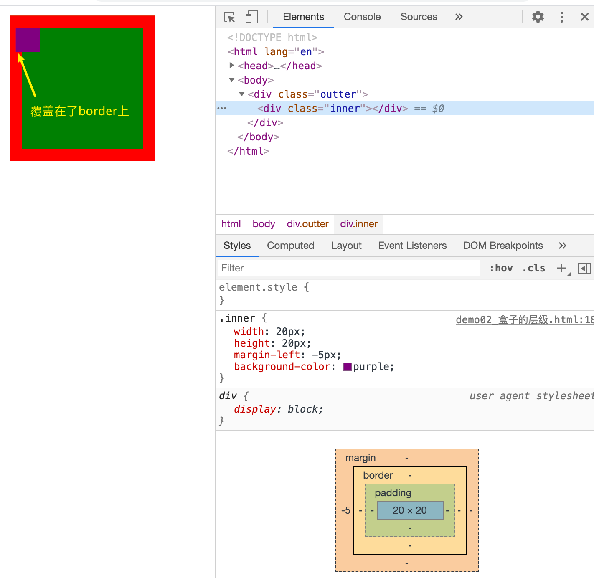
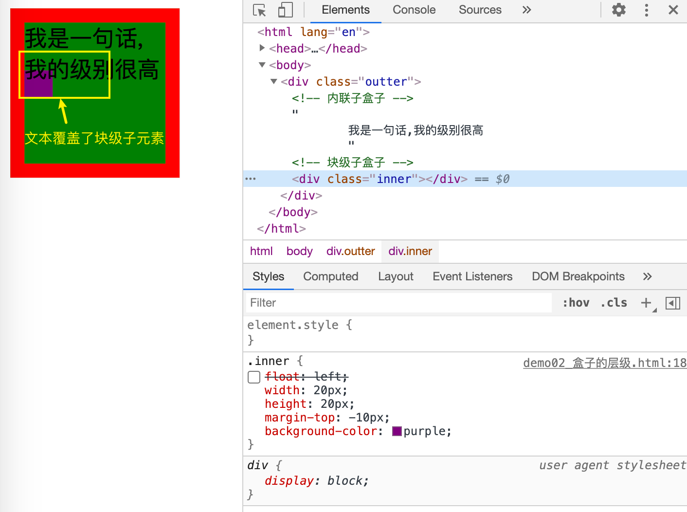
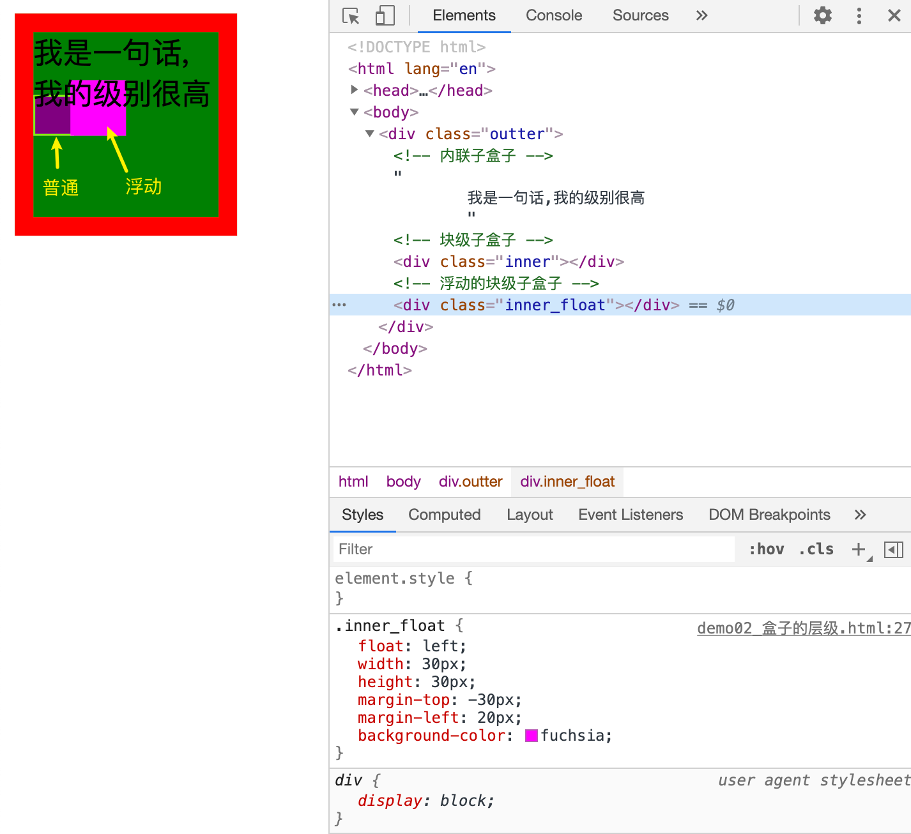
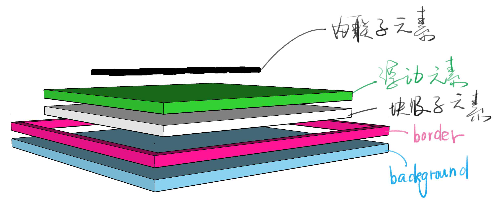
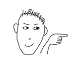
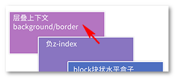

# 定位


## 布局和定位的区别

* 布局是屏幕平面上的

* 定位是垂直于屏幕的


## position

**属性：**

* `position : static` 默认
* `postion : relative` 相对定位
* `position : absolute` 绝对定位
* `position : fixed` 固定定位
* `position: sticky` 粘滞定位

### static

一个元素默认就是这种定位，不管你写没写。

它一直呆在文档流里面不带变的。

### relative

相对定位，并不会脱离文档流（也就是说，它还会在原来的位置，其他元素来到他的位置会被它盖住）

但是他在盒子中的层级会提高（后面说层级）

### absolute

绝对定位，脱离文档流，定位的基准是祖先里面的非`static`元素

### fix

固定布局，定位基准是viewport（视窗 ）

### sticty

粘滞定位，兼容性不好，就是那种导航栏的感觉。正常能看见他的时候他在文档流里面，但是将要看不到他的时候，他就会固定在最上方


## 文档流和盒子模型


**问题引入：**

`background`的范围是从哪里到哪里的？

* `content-box`的情况下

  ```css
  <style>
          div {
          /* box-sizing: border-box; */
          border: 10px solid rgba(255, 0, 0, 1);
          width: 100px;
          height: 100px;
          background-color: blue;
      }
  </style>
  ```
  
  ```html
  <body>
      <div>
      </div>
  </body>
  ```
  
  我们在Chrome的调试工具中调试这个透明度（选中数值，按`option + 方向键↓`可以让数值一点一点下降）
  
  
  
* `border-box`的情况

  ```css
  <style>
          div {
          box-sizing: border-box;
          border: 10px solid rgba(255, 0, 0, 1);
          width: 100px;
          height: 100px;
          background-color: blue;
      }
  </style>
  ```

  

  由此得出**背景的范围是从`border`外部开始的，`background`包括了`border`**

  从三维的角度看，`border`覆盖在`background`上面


## 层叠上下文

### 一个普通div的层级

由上面的例子可以知道，在一个普通的盒子里面他的`border`和`background`是有摆放顺序的。

但是对于我们用户来说，我们只能看到一个平面。

我们可以通过测试得出一个普通的盒子的层级

* 根据上面的例子，我们已经知道了，`border`是在`background`上面的。


**块级子盒子和`border`谁在上谁在下？**

```CSS
<style>

    .outter{
        width: 100px;
        height: 100px;

        border: 10px solid red;
        background-color: green;
    }

    .inner {
        width: 20px;
        height: 20px;
        /* 让块级子盒子移动到border上 */
        margin-left: -5px;
        background-color: purple;
    }

</style>
```

```html
<body>
    <div class="outter">
        <!-- 块级子盒子 -->
        <div class="inner"></div>
    </div>
</body>
```

结果如图所示，块级子盒子能够压住`border`，而`background`肯定也是覆盖在上面了。




**接下来我们再来看看内联子盒子（文字）与块级子盒子的关系**

```css
<style>
    .outter{
        width: 100px;
        height: 100px;

        border: 10px solid red;
        background-color: green;
    }
    .inner {
        width: 20px;
        height: 20px;
        margin-top: -10px;
        background-color: purple;
    }
</style>
```

```html
<body>
    <div class="outter">
         <!-- 内联子盒子 -->
        我是一句话,我的级别很高
        <!-- 块级子盒子 -->
        <div class="inner"></div>
    </div>
</body>
```

效果如图所示，内联子元素肯定是比块级子元素的层级高的



最后我们在对比一下，浮动的块级子元素，普通的块级子元素和内联子元素

```css
<style>
    .outter{
        width: 100px;
        height: 100px;

        border: 10px solid red;
        background-color: green;
    }

    .inner {
        width: 20px;
        height: 20px;
        margin-top: -10px;
        background-color: purple;
        border: 1px solid chartreuse;
    }

    .inner_float {
        float: left;
        width: 30px;
        height: 30px;
        margin-top: -30px;
        margin-left: 20px;
        background-color:fuchsia;
    }
</style>
```

```html
<body>
    <div class="outter">
         <!-- 内联子盒子 -->
        我是一句话,我的级别很高
        <!-- 块级子盒子 -->
        <div class="inner"></div>
        <!-- 浮动的块级子盒子 -->
        <div class="inner_float"></div>
    </div>
</body>
```

效果图如下，我给普通的盒子加上了绿色的边框，这样我们可以发现`float`的子盒子会盖住普通的子盒子，但是无法盖住内联子盒子。




**现在我们就可以对普通的盒子进行一个总结了**

对于一个普通的盒子来说，层级是这样的

`内联元素（文本）= inline-block > 浮动的块级子元素 > 普通的块级子元素 > border > background`

立体的图像如下图所示：



> 图片来自饥人谷


为什么内联子元素的层级会比块级和浮动高呢？

张鑫旭老师这有个很好的说法。

> 诸如`border`/`background`一般为装饰属性，而浮动和块状元素一般用作布局，而内联元素都是内容。网页中最重要的是什么？当然是内容了哈，对不对！
>
> 因此，一定要让内容的层叠顺序相当高，当发生层叠是很好，重要的文字啊图片内容可以优先暴露在屏幕上。


我们其实已经有了一个大概的层级概念，但是目前还是不够完整，所以我们通过张鑫旭的博客来完整的了解下层叠上下文以及层级

### 张鑫旭的层叠上下文博客

> 该部分引用张鑫旭的[博客内容](https://www.zhangxinxu.com/wordpress/2016/01/understand-css-stacking-context-order-z-index/?shrink=1)
>
> ### 一、什么是层叠上下文
>
> 层叠上下文，英文称作”stacking context”. 是HTML中的一个三维的概念。如果一个元素含有层叠上下文，我们可以理解为这个元素在z轴上就“高人一等”。
>
> 这里出现了一个名词-**z轴**，指的是什么呢？
>
> 表示的是用户与屏幕的这条看不见的垂直线（参见下图示意-红线）：
> 
>
> 层叠上下文是一个概念，跟「[块状格式化上下文(BFC)](http://www.zhangxinxu.com/wordpress/?p=4588)」类似。然而，概念这个东西是比较虚比较抽象的，要想轻松理解，我们需要将其具象化。
>
> 怎么个具象化法呢？
>
> 你可以**把「层叠上下文」理解为当官**：网页中有很多很多的元素，我们可以看成是真实世界的芸芸众生。真实世界里，我们大多数人是普通老百姓们，还有一部分人是做官的官员。OK，这里的“官员”就可以理解为网页中的层叠上下文元素。
>
> 换句话说，页面中的元素有了层叠上下文，就好比我们普通老百姓当了官，一旦当了官，相比普通老百姓而言，离皇帝更近了，对不对，就等同于网页中元素级别更高，离我们用户更近了。
>
> 
>
> ### 二、什么是层叠水平
>
> 再来说说层叠水平。“层叠水平”英文称作”stacking level”，决定了同一个层叠上下文中元素在z轴上的显示顺序。level这个词很容易让我们联想到我们真正世界中的三六九等、论资排辈。真实世界中，每个人都是独立的个体，包括同卵双胞胎，有差异就有区分。例如，双胞胎虽然长得像Ctrl+C/Ctrl+V得到的，但实际上，出生时间还是有先后顺序的，先出生的那个就大，大哥或大姐。网页中的元素也是如此，页面中的每个元素都是独立的个体，他们一定是会有一个类似的排名排序的情况存在。而这个排名排序、论资排辈就是我们这里所说的“层叠水平”。层叠上下文元素的层叠水平可以理解为官员的职级，1品2品，县长省长之类；对于普通元素，这个嘛……你自己随意理解。
>
> 于是，显而易见，所有的元素都有层叠水平，包括层叠上下文元素，层叠上下文元素的层叠水平可以理解为官员的职级，1品2品，县长省长之类。然后，对于普通元素的层叠水平，我们的探讨仅仅局限在当前层叠上下文元素中。为什么呢？因为否则没有意义。
>
> 这么理解吧~ 上面提过元素具有层叠上下文好比当官，大家都知道的，这当官的家里都有丫鬟啊保镖啊管家啊什么的。所谓打狗看主人，A官员家里的管家和B官员家里的管家做PK实际上是没有意义的，因为他们牛不牛逼完全由他们的主子决定的。一人得道鸡犬升天，你说这和珅家里的管家和七侠镇娄知县县令家里的管家有可比性吗？李总理的秘书是不是分分钟灭了你村支部书记的秘书（如果有）。
>
> 翻译成术语就是：普通元素的层叠水平优先由层叠上下文决定，因此，层叠水平的比较只有在当前层叠上下文元素中才有意义。
>
> 
>
> 需要注意的是，诸位千万不要把层叠水平和CSS的z-index属性混为一谈。没错，某些情况下z-index确实可以影响层叠水平，但是，只限于定位元素以及flex盒子的孩子元素；而层叠水平所有的元素都存在。
>
> ### 三、什么是层叠顺序
>
> 再来说说层叠顺序。“层叠顺序”英文称作”stacking order”. 表示元素发生层叠时候有着特定的垂直显示顺序，注意，这里跟上面两个不一样，上面的**层叠上下文和层叠水平是概念**，而这里的**层叠顺序是规则**。
>
> 在CSS2.1的年代，在CSS3还没有出现的时候（注意这里的前提），层叠顺序规则遵循下面这张图：
> 
>
> 有人可能有见过类似图，那个图是很多很多年前老外绘制的，英文内容。而是更关键的是国内估计没有同行进行过验证与实践，实际上很多关键信息缺失。上面是我自己手动重绘的中文版同时补充很多其他地方绝对没有的重要知识信息。如果想要无水印高清大图，点击这里购买(0.5元)。
>
> 缺失的关键信息包括：
>
> 1. 位于最低水平的`border`/`background`指的是层叠上下文元素的边框和背景色。每一个层叠顺序规则适用于一个完整的层叠上下文元素。
> 2. 原图没有呈现inline-block的层叠顺序，实际上，inline-block和inline水平元素是同等level级别。
> 3. z-index:0实际上和z-index:auto单纯从层叠水平上看，是可以看成是一样的。注意这里的措辞——“单纯从层叠水平上看”，实际上，两者在层叠上下文领域有着根本性的差异。
>
> 下面我要向大家发问了，大家有没有想过，为什么内联元素的层叠顺序要比浮动元素和块状元素都高？
> 
>
> 为什么呢？我明明感觉浮动元素和块状元素要更屌一点啊。
>
> 嘿嘿嘿，我就不卖关子了，直接看下图的标注说明：
> 
>
> 诸如`border`/`background`一般为装饰属性，而浮动和块状元素一般用作布局，而内联元素都是内容。网页中最重要的是什么？当然是内容了哈，对不对！
>
> 因此，一定要让内容的层叠顺序相当高，当发生层叠是很好，重要的文字啊图片内容可以优先暴露在屏幕上。例如，文字和浮动图片重叠的时候：
>
> 
>
> 上面说的这些层叠顺序规则还是老时代的，如果把CSS3也牵扯进来，科科，事情就不一样了。
>
> ### 四、务必牢记的层叠准则
>
> 下面这两个是层叠领域的黄金准则。当元素发生层叠的时候，其覆盖关系遵循下面2个准则：
>
> 1. **谁大谁上：**当具有明显的层叠水平标示的时候，如识别的z-indx值，在同一个层叠上下文领域，层叠水平值大的那一个覆盖小的那一个。通俗讲就是官大的压死官小的。
> 2. **后来居上：**当元素的层叠水平一致、层叠顺序相同的时候，在DOM流中处于后面的元素会覆盖前面的元素。
>
> 在CSS和HTML领域，只要元素发生了重叠，都离不开上面这两个黄金准则。因为后面会有多个实例说明，这里就到此为止。
>
> ### 五、层叠上下文的特性
>
> 层叠上下文元素有如下特性：
>
> - 层叠上下文的层叠水平要比普通元素高（原因后面会说明）；
> - 层叠上下文可以阻断元素的混合模式（见[此文第二部分说明](http://www.zhangxinxu.com/wordpress/?p=5155)）；
> - 层叠上下文可以嵌套，内部层叠上下文及其所有子元素均受制于外部的层叠上下文。
> - 每个层叠上下文和兄弟元素独立，也就是当进行层叠变化或渲染的时候，只需要考虑后代元素。
> - 每个层叠上下文是自成体系的，当元素发生层叠的时候，整个元素被认为是在父层叠上下文的层叠顺序中。
>
> 翻译成真实世界语言就是：
>
> - 当官的比老百姓更有机会面见圣上；
> - 领导下去考察，会被当地官员阻隔只看到繁荣看不到真实民情；
> - 一个家里，爸爸可以当官，孩子也是可以同时当官的。但是，孩子这个官要受爸爸控制。
> - 自己当官，兄弟不占光。有什么福利或者变故只会影响自己的孩子们。
> - 每个当官的都有属于自己的小团体，当家眷管家发生摩擦磕碰的时候（包括和其他官员的家眷管家），都是要优先看当官的也就是主子的脸色。
>
> ### 六、层叠上下文的创建
>
> 卖了这么多文字，到底层叠上下文是个什么鬼，倒是拿出来瞅瞅啊！
>
> 哈哈。如同块状格式化上下文，层叠上下文也基本上是有一些特定的CSS属性创建的。我将其总结为3个流派，也就是做官的3种途径：
>
> 1. **皇亲国戚**派：页面根元素天生具有层叠上下文，称之为“根层叠上下文”。
> 2. **科考入选**派：z-index值为数值的定位元素的传统层叠上下文。
> 3. **其他当官途径**：其他CSS3属性。
>
> //zxx: 下面很多例子是实时CSS效果，建议您去[原地址浏览](http://www.zhangxinxu.com/wordpress/?p=5115)，以便预览更准确的效果。
>
> **①. 根层叠上下文**
> 指的是页面根元素，也就是滚动条的默认的始作俑者`<html>`元素。这就是为什么，绝对定位元素在`left`/`top`等值定位的时候，如果没有其他定位元素限制，会相对浏览器窗口定位的原因。
>
> **②. 定位元素与传统层叠上下文**
> 对于包含有`position:relative`/`position:absolute`的定位元素，以及FireFox/IE浏览器（不包括Chrome等webkit内核浏览器）（目前，也就是2016年初是这样）下含有`position:fixed`声明的定位元素，当其`z-index`值不是`auto`的时候，会创建层叠上下文。
>
> 后面还有张鑫旭老师举的例子以及加入了css3出现的新情况，这里就不放出来了
>
> by [zhangxinxu](http://www.zhangxinxu.com/) from [http://www.zhangxinxu.com](http://www.zhangxinxu.com/)
> 本文地址：http://www.zhangxinxu.com/wordpress/?p=5115


在他的博客中，这个例子我无法理解（解释无法理解，我认为还要加一层）。


> **1. display:flex|inline-flex与层叠上下文**
> 注意，这里的规则有些~~负责~~复杂。要满足两个条件才能形成层叠上下文：条件1是父级需要是`display:flex`或者`display:inline-flex`水平，条件2是子元素的z-index不是`auto`，必须是数值。此时，这个子元素为层叠上下文元素，没错，注意了，是子元素，不是flex父级元素。
>
> 眼见为实，给大家上例子吧。
>
> 如下HTML和CSS代码：
>
> ```
> <div class="box">
>     <div>
>     	
>     </div>
> </div>
> .box {  }
> .box > div { background-color: blue; z-index: 1; }    /* 此时该div是普通元素，z-index无效 */
> .box > div > img { 
>   position: relative; z-index: -1; right: -150px;     /* 注意这里是负值z-index */
> }
> ```
>
> 结果如下：
>
> 
>
> 会发现，妹子跑到蓝色背景的下面了。为什么呢？层叠顺序图可以找到答案，如下：
> 
>
> 从上图可以看出负值z-index的层叠顺序在block水平元素的下面，而蓝色背景`div`元素是个普通元素，因此，妹子直接穿越过去，在蓝色背景后面的显示了。
>
> 现在，我们CSS微调下，增加`display:flex`, 如下：
>
> ```
> .box { display: flex; }
> .box > div { background-color: blue; z-index: 1; }    /* 此时该div是层叠上下文元素，同时z-index生效 */
> .box > div > img { 
>   position: relative; z-index: -1; right: -150px;     /* 注意这里是负值z-index */
> }
> ```
>
> 结果：
>
> 
>
> 会发现，妹子在蓝色背景上面显示了，为什么呢？层叠顺序图可以找到答案，如下：
> 
>
> 从上图可以看出负值`z-index`的层叠顺序在当前第一个父层叠上下文元素的上面，而此时，那个`z-index`值为`1`的蓝色背景`<div>`的父元素的`display`值是`flex`，一下子升官发财变成层叠上下文元素了，于是，图片在蓝色背景上面显示了。这个现象也证实了层叠上下文元素是`flex`子元素，而不是`flex`容器元素。
>
> 另外，另外，这个例子也颠覆了我们传统的对`z-index`的理解。在CSS2.1时代，`z-index`属性必须和定位元素一起使用才有作用，但是，在CSS3的世界里，非定位元素也能和`z-index`愉快地搞基。


