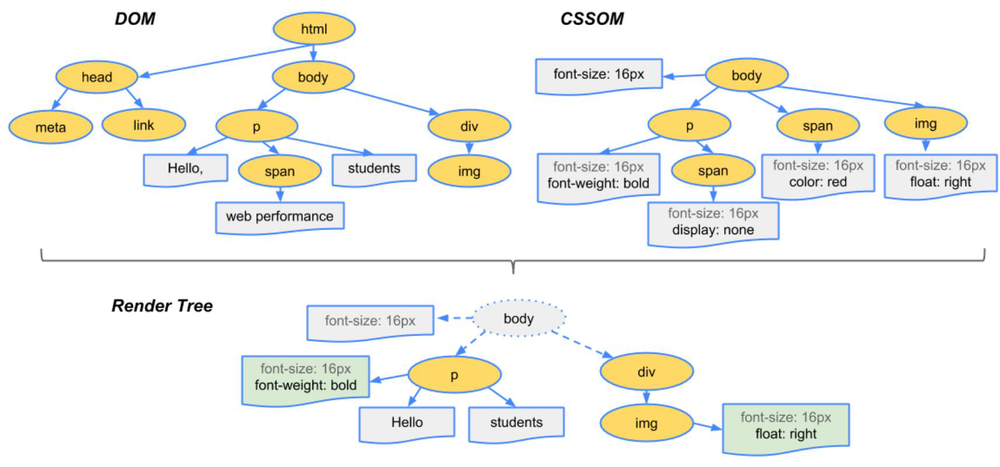

# 动画

## 浏览器渲染步骤

* 首先创建一个html的树（dom树）
* 根据CSS构建CSS树（CSSOM树）
* 将两棵树合并成一颗渲染树（render tree）
* Layout布局（文档流，盒模型，计算大小和位置）
* Paint绘制（把边框颜色，文字颜色，阴影等画出来）
* composite合成（将不同层级的部分合成为一层）



## 如何更新样式

一般使用js来更新样式

* `div.classList.add('red')`
* `div.remove()`直接删掉节点（dom节点）

## 更新样式的步骤


* 第一种：重排

  `div.remove()` 直接将`div`移出`dom`树，这样就会导致布局改变，因此后面的都要重新布局

* 第二种：重绘

  改变背景颜色，这种将跳过布局阶段，重新上色并且合成

* 第三种：

  改变`transform`， 这种只需要重新合成。

[bilibili有个视频较为完整的讲解了浏览器渲染页面的机制](https://www.bilibili.com/video/BV1x54y1B7RE)


> [csstriggers](https://csstriggers.com/)记录了不同属性在不同的浏览器中渲染所需要的步骤


## 如何优化浏览器渲染

Google官方文档——[渲染性能](https://developers.google.com/web/fundamentals/performance/rendering)


## transform的完整语法

### 四个常用属性

* 位移`translate`
* 缩放`scale`
* 旋转`rotate`
* 倾斜`skew`

> **经验之谈：**
>
> 这几个属性一般都与`transition`（过渡）配合使用
>
> `inline`元素不支持过渡，所以需要将其转换为`block`

> **小技巧：使用绝对定位与translate(-50%, -50%)实现水平垂直居中**
>
> ```css
>     <style>
> 
>         .outter{
>             position: relative;
>             height: 500px;
>             width: 500px;
>             border: 1px solid red;
>         }
> 
>         .inner{
>             position: absolute;
>             height: 20px;
>             width: 20px;
> 			/* 关键 */
>             left: 50%;
>             top: 50%;
>             transform: translate(-50%, -50%);
>             /* 关键 */
>             background-color: red;
>         }
> 
>     </style>
> ```
>
> ```html
> <body> 
>     <div class="outter">
>         <div class="inner"></div>
>     </div>
> </body>
> ```


## transition

[`transition`](https://developer.mozilla.org/zh-CN/docs/Web/CSS/transition)是一个简写属性，他包括以下四种属性：

*  [`transition-property`](https://developer.mozilla.org/zh-CN/docs/Web/CSS/transition-property)  需要使用过渡的属性，默认值`all`：所有属性都应用过渡
* [`transition-duration`](https://developer.mozilla.org/zh-CN/docs/Web/CSS/transition-duration) 过渡持续的时间，单位秒或者毫秒都行，`0.3`可以表示为`.3`
* [`transition-timing-function`](https://developer.mozilla.org/zh-CN/docs/Web/CSS/transition-timing-function) 变换速度，比如说可以设置匀速变换。
*  [`transition-delay`](https://developer.mozilla.org/zh-CN/docs/Web/CSS/transition-delay) 延迟，延迟几秒才开始执行过渡

> 具体的使用方法和相关注意查阅MDN

> 经验之谈：
>
> 并不是所有属性都能使用过渡
>
> `display:none => block`无法过渡
>
> 一般使用`visibility:hedden => visible`
>
> * `display`与`visibility`的区别
>
>   [张鑫旭的博客有一篇相关的介绍](https://www.zhangxinxu.com/wordpress/2012/02/css-overflow-hidden-visibility-hidden-disabled-use/)


## animation

`animation`也是一堆属性的简写，它的属性包括：

* [`animation-name`](https://developer.mozilla.org/zh-CN/docs/Web/CSS/animation-name) keyframe的名字
* [`animation-duration`](https://developer.mozilla.org/zh-CN/docs/Web/CSS/animation-duration) 动画持续的时间
* [`animation-timing-function`](https://developer.mozilla.org/zh-CN/docs/Web/CSS/animation-timing-function) 变化曲线
* [`animation-delay`](https://developer.mozilla.org/zh-CN/docs/Web/CSS/animation-delay) 时间延迟
* [`animation-iteration-count`](https://developer.mozilla.org/zh-CN/docs/Web/CSS/animation-iteration-count) 定义动画在结束前运行的次数
* [`animation-direction`](https://developer.mozilla.org/zh-CN/docs/Web/CSS/animation-direction) 动画运行的方向
* [`animation-fill-mode`](https://developer.mozilla.org/zh-CN/docs/Web/CSS/animation-fill-mode) 设置CSS动画在执行之前和之后如何将样式应用于其目标。
* [`animation-play-state`](https://developer.mozilla.org/zh-CN/docs/Web/CSS/animation-play-state) 属性定义一个动画是否运行或者暂停。

还是那句忠告上MDN，很详细


### key frames

`@keyframes` 关键帧。所谓关键帧就是在这一帧动画将会出现变化的帧。

```css
@keyframes slidein {
  from {
    transform: translateX(0%); 
  }

  to {
    transform: translateX(100%);
  }
}

/* 还可以使用百分号在不同的时间点定义多个不同的关键帧数 */

@keyframes identifier {
  0% { top: 0; left: 0; }
  30% { top: 50px; }
  68%, 72% { left: 50px; }
  100% { top: 100px; left: 100%; }
}
```


## 感想

这里的笔记做的再好也没有MDN给的详细完整，学会查MDN，多动手写CSS才是正道。真要记CSS的笔记还得是布局，一些抽象的概念（层叠上下文，BFC这种）以及CSS的技巧。

真要学语法还得是我MDN。


