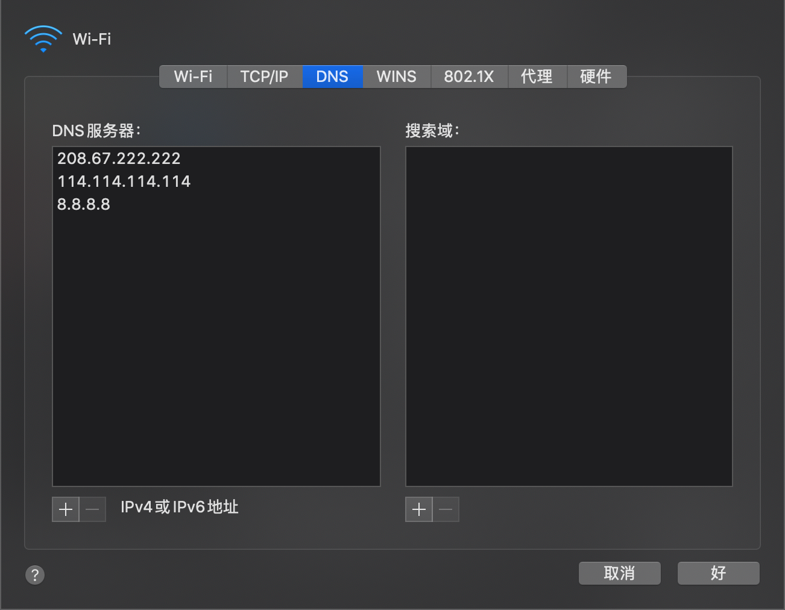
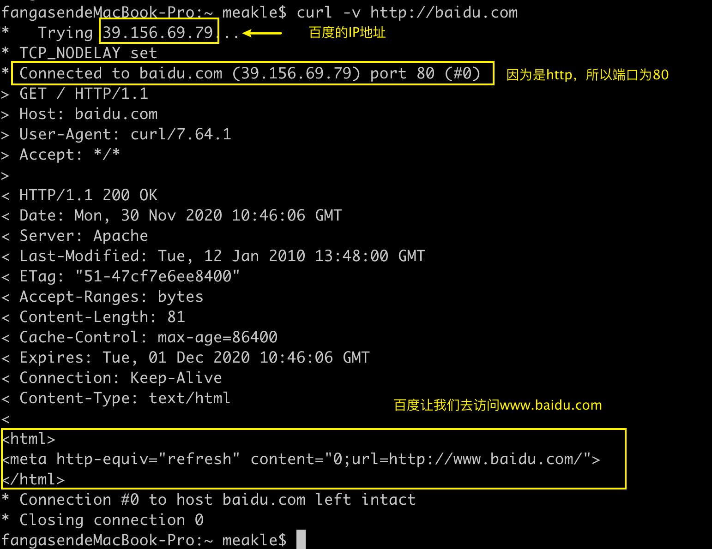

# 浅析URL

## 什么是URL

> **统一资源定位符**（英语：**U**niform **R**esource **L**ocator，缩写：**URL**；或称**统一资源定位器**、**定位地址**、**URL地址**[[1\]](https://zh.wikipedia.org/wiki/统一资源定位符#cite_note-1)，俗称**网页地址**或简称**网址**）是[因特网](https://zh.wikipedia.org/wiki/因特网)上标准的资源的地址（Address），如同在网络上的门牌。
>
> 统一资源定位符的标准格式如下：
>
> > [协议类型]: //服务器地址:端口号/资源层级UNIX文件路径文件名?查询#片段ID
>
> 统一资源定位符的完整格式如下：
>
> > [协议类型]: //访问资源需要的凭证信息@服务器地址:端口号/资源层级UNIX文件路径文件名?查询#片段ID
>
> 其中[访问凭证信息]、[端口号]、[查询]、[片段ID]都属于选填项。
>
> ——[wiki](https://zh.wikipedia.org/wiki/%E7%BB%9F%E4%B8%80%E8%B5%84%E6%BA%90%E5%AE%9A%E4%BD%8D%E7%AC%A6)


一个简单的例子：

`https://developer.mozilla.org/zh-CN/docs/Learn/Common_questions/What_is_a_URL`

* 协议类型：`https` 

* 服务器地址：`developer.mozilla.org`

* 端口号：这里省略了`443`

  完整版：`https://developer.mozilla.org:443/zh-CN/docs/Learn/Common_questions/What_is_a_URL`

  将完整版输入到浏览器中得到的结果是一样的。

* 资源层级UNIX文件路径文件名`/zh-CN/docs/Learn/Common_questions/What_is_a_URL`

* 查询和片段ID都省略了。

  * 如果你想在一个页面显示出不同的内容可以用查询

    `baidu.com/s?wd=url`

    `baidu.com/s?wd=http`

  * 如果你想在同一个页面的不同位置可以用片段ID （锚点）

    `https://developer.mozilla.org/zh-CN/docs/Web/CSS#%E5%8F%82%E8%80%83%E4%B9%A6`

    `https://developer.mozilla.org/zh-CN/docs/Web/CSS#%E5%8F%82%E8%80%83`

    `#`后面长得很像乱码的就是锚点的ID


这就是一个URL的组成，然后我们再逐个分析它所包含的部分。


> 更加完整的参考
>
> [MDN——什么是URL](https://developer.mozilla.org/zh-CN/docs/Learn/Common_questions/What_is_a_URL)


## 什么是IP地址

首先我们了解下什么是IP——**Internet protocol ： 网络协议**

**IP地址**（英语：IP Address，全称Internet Protocol Address），又译为**网际协议地址**、**互联网协议地址**。当设备连接网络，设备将被分配一个IP地址，用作标识。通过IP地址，设备间可以互相通讯，如果没有IP地址，我们将无法知道哪个设备是发送方，无法知道哪个是接收方。


IP的两个作用

* 标志主机，告诉别人我是谁
* 网络寻址


**IP分为内网和外网**

我们先来将内网，当你的设备连接上你的路由器，这个时候路由器就会分配一个IP地址给你的电脑，当你的手机连接上路由器的时候，路由器会给你的手机一个IP地址。

这里给的两个地址都是路由器分配的，是内网IP。

然后说下外网IP。

一般我们通过路由器来访问网络，当路由器启动的时候，外网会分配一个IP地址给路由器，当你需要从外网下载资源的时候，资源会通过路由器，然后将资源通过内网IP地址寻找用户。


> 图片来自饥人谷

## 口号

用于定位一个设备的服务

几个常用的端口号：

* 80  [超文本传输协议](https://zh.wikipedia.org/wiki/超文本传输协议)（超文本传输协议）或[快速UDP网络连接](https://zh.wikipedia.org/wiki/快速UDP网络连接)- 用于传输网页
* 443 [ 超文本传输安全协议](https://zh.wikipedia.org/wiki/超文本传输安全协议)或[QUIC](https://zh.wikipedia.org/wiki/QUIC)


如果协议用的是`http`那么就是80端口，如果协议用的是`https`那么就是443号端口

一般来说这两种端口号在浏览器的URL栏里面会自动省略

## 域名

域名其实就是对IP的别称


* 一个域名可以对应不同IP
  * 这叫做均衡负载，防止一台机器抗不住
* 一个IP可以对应不同的域名
  * 这叫做共享主机，没钱就这么干


> 顶级域名`.com`
>
> 一级域名`baidu.com`
>
> 二级域名`www.baidu.com`
>
> 二级域名的父域名是`baidu.com`


##  域名和IP是如何对应的

通过**DNS**

DNS：Domain Name System 


通过域名访问某个网站的时候，通过DNS服务器查询域名对应的IP是多少，得到IP之后再访问站点。




## curl命令

可以使用`curl`命令来发送请求

```sh
curl -v http://baidu.com
```




