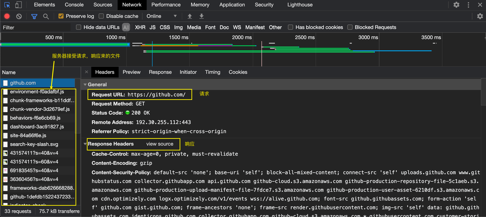
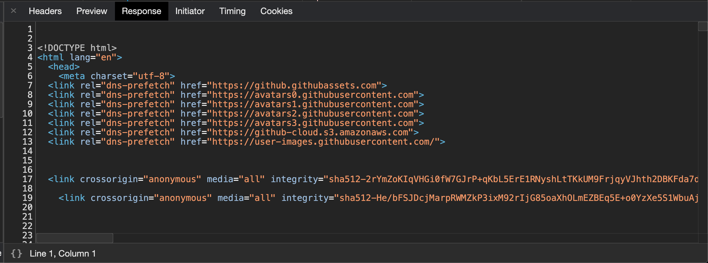
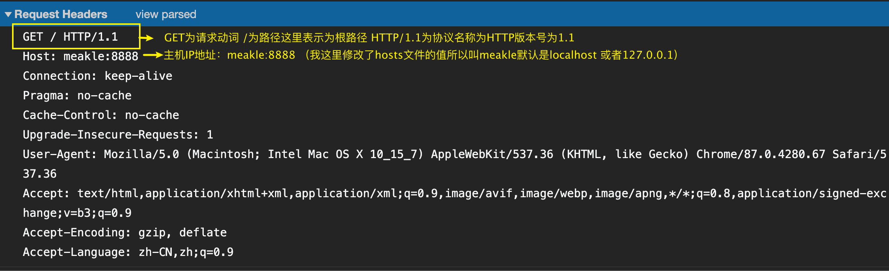
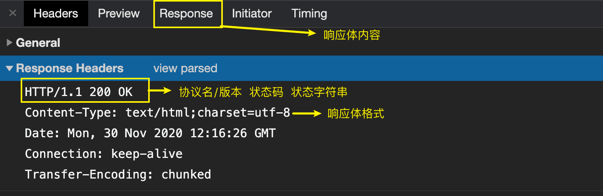
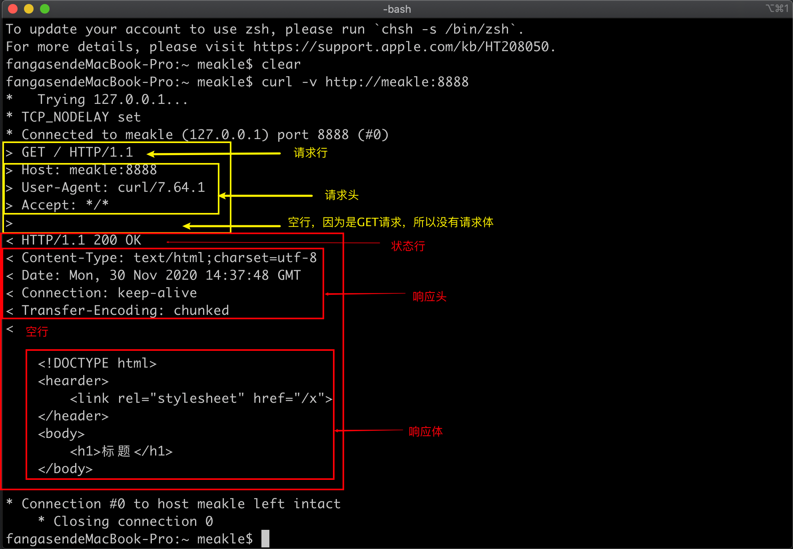
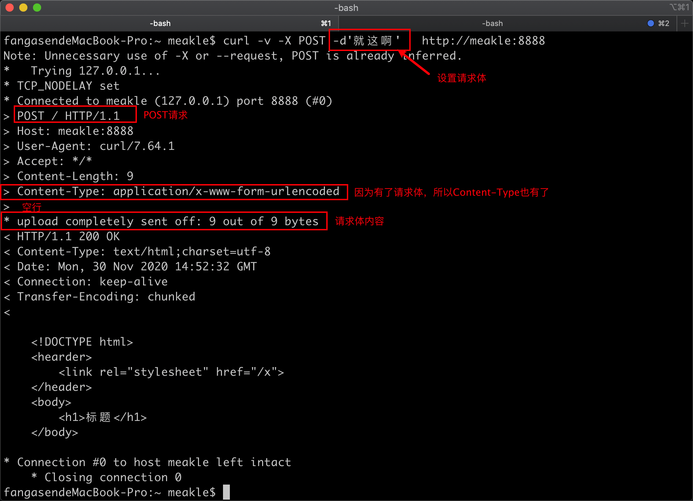

# 请求与响应&&nodejs

## 什么是请求与响应

我们在在客户端发送一个请求（比如说我要访问xxx网站）给服务端，然后服务端将我所请求的资源（xxx网站的内容）发给我（响应给我 ）。

这一整个过程就是请求与响应。

比如我在浏览器输入`github.com`，我们来看看发生了啥






## 如何发送请求

使用用户代理（user agent）发送请求。

* 浏览器
* 终端

发送请求的方法

* 浏览器地址栏
* `curl`命令

## 如何做出一个响应

用户发出请求之后，会通过IP地址找到对应的服务器，然后服务器做出响应，根据请求的路径，响应相对应的状态码和内容并结束响应。然后用户会在他的用户代理上获得服务器发送过来的数据。


## HTTP

### 请求

`请求动词 路径加查询参数 协议名/版本 ` 

三个部分：

```
请求行：`请求动词 路径加查询参数 协议名/版本 `      (PS: 请求动词有`GET/POST/PUT/DELETE`等)
请求头:
host: 域名或IP
accept: text/html
content-type: 请求体格式
<空行>
请求体: 内容
```

* 请求体在`GET`请求中一般是空
* 大小写不敏感




### 响应

```
状态行：协议名/版本 状态码 状态字符串
响应头：
`content-type` ：响应体格式
<空行>
响应体：内容
```




## 用curl构造请求

`curl -v http://localhost:8888`



### 发送POST请求

语法：

* 设置请求动词

  ```
  -X POST
  ```

* 设置路径查询参数，直接在URL后面加

  ```
  http://localhost:8888/?wd=hi
  ```

* 设置请求头

  ```
  -H'key:value'  |  --header'key:value'
  ```

* 设置请求体

  ```
  -d'content'    | --data'content'
  ```




