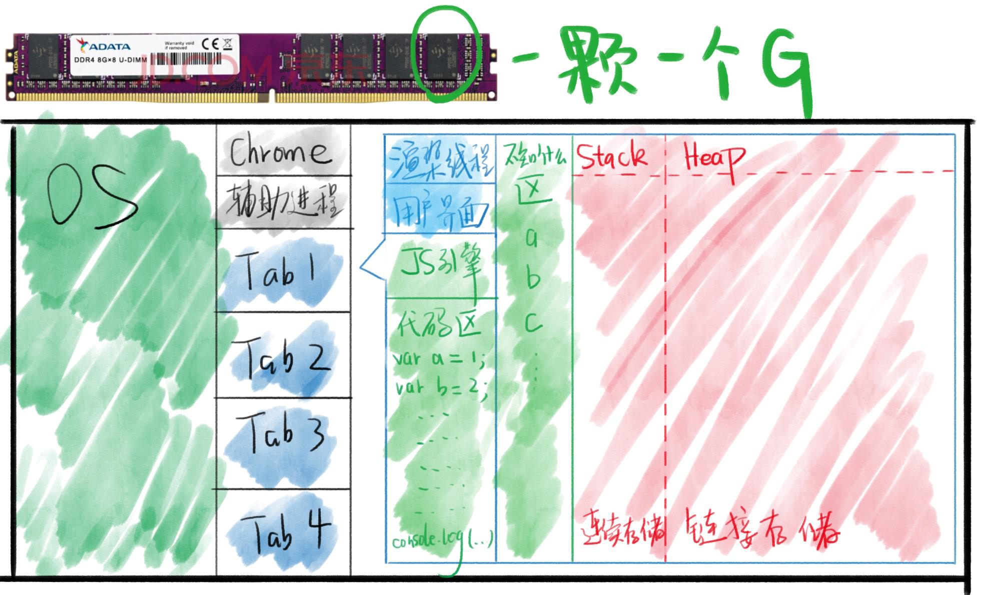
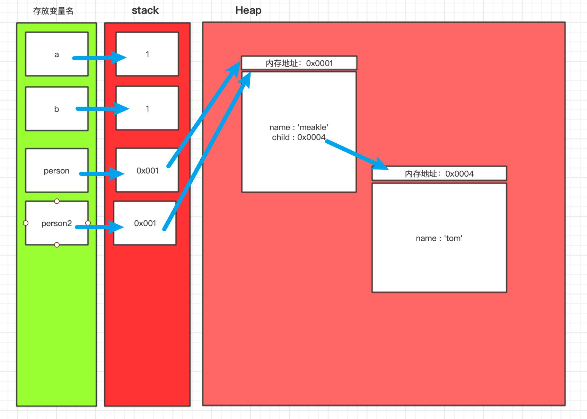
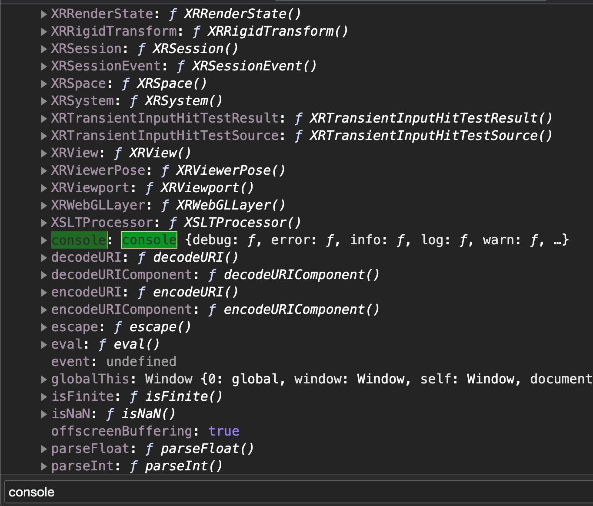
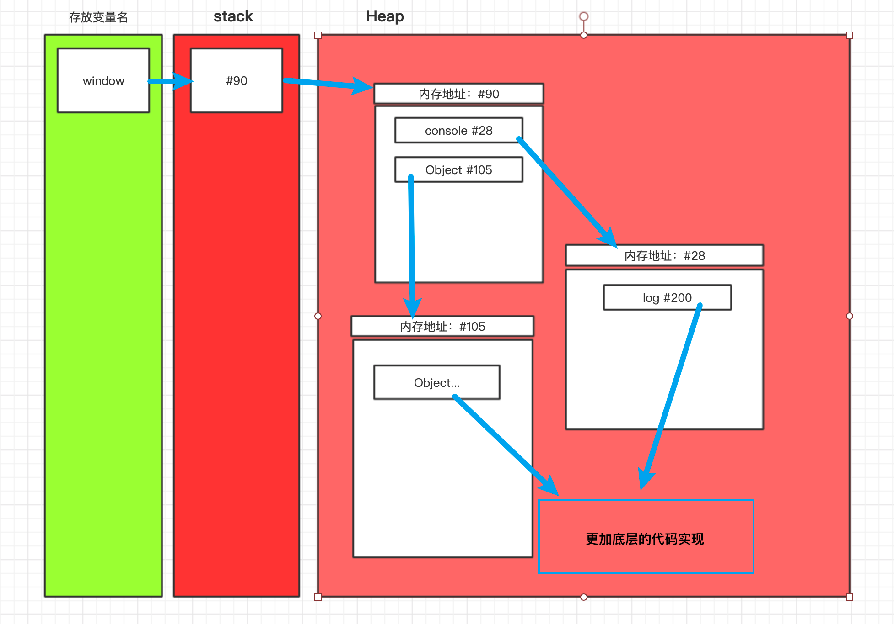
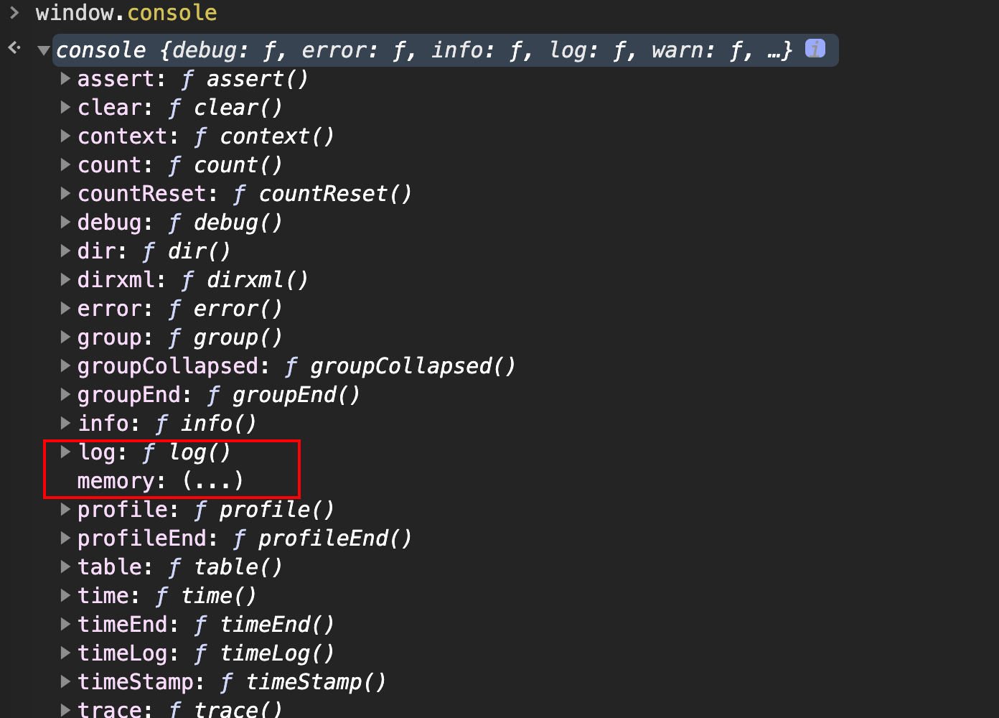
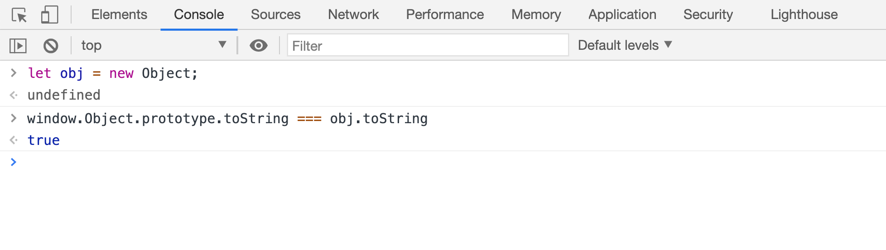
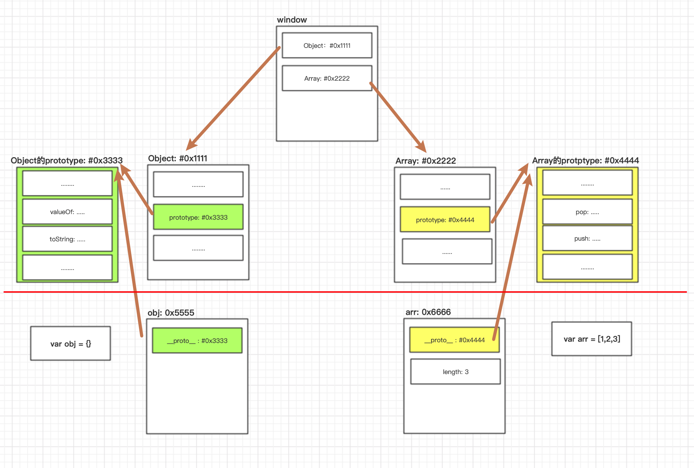

# 内存图与js世界

| 英语             | 翻译      | 英语    | 翻译       |
| ---------------- | --------- | ------- | ---------- |
| operating system | 操作系统  | kernel  | 内核       |
| runtime          | 运行时    | compile | 编译       |
| environment      | 环境，env | memory  | 记忆，存储 |
| person           | 一个人    | people  | 一群人     |


## 浏览器的功能

发起请求

* 下载HTML，解析HTML
* 下载CSS，解析CSS
* 渲染界面
* 下载js，解析js，执行js

功能模块（线程）

* 用户界面
* 渲染引擎
* JS引擎
* 存储

> 跨线程通信：
>
> 我们通过JS改变dom树。为了让效果显示在界面上，JS引擎会与渲染引擎进行通信，并让渲染引擎这个线程渲染出效果。
>
> DOM操作慢：
>
> 因为我们要进行跨线程通信，通信的速度比在同一线程通信要慢。


## JS引擎

### 有哪些JS引擎

* Chrome用的是v8引擎，C++编写
* 网景用的是SpiderMonkey，后来被Firefox使用，C++编写
* Node.js使用的是v8引擎

### 引擎的主要功能

* 编译：将JS代码翻译为机器能够执行的字节码（二进制）或者机器码
* 优化：改写代码，使其更加的高效
* 执行：执行上面的字节码或者机器码
* 垃圾回收：把JS用完的内存回收，方便下一次的使用

## 执行JS代码

### 准备工作

提供API：`window/document/setTimeout`

* 这些个API并不是JS自身具备的功能
* 我们将这些功能称为运行环境`runtime env`
* 一旦将JS放进页面中，就开始执行JS

### 在内存中执行JS代码



> 上图并不完整：
>
> 缺少了调用栈，任务队列等区域

Stack栈：在栈里面的数据顺序存放

Heap堆：在堆里面的数据随机存放


举例子说明堆和栈的作用：

```JS
var a = 1;
var b = a;

var person = {
    name : 'meakle',
    child : {
      name : 'tom'   
    },
}

var person2 = person;
```

内存图如下：




对着内存图，讲解一遍代码

```js
//将变量a的值放入栈
var a = 1;
//b = a，而a = 1
//按值传递，所以b此时等于1，所以变量b的值1入栈
var b = a;

//变量person是一个对象，所以变量在栈中存储的是堆中存放数据的地址值
//在图里面也就是person的值为0x0001，而这个值指向了堆中的数据
var person = {
    name : 'meakle',
    child : {
      name : 'tom'   
    },
}

// 和上面一样都是按值传递，因此person2这个对象里面存的值也是0x0001，因此指向的地址也是同一个
var person2 = person;
```

理解了上面，我们就能知道下面的代码的结果了

```js
person2.name = 'kitty';

console.log(person.name); //kitty
```


## window对象

`window`对象是由浏览器提供的。

### window对象下面都有些什么东西？

什么`console`，`document`，`Object`，` Array`，`Function`都挂在了`window`下



之所以挂在`window`对象里面是因为，挂在下面的东西可以直接调用。

我们来看下window在内存中的样子





* `window`变量和`window`对象是两个东西。

  `window`变量是一个容器，存放着`window`对象的地址值（可以理解成通往`window`的门牌号），而`window`对象指的是存在堆内存里面的数据。

* 同理`console`和`console`对象不是一个东西，`Object`和`Object`函数对象不是一个东西。


## Prototype

问题引入：

```js
var obj = {};

obj.toString(); 
```

为什么这个代码不会报错呢？

因为在对象`obj`中还有一个隐藏起来的属性名字`__poroto__`，这里存的是`prototype`对象的地址，而这个对象里面就有`toString()`方法。

* obj有一个隐藏属性
* 隐藏属性存储了`Object.prototype`对象的地址
* `obj.toString`发现obj上没有toString方法
* 就去隐藏属性里面找
* 于是就有了`Object.prototype.toString`。

验证一下：



`prototype`和`__proto__`的异同

同：都储存着原型的地址

异：`prototype`挂在函数上，`__proto__`挂在每个新生成的对象上


原型内存图：




