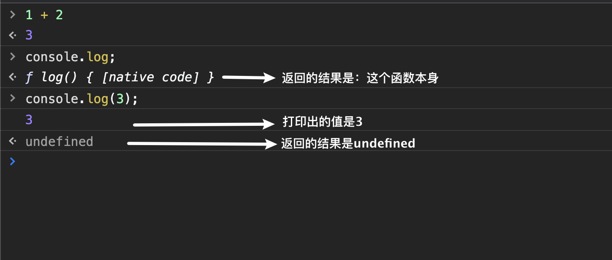
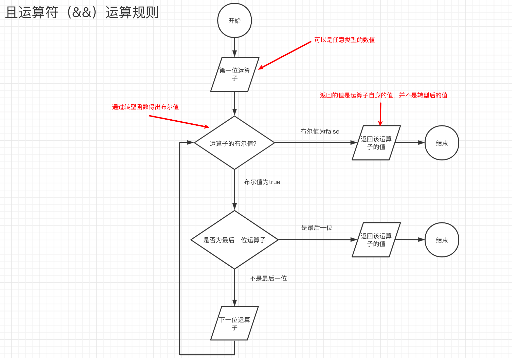

# js基础语法

## 一句话

它的优秀之处并非原创，它的原创之处并不优秀


## 表达式与语句

**区别：**

* 表达式一般都有值，语句可能有可能没有
* 语句一般会改变环境（声明，赋值）
* 上面两句话不是绝对的


### 什么是值，什么是返回值，什么是打印出来的东西

普通表达式的结果叫做**值**

函数表达式返回的结果叫做**返回值**

比如说：

```js
// 这个表达式的值为3
1 + 2；
// 这个表达式的值为函数的返回值，当然首先我们需要有这个函数我们才能调用他
add(1, 3);
// 表达式的值是undefined，打印出来的值是3
console.log('3');
// 表达式的值是函数本身
console.log;
```

`console.log(3)`所打印的来的值是3，但`console.log(3)`的返回值并不是3

我们可以借助Chrome来看看这几个表达式所反应出来的东西




## js中的一些小语法

* JavaScript对大小写是敏感的

* 只要不影响语法，JavaScript对于空格多或少没有想法

* 一般情况下，回车可以随便加

  * 特殊情况`return`后面不能加回车

    ```js
    function f(){
        return 
        3;
    }
    
    // 等同于
    
    function f(){
        return undefined;
    	// 后面的内容被忽略    
        3;
    }
    ```


## 标识符

### 规则

1. 只能包含字母，数字，符号 `$` 和 `_`
2. 首字符不能是数字
3. 使用驼峰命名法（[camelCase](https://en.wikipedia.org/wiki/CamelCase)）

### 补充

* 在JavaScript中变量区分大小写

* 从技术上允许使用汉字或者其他语言，因为在 JavaScript 使用的内部编码表中（Unicode）

* 不能使用保留字（reserved word）

  * 指在高级语言中已经定义过的字，使用者不能再将这些字作为变量名或过程名使用——百度百科
  * 保留字包括关键字和未使用的保留字。关键字则指在语言中有特定含义，成为语法中一部分的那些字。在一些语言中，一些保留字可能并没有应用于当前的语法中，这就成了保留字与关键字的区别。一般出现这种情况可能是由于考虑扩展性。例如，Javascript有一些未来保留字，如[abstract](https://baike.baidu.com/item/abstract/2216763)、double、[goto](https://baike.baidu.com/item/goto/12755716)等等。

* 在早期的JavaScript版本中我们可以不声明变量直接赋值使用，但是在使用严格的模式的时候不允许这种情况

  ```javascript
  "use strict";
  
  num = 5; // 错误：num 未定义
  ```

  

中文是合法的标识符，可以用作变量名。

> JavaScript 有一些保留字，不能用作标识符：arguments、break、case、catch、class、const、continue、debugger、default、delete、do、else、enum、eval、export、extends、false、finally、for、function、if、implements、import、in、instanceof、interface、let、new、null、package、private、protected、public、return、static、super、switch、this、throw、true、try、typeof、var、void、while、with、yield。


## 区块block

```js
{
	a = 1;
    b = 2;
}
```

将代码包了起来

一般这种是与`if/for/while`一起使用

## if语句

**经典错误：**

```js
let a = 2;

if( a = 1){
    console.log('12');
} else {
 	console.log('234');   
}
```

此时控制台打印出的结果是`12`。

**分析：**

因为`if(a = 1)`，其中的`a = 1`是一个赋值语句，也就是让a的值为1。

此时a的值为1所以说计算出来的布尔值应该是`true`，因此打印出`12`。


**经典错误：**

```js
let a = 1;

if(a === 2)
    console.log('a')
	console.log('a 等于 2')
```

此时控制台打印出的结果是`a 等于 2`

**分析：**

因为if语句后面并没有花括号，因此只有距离if语句最近的语句会被计算到if语句块内部

我们可以将以上代码变成以下的形式

```js
let a = 1;

if(a === 2){
    console.log('a');
}
console.log('a 等于 2');
```

> 拓展情况：
>
> ```JS
> let a = 1;
> 
> if(a === 2)
>     console.log('a'), console.log('a 等于 2');
> ```
>
> 注意这里两个语句之间是逗号`,`
>
> 此时控制台返回的结果是：`undefined`


## 逻辑运行符

两个短路运算符

### &&运算符

首先必须要了解的一个事情是——使用了且运算符的表达式，其返回的值不一定是布尔类型。

直观的举一个例子

```js
a && b && c && d;
```

这个表达式所返回的值应该是取第一个假值或者是d


直接来看流程图吧：




**`&&`运算符有短路机制。**

从左往右，如果现在有一个运算子的布尔值是`false`，那么就直接返回值，不会计算后面的值。


通过这个性质，我们可以用它来代替常规的if语句

```js
A && B
fn && fn() // 如果函数存在，那么就调用这个函数

// 等价于

if(A){
    B
}
```

```js
let a = 1;
(a === 1) && (a = 2)
```


### ||运算符

和`&&`的运算法则只有一个区别，就是或运算符是当运算子的布尔值为`true`的时候返回数值。


一般使用这种方法为一个变量设置一个默认值

```js
let a;

......

a = a || 100; //如果说a没有值得话，那么a = 100这个语句成立
```


## 三元运算符(? :)

三元条件运算符由问号（?）和冒号（:）组成，分隔三个表达式。它是 JavaScript 语言唯一一个需要三个运算子的运算符。如果第一个表达式的布尔值为`true`，则返回第二个表达式的值，否则返回第三个表达式的值。

```js
't' ? 'hello' : 'world' // "hello"
0 ? 'hello' : 'world' // "world"
```

上面代码的`t`和`0`的布尔值分别为`true`和`false`，所以分别返回第二个和第三个表达式的值。

通常来说，三元条件表达式与`if...else`语句具有同样表达效果，前者可以表达的，后者也能表达。但是两者具有一个重大差别，`if...else`是语句，没有返回值；三元条件表达式是表达式，具有返回值。所以，在需要返回值的场合，只能使用三元条件表达式，而不能使用`if..else`。

```js
console.log(true ? 'T' : 'F');
```

上面代码中，`console.log`方法的参数必须是一个表达式，这时就只能使用三元条件表达式。如果要用`if...else`语句，就必须改变整个代码写法了。


> 三元运算符是右结合的运算符


## while语句

```js
while(condition){
    ....
}
```

判断condition的布尔值是否为`true`。

如果为真，那么就继续循环

如果为假，那么久跳出循环

## for语句

for是while语句的语法糖

```js
for(let i = 0; i < 10 ; i ++){
    ....
}

// 等同于
let i = 0;
while(i < 10) {
    ....
    i++;
}
```


经典错误

```js
for (var i = 0; i < 5 ; i++){
}

console.log(i); // 5
```

`var`的作用域是函数作用域，而这里是块级作用域，所以这里i是5


经典错误

```js
for(var i = 0;i < 5; i++){
    setTimeout(() => {
        console.log(i);
    }, 0)
}
```

结果：

````js
5
5
5
5
5
````

当将`var`改成`let `的时候

```js
for(let i = 0;i < 5; i++){
    setTimeout(() => {
        console.log(i);
    }, 0)
}
```

结果：

```js
0
1
2
3
4
```


### break和continue

break ：跳出**所有**循环

continue：跳过**本次**循环


### label

`break <labelName>` 语句跳出循环至标签处，然后退出循环

`continue <labelName>`语句跳出循环至标签处，然后继续执行循环

```js
foo: for(let i = 0; i < 10; i++){

    console.log('第一次循环');

    for(let j = 0; j < 10; j++){
        // 我想要跳出两次循环
        console.log('第二次循环');
        break foo;
        console.log('第二次循环,但是不会打印');
    }

}
```

结果：

```js
第一次循环
第二次循环
```

