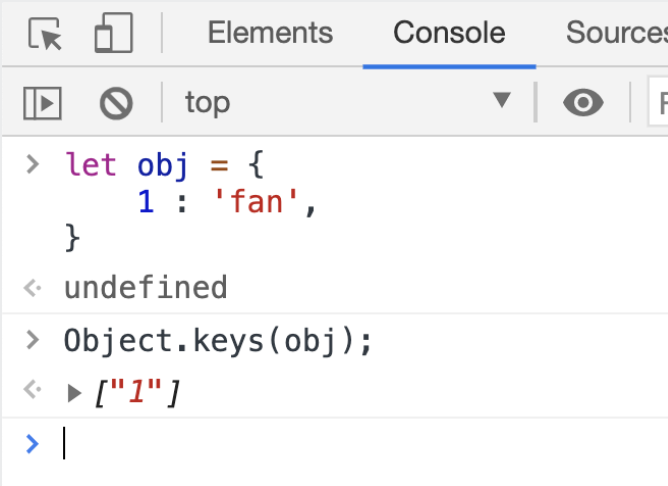
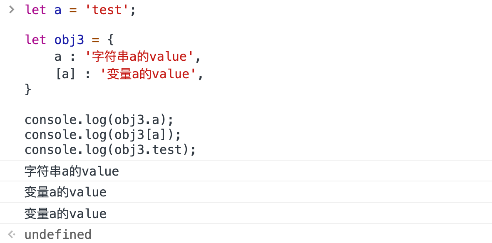
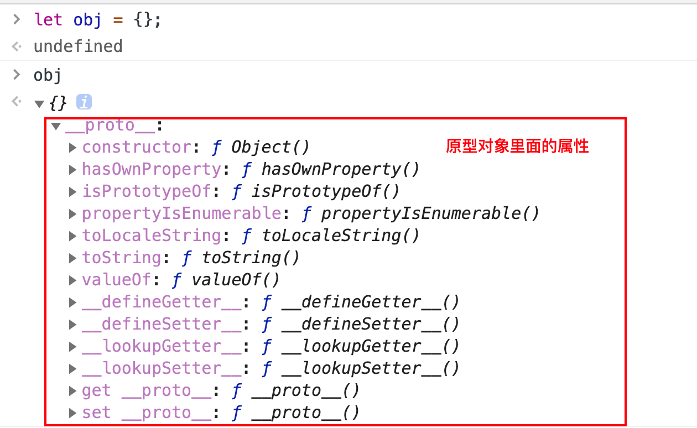
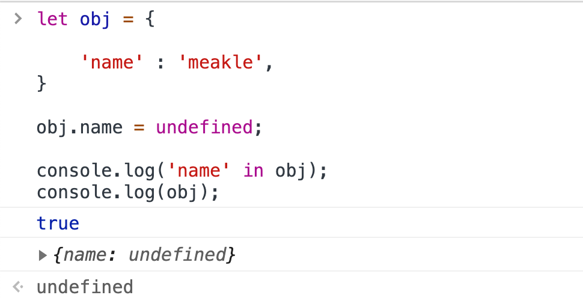
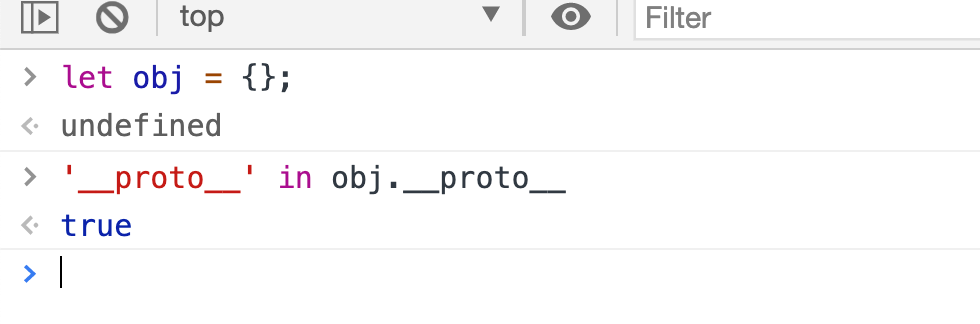
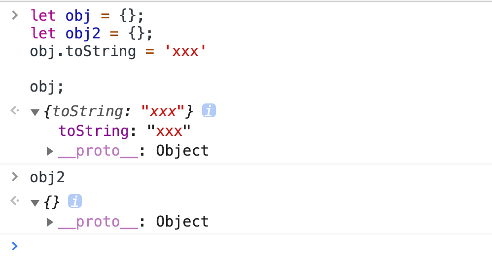
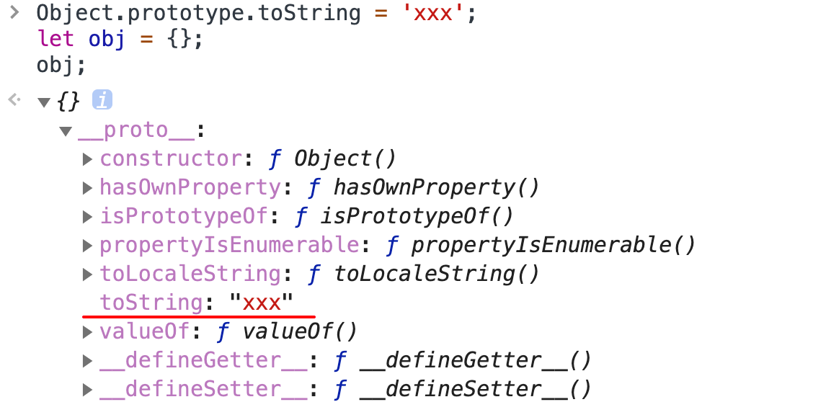
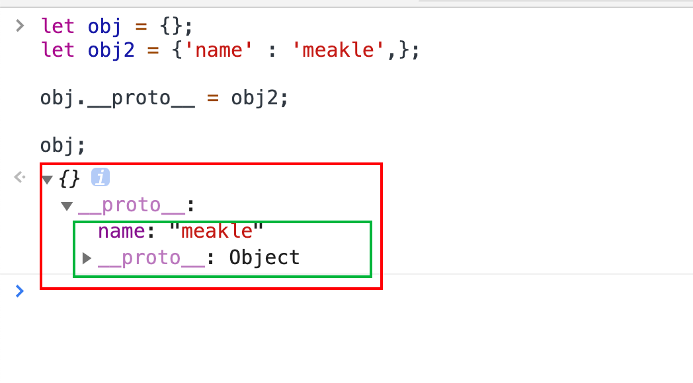
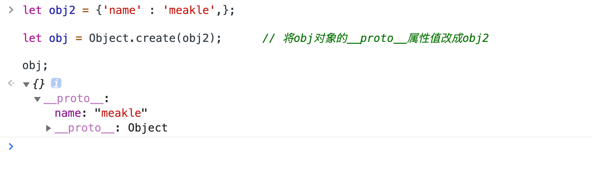

# js对象

> 这是唯一一种复杂类型

## 什么是对象

**简单定义**

- 无需的数据集合
- 键值对的集合

**写法**

```jsx
let obj = {
		'name' : 'meakle',
		'age'  : 12,
}

let obj = new Object({
		'name' : 'meakle',
})

// 匿名对象
console.log({'name' : 'meakle',});
```

## 属性名的问题

**key name是字符串，不是标识符，可以包含任意字符**

引号是可以省略的，省略之后key name只能使用标识符规则（数字除外）

```jsx
let obj = {

    'name' : 'fan',
    1 : 'fd',
    // & : 123,  报错
}
```

即使引号被省略了，key name 还是字符串

```jsx
let obj = {
    1 : 'fan',
}
```




**属性名会自动变成字符串**

属性名转变为字符串的过程中，会将科学计数法表示的属性变为它原来的值。

```jsx
let obj = {
    1e3 : 'fan', // 用科学计数法表示的1000
}
```


**变量作为属性名**

```jsx
let a = 'test';

let obj3 = {
    a : '字符串a的value',
    [a] : '变量a的value',
}

console.log(obj3.a);
console.log(obj3[a]);
console.log(obj3.test);
```




## 对象的隐藏属性

每一个对象都有一个隐藏属性，而这个属性存的是一个地址，这个地址指向的就是原型对象。

可以将原型对象理解成为存储着对象的所有共有属性的一个地方（一块内存）。




## 删除属性

**方法:**

```js
delete obj.xxx;
delete obj[xxx];
```

我们不能使用`obj.xxx = undefined`

因为使用上面这个语句的作用只是将对象里面的这个属性的值改成了`undefined`

实际上这个属性还在这个对象里面。




**两个注意点**

第一点：

在使用`'xxx' in obj`这个方法的时候，`'xxx'`必须是字符串，而不能是`xxx`

如果你直接使用了`xxx`，JS会将`xxx`当做一个变量名对

第二点：

不能通过`obj.xxx ===  undefined`来判断一个属性是否在对象内，

因为有两种可能，一种你是这个属性确实不在对象里面，另一种是这个属性在对象里面，而这个属性的值是`undefined`


## 查看属性

查看所有的属性

```js
console.dir(obj);
//野路子查看共有属性
obj.__proto__;
```

查看自身所有的属性

```js
Object.keys(obj);
```

判断一个属性是否是自身的

```js
Obj.hasOwnProperty('toString');
```


`'name' in obj`可以查询到对象的原型里面的属性

`obj.hasOwnProperty('name')` 只能查询对象本身的属性

```js
let obj = {
    name : 'meakle',
};

'toString' in obj; 		// true
'name' in obj;			// true

obj.hasOwnProperty('toString');  // false
obj.hasOwnProperty('name');		 // true
```


### 使用属性

使用属性的操作符号有两种

* `.`操作符

* `[]`操作符


**这两种操作符有很大的区别**

使用`.`运算符后面的那一串字将字符会是一个字符串

而使用`[]`运算符后面的那一串字字符将会是变量名字，除非你使用了引号特别说明了

```js
name = 'fake';

obj.name; 		// 使用属性名为name的属性
obj[name];		// 使用属性名为fake的属性，因为这里的name是变量名，而不是字符串
obj['name'];	// 和obj.name一个意思
```


### 原型

每一个对象都有原型，原型本身也是一个对象

所以我们可以得出，原型自身也有原型。并且原型的原型所存的值是`null`



`obj = {}` 的原型即为所有对象的原型。

这个原型包含的所有对象的共有属性，是对象的根


## 修改属性

修改或者添加单个属性

```js
let obj = {};

obj.name = 'fang';		// 添加name属性
obj.age = 12;			// 添加age属性
obj.name = 'meakle';	// 修改name属性

obj;					// {name: "meakle", age: 12}
```

使用`assign(obj, {key : value, key : value})`

```js
let obj = {};

Object.assign(obj, {
    'name' : 'meakle',
    'age' : 18,
})


obj;			// {name: "meakle", age: 18}
```


### 修改与添加共有属性

在读取的时候，我们可以读取到原型对象，但是我们在修改的时候是不能直接通过对象修改原型的。

```js
let obj = {};
let obj2 = {};
obj.toString = 'xxx'

obj;
```



虽然我们不能通过对象直接修改原型对象的，但是我们可以曲线救国

```js
let obj = {};

obj.__proto__.toString = 'xxx';		// 通过这种方法就会修改原型对象中`toString`属性的值。

let obj2 = {};
obj.toString;		// xxx
```

但是不建议用`__proto__`来修改原型对象。

我们使用`Object.prototype.toString`来修改

```js
Object.prototype.toString = 'xxx';
let obj = {};
obj;
```




我们还可以修改一个对象的`__proto__`属性的值，让他指向另一个地方

```js
let obj = {};
let obj2 = {'name' : 'meakle',};

obj.__proto__ = obj2;

obj;
```



我们依然不推荐使用这种方法修改

`Object.create(obj)`

```js
let obj2 = {'name' : 'meakle',};

let obj = Object.create(obj2);		// 将obj对象的__proto__属性值改成obj2

obj;
```




