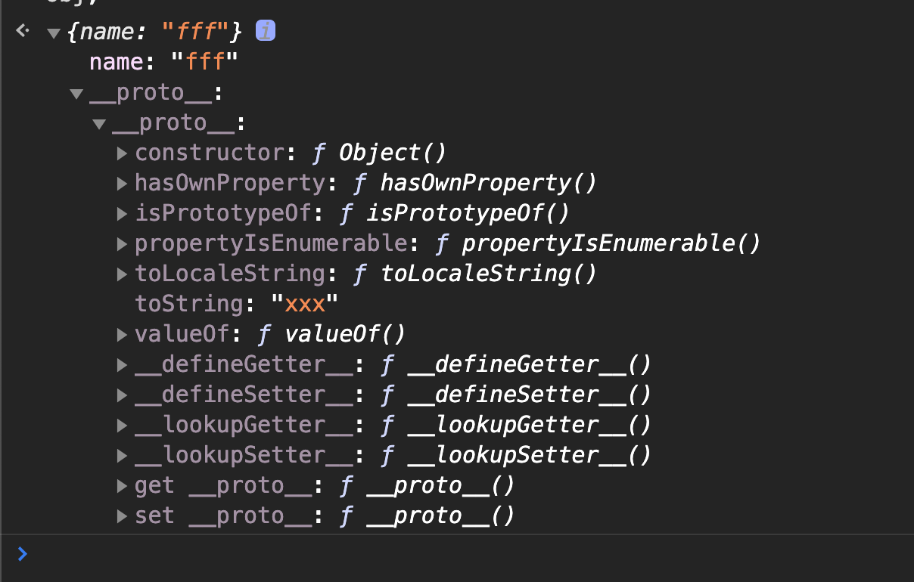

# JS对象基本用法

## 声明对象的两种语法

```js
let obj = {};

let obj2 = new Object();
```

## 如何删除对象的属性

```js
let obj = {
	'name' : 'meakle',
}
delete obj.name;
//或者
delete obj['name'];
```

## 如何查看对象的属性

```js
let age = 1;
let obj = {
    'name' : 'meakle',
}

// 打印出所有自身的属性
Object.keys(obj);
// 打印出所有属性
console.dir(obj);
```

## 如何修改或增加对象的属性

```js
// 修改或者增加单个对象的属性

let obj = {};

obj.name = 'meakle';		// 增加属性 
obj.age = 20;				// 增加属性
obj['name'] = 'xx'; 		// 修改属性

// 修改或增加多个属性
Object.assign(obj, {
    name : 'lll',		// 修改属性
    age : 10,			// 修改属性
    gender : 'man',		// 增加属性
})
```

修改共有属性

```js
let obj2 = {};

// 修改原型对象的属性
Object.prototype.toString = 'xxx';

// 修改obj的__proto__属性值, 让其指向obj2的地址
let obj = Object.create(obj2);

obj.name = 'fff';
obj;
```




## 'name' in obj和obj.hasOwnProperty('name') 的区别

`'name' in obj`可以查询到对象的原型里面的属性

`obj.hasOwnProperty('name')` 只能查询对象本身的属性

```js
let obj = {
    name : 'meakle',
};

'toString' in obj; 		// true
'name' in obj;			// true

obj.hasOwnProperty('toString');  // false
obj.hasOwnProperty('name');		 // true
```


