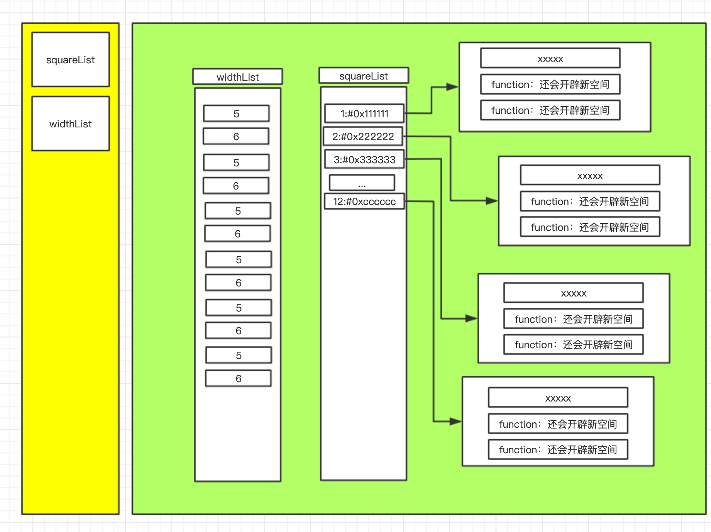
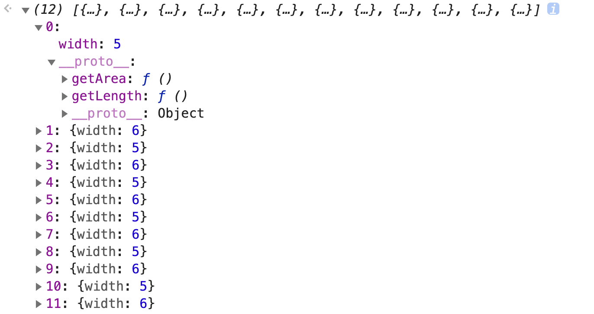
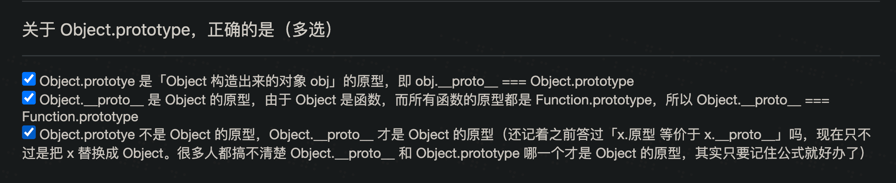

# JS对象分类

## 引入

我们来看下面的代码

```js
let squareList = [];
let widthList = [5, 6, 5, 6, 5, 6, 5, 6, 5, 6, 5, 6];

for (let i = 0; i < 12; i++){
    squareList[i] = {
     	width : widthList[i],
        
    	getArea : function(){
        	return this.width*ths.width;
	    },
    	getLength : function(){
        	return this.width * 4;  
	    },   
    }
}
```

这个代码的问题在哪里呢，就是耗费的内存太多了。

每一次的`for`循环创建的函数都会在内存中占据新的内存

每一次通过for循环创建出来的对象都是一个新的对象，而每一个对象中包含的复杂数据类型都会在内存中重新申请一个新的空间

内存图如下:




可以发现，每一次循环都会在内存中重复创建一样的函数，这样就造成了空间的浪费。

我们可以通过原型来优化这段代码

```js
let squareList = [];
let widthList = [5, 6, 5, 6, 5, 6, 5, 6, 5, 6, 5, 6];

// 创建一个自定一点的原型对象
let squarePropotype = {
    getArea: function () {
        return this.width * ths.width;
    },
    getLength: function () {
        return this.width * 4;
    },
}


for (let i = 0; i < 12; i++) {
    // 给数组对象的第i个的__proto__值改成我们自定义的原型对象
    squareList[i] = Object.create(squarePropotype);
    // 给数组中第i个对象设置新的属性与属性值
    squareList[i].width = widthList[i];    
}
```




这样写了之后还有一个缺点，我们并没有很好对代码进行封装。

接下来，我们封装下刚才的代码，将实现的逻辑放在函数里面

```js
let squareList = [];
let widthList = [5, 6, 5, 6, 5, 6, 5, 6, 5, 6, 5, 6];

let squarePropotype = {
    getArea: function () {
        return this.width * ths.width;
    },
    getLength: function () {
        return this.width * 4;
    },
}

function createSquare(widthList){
    let width = widthList;
    let obj = Object.create(squarePropotype);
    obj.width = width;

    return obj;
}

for (let i = 0; i < 12; i++) {
    squareList[i] = createSquare(widthList[i]);
}
```

我们将创建对象的操作，封装进了函数`createSquare`当中。


接下来我们模拟一下构造函数

```js

let squareList = [];
let widthList = [5, 6, 5, 6, 5, 6, 5, 6, 5, 6, 5, 6];

let squarePropotype = {
    getArea: function () {
        return this.width * ths.width;
    },
    getLength: function () {
        return this.width * 4;
    },
	// 指向原来的东西
    constructor : createSquare,
}
// 构造函数
function createSquare(width){
    let obj = Object.create(squarePropotype);
    obj.width = width;
    return obj;
}

for (let i = 0; i < 12; i++) {
    squareList[i] = createSquare(widthList[i]);
}

```

说白了就是在构造函数的原型对象中还要增加一个`constructor`指回原来的构造函数

## new操作符

我们可以使用让构造函数和new操作符结合起来，这样我们就能简化刚刚的操作

```js

let squareList = [];
let widthList = [5, 6, 5, 6, 5, 6, 5, 6, 5, 6, 5, 6];

function Square(width){
    this.width = width;
}

Square.prototype.getArea = function (){
    return this.width * ths.width;
}

Square.prototype.getLength = function (){
	return this.width * 4;
}

for(let i = 0; i < 12; i++){
    
    squareList[i] = new Square(widthList[i]);
    console.log(squareList[i].constructor);
}
```

我们可以发现，当构造函数与`new`操作符结合起来一起使用的时候，构造函数就可以省略一些操作。而这些操作是因为`new`帮我们做的。

`new X()`自动做了四件事情

* 自动创建空对象
* 自动将空对象关联原型，原型地址指定为`X.prototype`
* 自动将空对象作为`this`关键字运行构造函数
* 自动`return this`

## 如何确定一个对象的原型

你是谁构造的，你的原型就是谁的prototype属性对应的对象

> 因为当你`new X()`的时候，自动将你创建的空对象的`__proto__`指向的地址改成了`X.prototype`所指向的地址

```js
对象.__proto__  === 其构建函数.prototype;
```





