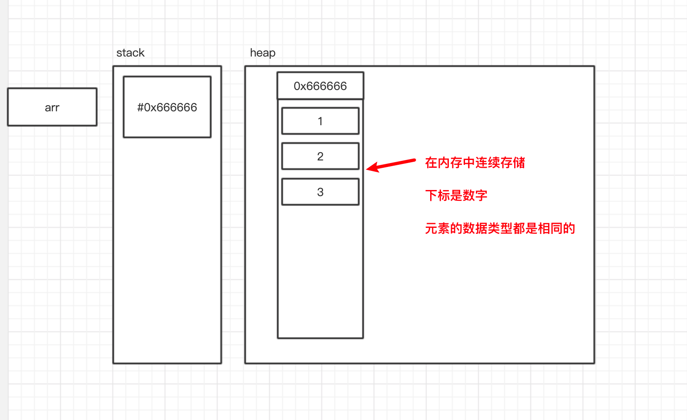
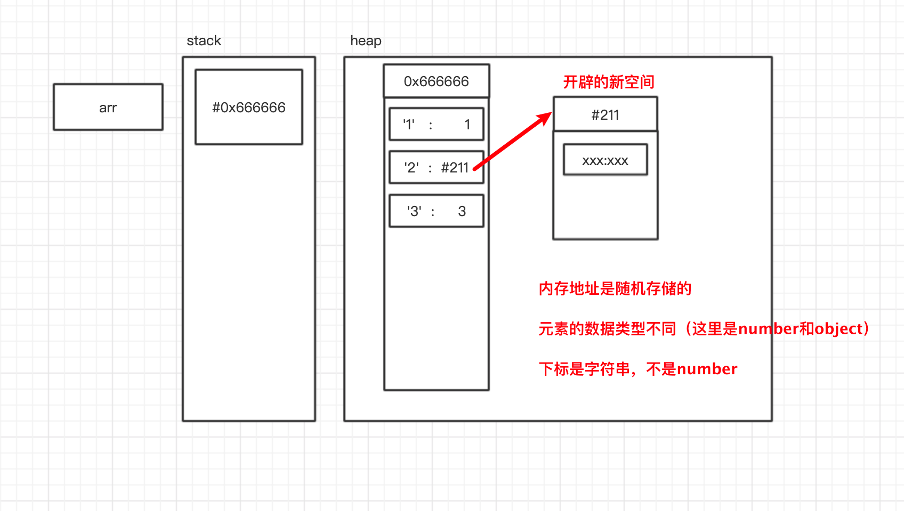
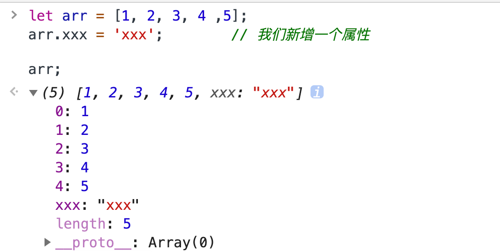

# JS数组对象

JS的数组并不是典型的数组

## 典型数组

* 元素的数据类型相同

* 通过连续的内存存储
* 通过数字下标获取元素



## JS中的数组

* 元素的数据类型可以不相同
* 内存不一定是连续的，比如有当对象作为数组元素的时候
* 下标实际上不是数字，而是字符串
  * 这意味着数组可以有任何样子的key，比如说`arr[xxx] = 'xxx'`




## 数组概览

### 新建数组

`let arr = [1, 2, 3]` 创建一个长度为3的数组，并给数组前位赋值

`let arr = new Array(1, 2, 3)` 和上面一个意思

`let arr = new Array(3)` 创建一个长度为3的数组，这个没有赋值

### 转化

我们可以让一个字符串转化成数组


> `split() `方法使用指定的分隔符字符串将一个[`String`](https://developer.mozilla.org/zh-CN/docs/Web/JavaScript/Reference/String)对象分割成子字符串数组，以一个指定的分割字串来决定每个拆分的位置。 
>
> `Array.from()` 方法从一个类似数组（有0，1，3这种下标且有length，伪数组）或可迭代对象创建一个新的，浅拷贝的数组实例。
>
> ——MDN


```js
let str = '1,2,3';
let str2 = '123';

let arr = str.split(','); 		
// expected output: Array ["1", "2", "3"]
let arr2 = str2.split('');
// expected output: Array ["1", "2", "3"]

let arr3 = Array.from('abc');
// expected output: Array ["a", "b", "c"]
```


### 伪数组

伪数组的原型链中并没有数组的原型。

* 使用`document.querySelectorAll('div')`获取的数组就是伪数组

当我们得到一个伪数组的时候，我们要马上使用`Array.from()`将其转换为数组

### 合并数组

```js
let arr1 = [1, 2, 3];
let arr2 = [4, 5, 6];

let arr3 = arr1.concat(arr2);		// 开辟一块新内存，然后合并两个数组，原来的数组不会变化

// 截取一个数组的一部分，返回一个新的数组
let arr4 = arr3.slice(1);			// 从第二位开始截取
let arr5 = arr3.slice(0);			// 从第一位开始截取，相当于拷贝操作（浅拷贝）
```


## 数组中的增删改查

### 删元素——对象的删除方式

```js
let arr = ['a', 'b', 'c'];

delete arr[0];
```

此时


数组元素出现了一个值为`empty`的元素，并且在数组对象中，并没有响应的属性出现。长度`length`也没有变化。

因为js中的数组并没有对内存空间的连续性有要求，因此在数组之间可以存在所谓的`empty`。

我们将数组中有`empty`的数组叫做稀疏数组

### 删元素——使用数组API

删除头部元素

`arr.shift()`   arr会被修改，返回被修改元素

删除尾部元素

`arr.pop()`  arr会被修改，返回被修改元素

删除中间的元素（也可以修改和增加）

```js
arr.splice(index, 1); 			// 从index的位置开始删除1个元素
arr.splice(index, 1, 222); 		// 从index的位置开始删除一个元素，并添加222作为新元素（替换）
arr.splice(index, 1, 222, 333); // 从index的位置开始删除一个元素，并添加222，333 作为新元素（增加）
```

### 遍历数组

因为数组本身也是对象，因为我们一样可以使用遍历对象的方式来遍历数组

```js
let arr = [1, 2, 3, 4, 5];

// for in
for(key in arr){
    console.log(`key:${key}, value:${arr[key]}`);
}

// keys
Object.keys(arr);
```

但是这一种方法有一个问题，数组元素不一定就是数组对象中的所有属性

```js
let arr = [1, 2, 3, 4 ,5];
arr.xxx = 'xxx';		// 我们新增一个属性

arr;
```



我们可以看到，`arr`这个数组的长度是没有变化的，但是我们增加了一个属性（默认情况下，属性都是可以遍历的）所以如果我们再使用上面的方法就会将`xxx`这个属性当成数组的下标打印出来


这个时候我们可以利用`length`这个属性值不变的情况，利用for循环解决上面的问题

```js
for(let i = 0; i < arr.length; i++){
    console.log(`key:${i}, value:${arr[i]}`);
}
```

我们也可以使用`forEach`，`map`等原型上的函数

> `forEach()` 方法按升序为数组中含有效值的每一项执行一次 `callback` 函数，那些已删除或者未初始化的项将被跳过（例如在稀疏数组上）。

```js
arr.forEach(function(item, index){
    console.log(`key:${index}, value:${item}`);
})
```

### 查看单个属性

因为数组也是对象，所以我们依然能够用对象的方法查看

**数组越界**

如果说我们访问的下标超过了数组的范围或者是这个下标在数组对象中不存在(undefined)的话

那么我们就越界了

```js
let arr = [1, 2, 3];

console.log(arr[3].toString());  // Uncaught TypeError: Cannot read property 'toString' of undefined
```

**在Array对象的Prototype里面依然提供了一些方法给我们查看数组的单个属性**

查看某个元素是否在数组里

`arr.indexOf(item)` 查看item这个元素是否在数组里

按照条件查找，返回相应的值

`arr.find()`

> `find`方法对数组中的每一项元素执行一次 `callback` 函数，直至有一个 callback **返回** `true`。当找到了这样一个元素后，该方法会立即返回这个元素的值，否则返回 [`undefined`](https://developer.mozilla.org/zh-CN/docs/Web/JavaScript/Reference/Global_Objects/undefined)。注意 `callback `函数会为数组中的每个索引调用即从 `0 `到 `length - 1`，而不仅仅是那些被赋值的索引，这意味着对于稀疏数组来说，该方法的效率要低于那些只遍历有值的索引的方法。

按条件查找，返回相应值的索引

`arr.findIndex()` 


例子：

```js
const array1 = [5, 12, 8, 130, 44];

const found = array1.find(element => element > 10);
const found2 = array1.findIndex(element => element > 10);
console.log(found);
// expected output: 12
console.log(found2);
// expected output: 1
```


### 增加元素

依然不推荐使用对象的方式增加元素

我们使用Array提供给我们的方法修改


**在尾部添加**

`arr.push(item1, item2)`  返回新的长度

`arr,push(item1) `  返回新的长度

**在头部添加** 

`arr.unshift(item1, item2)` 返回新的长度

`arr.unshift(item1)` 返回新的长度

**在中间添加元素**

`arr.splice(index, 0, 'x')` 在index处删除0个元素，然后再讲x插入index处


### 反转数组

`arr.reverse()` 讲一个数组反转过来


> 如何反转字符串
>
> 1. 将字符串变成数组
> 2. 将数组反转
> 3. 将数组变成字符串
>
> ```js
> let str = 'abc';
> 
> let str2 = str.split('').reverse().join('');
> ```


### 排序

`arr.sort()` 从小到大

我们也可以自己定义`sort`的排序规则

```js
arr.sort(function(a, b) {
    if(a > b){
        return -1;
    }else if(a === b){
        return 0;
    }else{
        return 1;
    }
})
```

```js
// 简写
arr.sort((a, b) => {
  return  a - b;
})
```


## 数组变换

这三个方法都是返回一个新的数组，并不会改变原来的数组

* map  n变n
* filter  n变少
* reduce  n变1


我们现在来分别看看这几个方法（还是那句话，学语法，上MDN）

### map

`map` 方法会给原数组中的每个元素都按顺序调用一次  `callback` 函数。`callback` 每次执行后的返回值（包括 [`undefined`](https://developer.mozilla.org/zh-CN/docs/Web/JavaScript/Reference/Global_Objects/undefined)）组合起来形成一个新数组。 `callback` 函数只会在有值的索引上被调用；那些从来没被赋过值或者使用 `delete` 删除的索引则不会被调用。

我这里直接上例子（看不懂上MDN，求你了）

```js
let arr = [0,1,2,2,3,3,3,4,4,4,4,6];

let arr2 = arr.map((x) => {
    if(x === 0){
        return '星期天';
    }else if(x === 1){
        return '星期一';
    }else if(x === 2){
        return '星期二';
    }else if(x === 3){
        return '星期三';
    }else if(x === 4){
        return '星期四';
    }else if(x === 5){
        return '星期五';
    }else if(x === 6){
        return '星期六';
    }else{
        return '不存在';
    }
})

console.log(arr2);
```

### filter

`filter` 为数组中的每个元素调用一次 `callback` 函数，并利用所有使得 `callback` 返回 true 或[等价于 true 的值](https://developer.mozilla.org/zh-CN/docs/Glossary/Truthy)的元素创建一个新数组。`callback` 只会在已经赋值的索引上被调用，对于那些已经被删除或者从未被赋值的索引不会被调用。那些没有通过 `callback` 测试的元素会被跳过，不会被包含在新数组中。

```js
let scores = [95,91,59,55,42,82,72,85,67,66,55,91]
let scores2 = scores.filter( (x) => (x >= 60) );

console.log(scores2) //  [95,91,82,72,85,67,66, 91]
```

### reduce

`reduce()` 方法对数组中的每个元素执行一个由您提供的**reducer**函数(升序执行)，将其结果汇总为单个返回值。

**reducer** 函数接收4个参数:

1. Accumulator (acc) (累计器)
2. Current Value (cur) (当前值)
3. Current Index (idx) (当前索引)
4. Source Array (src) (源数组)

您的 **reducer** 函数的返回值分配给累计器，该返回值在数组的每个迭代中被记住，并最后成为最终的单个结果值。

```js
let scores = [95,91,59,55,42,82,72,85,67,66,55,91]

let sum = scores.reduce((sum, n)=>{
    // console.log(n%2);
    // if(n%2 === 0){
    //     console.log('偶数');
    //     return sum;
    // } else {
    //     console.log('奇数');
    //     return sum += n;
    // } 

    return (n % 2 === 0) ? sum : sum += n;
    // 我这里傻逼了, 这里要return的
},0)


console.log(sum) // 奇数之和：598 
```


