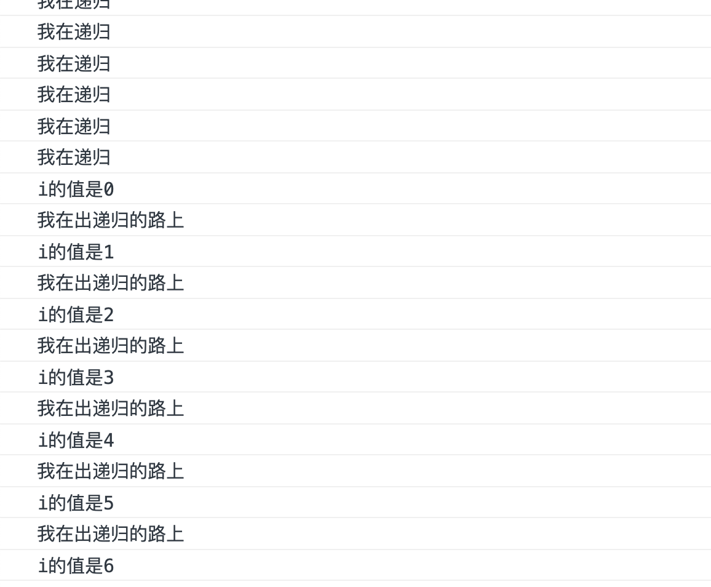

# 递归

> **递归**（英语：Recursion），又译为**递回**，在[数学](https://zh.wikipedia.org/wiki/数学)与[计算机科学](https://zh.wikipedia.org/wiki/计算机科学)中，是指在[函数](https://zh.wikipedia.org/wiki/函数)的定义中使用函数自身的方法。递归一词还较常用于描述以[自相似](https://zh.wikipedia.org/wiki/自相似)方法重复事物的过程。例如，当两面镜子相互之间近似平行时，镜中嵌套的图像是以无限递归的形式出现的。也可以理解为自我复制的过程。
>
> ——wiki

## 什么是递归

递归的语法现象很简单，就是你在函数体里面调用这个函数。

```js
let fn = () => {
    
    console.log('我在递归');
    fn();
    
}

fn();
```

这样做的现象就是，浏览器会不同的给你打log，和你说“我在递归”。

### 分析	

现在我们来分析一下这里的思路。

1. 首先你调用了这个函数。
2. 进入函数体，遇见第一句话就是`console.log('我在递归')`，浏览器打印出这句话
3. 然后就碰见了`fn()`，意思就是我要调用`fn()`
4. 然后我们就又调用`fn`了，然后我们从第一步，开始无限套娃。


### 疑问

* 在函数体内`fn()`这句话后面的语句会执行吗？

  ```js
  let fn = () => {
      
      console.log('我在递归');
      fn();
      console.log('我就是不执行，怎样');
  }
  
  fn();
  ```

  放到Chrome，如我所愿：就是不执行，怎样

* 那这个递归会一直套娃，有啥用呢，不就是死循环吗！

  既然说到死循环了，那么我们讲下循环。是什么原因造成的死循环？

  没错，是因为判断循环是否继续的条件一直为`true`。

  那么为什么你不给递归弄个停止递归的条件呢？


### 能用的递归

```js
let fn = (i) => {
    console.log('我在递归');
    i = i - 1;
    if(i !== 0){
        return fn(i);
    }
    console.log(`i的值是${i}`);
    console.log('我在出递归的路上');
}

fn(10);
```


你看，当我们给定了条件之后，递归就不会一直傻傻的做下去了。

我们再关注一下，打印结果最后的两行。

这两行是递归进行到最里面（也就是当`i`的值自减为不符合递归的条件）时，打印出来的结果。


那么我现在扩展一下如果我想实现下图的这种情况，那么我们该怎么做呢？（检验下自己）




如果你知道怎么做，那么你对与递归的认识。应该是有了

```js
let fn = (i) => {
    console.log('我在递归');
    i = i - 1;
    if(i !== 0){
        fn(i);
    }
    console.log(`i的值是${i}`);
    console.log('我在出递归的路上');
}

fn(10);
```


好的，接下来我们用递归来实现找到数组的最值和利用递归进行排序


## 查找最小值

### 思路

我们可以先看看如何查找两个值的最小值

```js
let arr = [1, 2];

let find2 = (arr) => {
    return arr[0] > arr[1] ? arr[1] : arr[0];
}

find2(arr);     // 1
```

然后我们再想一下如何找到三个值的最小值。

```js
let arr3 = [1, -2, 3];

let find3 = (arr) => {

    let result = find2([arr[1], arr[2]]);
    return arr[0] > result ? result : arr[0];
}

find3(arr3); // -2
```

不过这种方法好像还不够简洁。

我们可以升级一下。

```js
let find32 = (arr) => {
    return find2([arr[0], find2(arr.slice(1))]);
}
```

那么如果要找任意大小的数组中的最小值呢？

比如说`[2, 3, 2, 5, 1]`

我们可以这样找出最小值

1. 将数组一分为二`2, [3, 2, 5, 1]`

2. 找出`2`和`[3, 2, 5, 1]`中小的。

   > 但是后面的又是一串数字，怎么办呢，没事，我们这个函数的目的不就是找出任意大小数组的最小值吗
   >
   > 所以我们可以对后面的数组进行同样的操作。

   1. 将数组一份为二`3, [2, 5, 1]`
   2. 找出`3`和`[2, 5, 1]`中小的
      1. 将数组一分为二`2, [5, 1]`
      2. 找出`2`和`[5, 1]`中小的
         1. 这个时候到了最下面了，我们不用继续递归了，我们可以直接找到这个数组的最小值就行了
         2. 此时是`1`
      3. 此时比较`2`和`1`中小的
      4. 得出`1`
   3. 此时得出`3`和`1`中小的
   4. 得出`1`

3. 此时比较`2`和`1`中较小的

4. 得出`1`

5. 最后走出了所有递归，找到了这个数组最小的值是`1`


这就是思路，使用递归实现，我们可以用代码实现一遍

```js
let arrn = [2, 3, 2, 5, 1];

let find = (arr) => {

    // 判断目前数组是否到了最底层
    if (arr.length > 2) {
        // 还没有到最底层
        console.log(`当前数组:${arr}`); //你可把这个打开看看现在到哪里了
        // 返回出递归出来最后的结果
        return find([arr[0], find(arr.slice(1))]);
    } else{
        // 到了最只剩两个的时候，我们返回两个数组中小的那一个
		console.log(`我在出递归的路上，当前数组为${arr}`);
	    return arr[0] > arr[1] ? arr[1] : arr[0];
    }

}

find(arrn);
```


既然做完了这个，那么我们再来个例子，用递归实现一下选择排序

## 排序

接下来我们使用递归来实现数组排序

### 思路

每一次递归前，选择出当前数组中最下的数，并且将它提出来。

剩下的数组进入递归，循环本操作，直到只剩两个数的时候返回

### 实现

```js
let findMin = (arr) => {

    if (arr.length > 2) {
        return findMin([arr[0], findMin(arr.slice(1))]);
    } else {
        return arr[0] > arr[1] ? arr[1] : arr[0];
    }

}

// 返回最小值的坐标
let findMinIndex = (arr) => {
    return arr.indexOf(findMin(arr));
}

let sort = (arr) => {

    if (arr.length > 2) {
        // 提取数组中最小的数, 利用之前写的代码
        let min = findMin(arr);
        // 找到最小的数字的下标, 因为通过splice方法删除元素需要使用到index
        let minIndex = findMinIndex(arr);
        // 将最小的数提出来, 返回的是提取完之后的数组
        arr.splice(minIndex, 1);
        // 返回一个新的数组，这个数组第一位是当前数组中最小的数字，后面的位数通过cancat来拼接
        return [min].concat(sort(arr));
    } else {
        // 判断两个数大小,然后转换
        return arr[0] > arr[1] ? [arr[1], arr[0]] : [arr[0], arr[1]];
    }

}

let arr = new Array(1, 2, 8, 3);

let sortArr = sort(arr);
console.log(sortArr);
```


## 总结

说白了所谓递归就是套娃，一层一层往里面套，然后再通过某个条件，不再进行递归，返回某一个值，而这个值很有可能会作用于他的上一层。


> 一些不成熟的想法，留作思考
>
> 这里我还感觉递归有一种味道，你可以把一个整体分为两个部分，然后通过递归再一次分为两个部分，直到不能再分的时候就结束递归，然后返回的值有一定作用。感觉这部分说的有点不清楚了。


