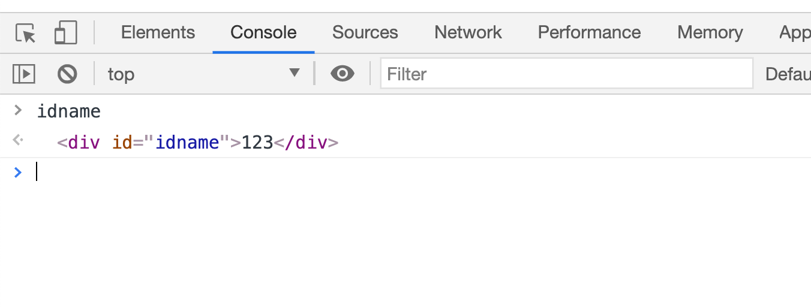
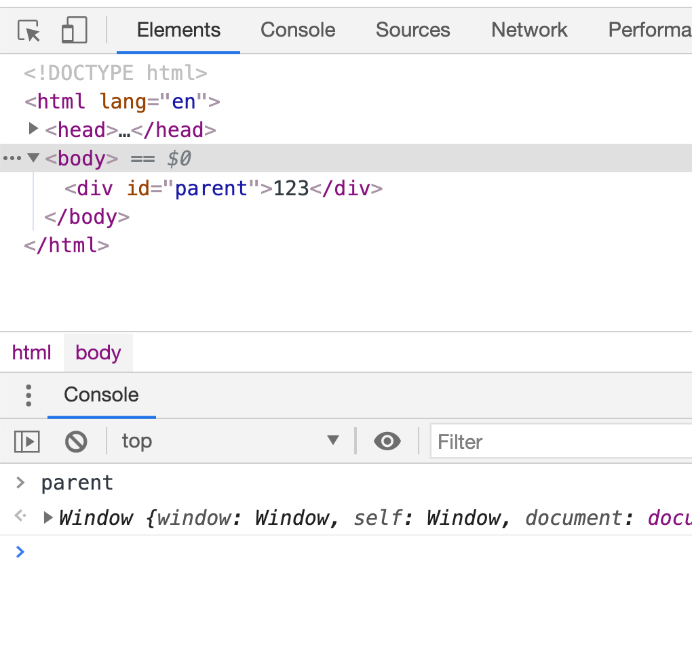
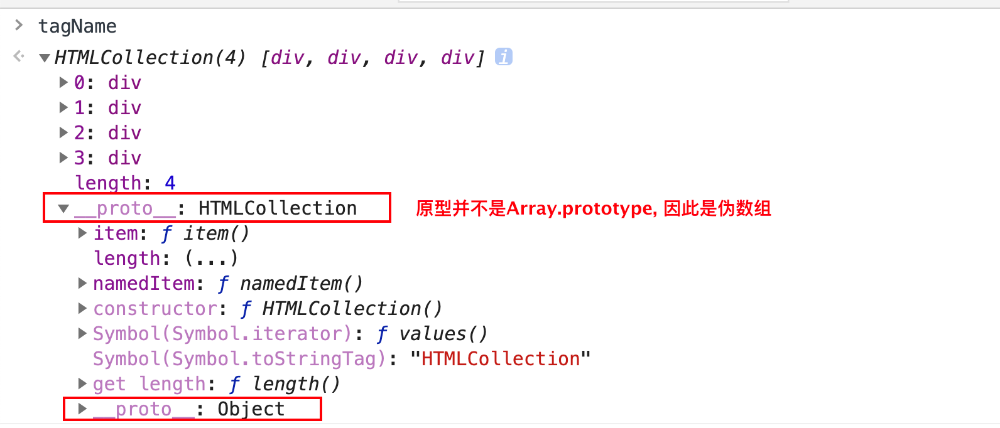
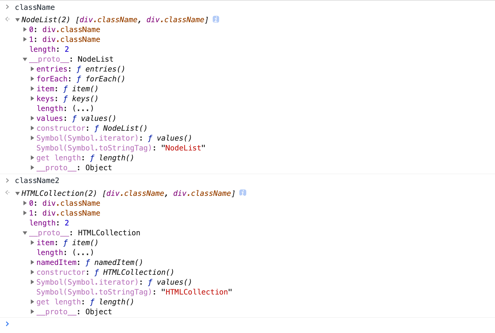
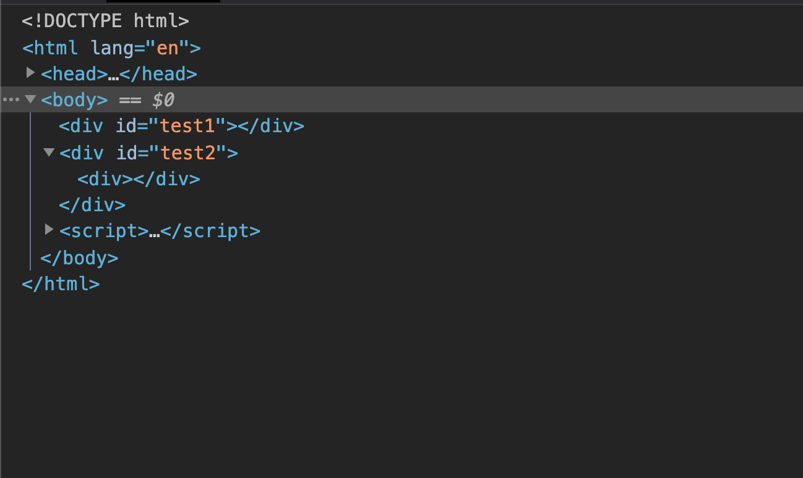
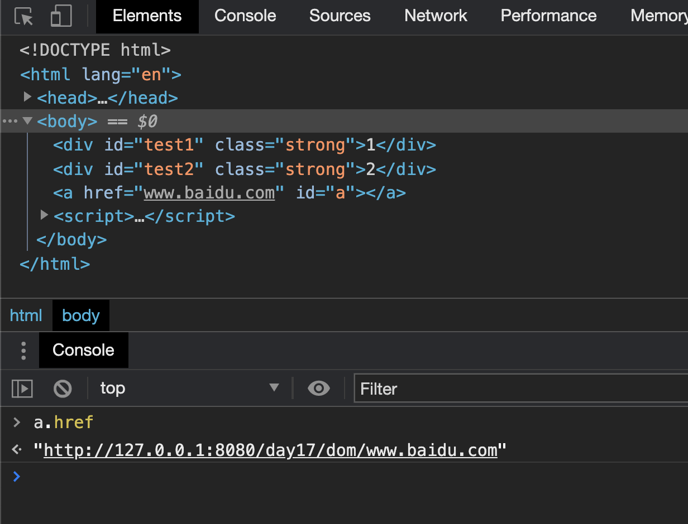

# dom编程

## 什么是dom

dom是 document object model的简写。

翻译成中文就是文档对象模型。


### 网页的结构

dom把一份文档表示为一棵树，网页中有的元素有父元素，子元素，兄弟元素


## 获取元素

利用window上的`document`方法就可以操作dom

### 获取元素

**`window.idxxx`或者直接`idxxx`**



但是这个方法并不保险，因为如果你的`id`名字和`window`上已有的名字冲突了，那么就不用用这种方式调用




但是问题不大，我们还有几个比较原始的调用方法


**`document.getElementId('idName')`**

通过标签的`id`获取这个标签。

**`document.getElementsByTagName('name');`**

通过标签的名字获取标签。

这个方法返回一个伪数组，他包含着`document`中所有名为`name`的标签



**`document.getElementsByClassName('className');`**

通过类型来选择标签，一样是返回一个伪数组。


**推荐：`document.querySelector('.className');`**

括号里面的参数格式就是css中选择器的格式

返回一个标签，这个标签是文档中第一个出现的标签。

**推荐：`document.querySelectorAll('.className');`**

括号里面的参数格式就是css中选择器的格式

返回所有符合要求的标签，并将其放入一个伪数组内。


>  一个注意点
>
> `querySelectorAll`返回的伪数组和`getElementsByClassName`或者``getElementsByTagName``所返回的伪数组不同
>
> 两种的`__proto__`所指向的原型对象是不一样的。
>
> 


### 获取特定元素

获取`html`元素

```js
document.documentElement
```

获取`head`元素

```js
document.head
```

获取`body`元素

```js
document.body
```

获取窗口（窗口并不是元素）

```js
window
```

获取所有元素

```js
document.all
```

这个是一个很特殊的东西。他的`falsy`值是`false`

```js
if(document.all){
    console.log('他的falsy是true');
} else {
    console.log('他的falsy是false')
}

// log出的结果：他的falsy是false
```


### 获取到的元素是什么

要了解一个东西什么，我们一定不能忘了，最重要的东西原型链

我们可以看看`div`的原型链


**第一层：**

`HTMLDivElement.prototype` 包含所有`div`共有的的属性。

**第二层：**

`HTMLElement.prototype` 包含所有HTML标签共有的属性

**第三层：**

`Element.prototype` 所有`XML`,`HTML`标签的共有属性

**第四层：**

`Node.prototype` 所有节点共有的属性，节点包括XML标签文本注释、HTML标签文本注释等等

**第五层：**

`EventTarget.prototype` 事件，包括`addEventListener`

**第六层：**

`Object.prototype`


## 节点和元素

看英文会更加直观，节点就是node，而元素是element

node包含这element，而element是node中的一种类型


节点Node分为以下几种

| 常量                               | 值   | 描述                                                         |
| :--------------------------------- | :--- | :----------------------------------------------------------- |
| `Node.ELEMENT_NODE`                | `1`  | 一个 [`元素`](https://developer.mozilla.org/zh-CN/docs/Web/API/Element) 节点，例如 [`p`](https://developer.mozilla.org/zh-CN/docs/Web/HTML/Element/p) 和 [`div`](https://developer.mozilla.org/zh-CN/docs/Web/HTML/Element/div)。 |
| `Node.TEXT_NODE`                   | `3`  | [`Element`](https://developer.mozilla.org/zh-CN/docs/Web/API/Element) 或者 [`Attr`](https://developer.mozilla.org/zh-CN/docs/Web/API/Attr) 中实际的 [`文字`](https://developer.mozilla.org/zh-CN/docs/Web/API/Text) |
| `Node.CDATA_SECTION_NODE`          | `4`  | 一个 [`CDATASection`](https://developer.mozilla.org/zh-CN/docs/Web/API/CDATASection)，例如 `<!CDATA[[ … ]]>`。 |
| `Node.PROCESSING_INSTRUCTION_NODE` | `7`  | 一个用于XML文档的 [`ProcessingInstruction`](https://developer.mozilla.org/zh-CN/docs/Web/API/ProcessingInstruction) ，例如 `<?xml-stylesheet ... ?>` 声明。 |
| `Node.COMMENT_NODE`                | `8`  | 一个 [`Comment`](https://developer.mozilla.org/zh-CN/docs/Web/API/Comment) 节点。 |
| `Node.DOCUMENT_NODE`               | `9`  | 一个 [`Document`](https://developer.mozilla.org/zh-CN/docs/Web/API/Document) 节点。 |
| `Node.DOCUMENT_TYPE_NODE`          | `10` | 描述文档类型的 [`DocumentType`](https://developer.mozilla.org/zh-CN/docs/Web/API/DocumentType) 节点。例如 `<!DOCTYPE html>` 就是用于 HTML5 的。 |
| `Node.DOCUMENT_FRAGMENT_NODE`      | `11` | 一个 [`DocumentFragment`](https://developer.mozilla.org/zh-CN/docs/Web/API/DocumentFragment) 节点 |


**我们只需要记住元素节点和文本节点分别是1，3就可以了**

属性节点好像已经不推荐使用了。


## 节点的增删改查

### 在dom中增加节点

**创建元素节点（`element node`）**

```js
let div = document.createElement('div');
let style = document.createElement('style');
```

**创建文本节点（`text node`）**

```js
let text = document.createTextNode('jiuzhe?');
```

**在标签里面插入文本**

```js
div.innerText = '你好';
div.innerHTML = '就这';
```

在标签里面插入文本节点

```js
div.appenChild(text);
```


我们创建的标签或者是文本节点默认都处于JS线程当中。

我们需要用`appenChild`方法把节点并入进DOM树中

```js
// 把div这个节点，合并成body的子节点
document.body.appendChild(div);
// 也可以给document中存在的节点一个子节点
div.appendChild(text);
```


一个题目：

此时创建出的div会出现在`#test1`中还是`#test2`中

```js
<!DOCTYPE html>
<html lang="en">
<head>
    <title>Document</title>
</head>
<body>
    <div id="test1"></div>
    <div id="test2"></div>
</body>

<script>

    let div = document.createElement('div');
    let test1 = document.querySelector('#test1');
    let test2 = document.querySelector('#test2');

    test1.appendChild(div);
    test2.appendChild(div);

</script>
</html>
```


结果如下：会添加到后出现的div上




### 在dom中删除元素

**通过父节点来删除**

```js
parentNode.removeChild(childNode);
```

直接通过自己删除

```js
childNode.remove();
```


如果一个节点被移出了页面，他会存在于JS线程中。

我们还可以让他重新回到页面中。

```js
parentNode.appendChild(childNode);
```


### 写属性

**改`class`**

这种方式直接覆盖标签上原本的class，如果原本class上就有样式，那么就会失去样式

```js
div.className = 'red blue'; //加上两个样式
```

这种方式就不会覆盖以前的样式

```js
div.classList.add('red');
```

> 我们需要在style标签中写好相应的样式。

两种方式的例子：

```js
<!DOCTYPE html>
<html lang="en">
<head>
    <title>Document</title>
    <style>

        .red {
            color: red;
        }

        .strong {
            font-weight: 700;
        }

    </style>
</head>
<body>

    <div id="test1" class="strong">1</div>
    <div id="test2" class="strong">2</div>
    
</body>

<script>

    let div = document.createElement('div');
    let test1 = document.querySelector('#test1');
    let test2 = document.querySelector('#test2');

    test1.className = 'red';
    test2.classList.add('red');
</script>
</html>
```

test1只会变红，不会加粗，因为被覆盖了

test2机会变红又会加粗，因为没有被覆盖


**改`style`**

```js
div.style = 'width: 200px; color: blue';
div.style.width = '300px';
div.style.backgroundColor = 'red';   //中间的-去掉，改成小驼峰式命名
```


**改`data-*`属性**

这种属性一般用于用户自定的属性

```js
<body>
    <div data-m="meakle" id="div"></div>
</body>

<script>
    let div = document.querySelector('#div');
    div.dataset.m = 'fangaseng';
</script>
```


### 读属性

直接读

```js
div.classList;		// 返回当前class属性的所有class
a.href				// 有点问题
```

锚点标签有特殊情况。他会自动返回当前域名下的路径




### 改文本内容

```js
div.innerHTML = 'content';
div.innerText =  'content';
div.textContent = 'content';
```

改标签

```js
div.innerHTML = ''; // 把这个节点下面的html内容直接清空，如果div下面有很多节点，直接这样清
div.appendChild(div2); 	// 加内容
```


### 查找

后面是node和后面是element差别害挺大的。node是节点提供的方法，有可能会查找到文本节点而element是元素提供的方法，只会查找元素节点。

```js
// 查父元素
node.parentNode;
node.parentElement;
// 查子元素
node.childNodes;
node.children;
// 查兄弟
node.parentElement.children; //排除自己
node.parentElement.childNodes; // 排除自己
// 查老大,老小
node.firstChild;
node.lastChild;
```


## dom的操作是跨线程的

JS线程：负责执行JS，不能操作页面

渲染线程：负责渲染界面，不能操作JS


本来大家井水不犯河水，但是有了他

```js
document.body.appenChild('div1');
```

JS告诉浏览器，我要在界面中弄一个`div1`。

浏览器知道后告诉渲染线程，渲染线程就按照要求开始渲染

新增的div中所有属性都来自于`div1`


### 属性同步问题

标准属性和`data-*`属性将会同步到新的元素中。但是自定义的属性不会，他会留在JS线程里。


### property和attribute

JS引擎中，属性称为property

渲染引擎中，属性称为attribute


只要是标准属性或`data-*`，那么两个会保持同步。

