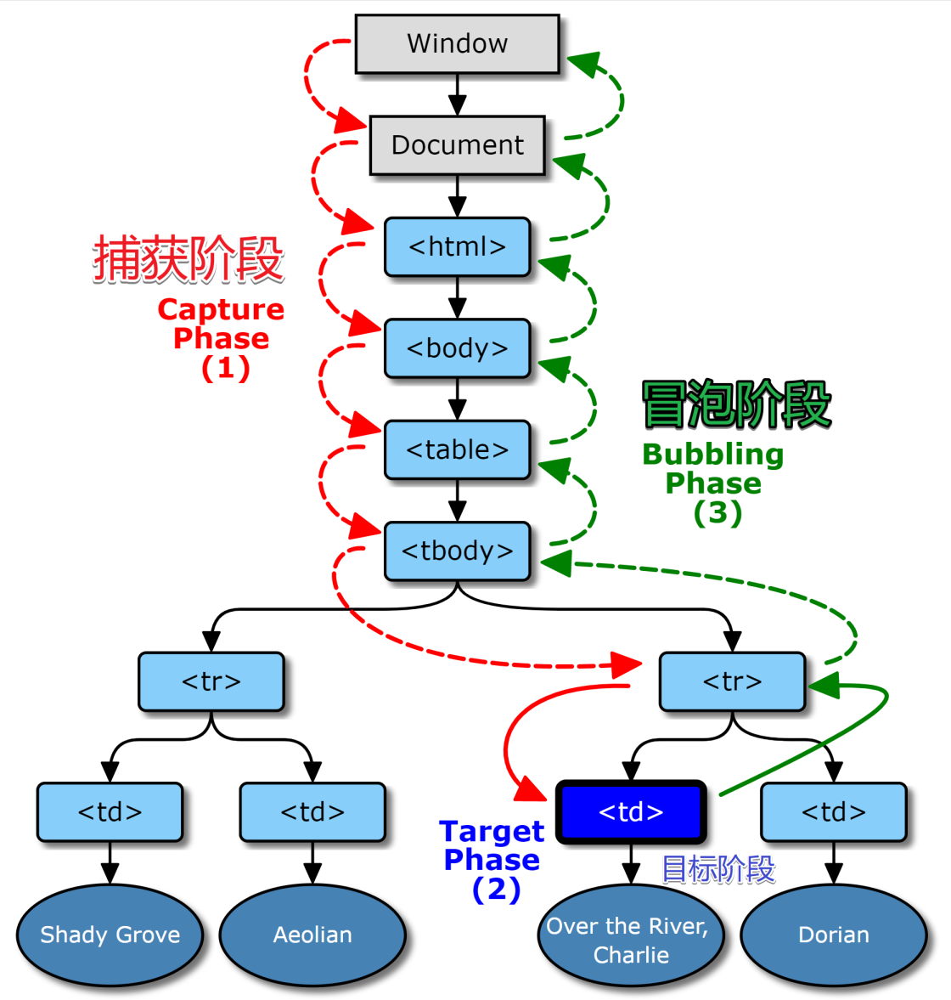
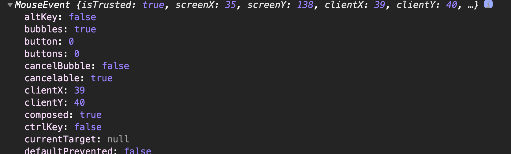
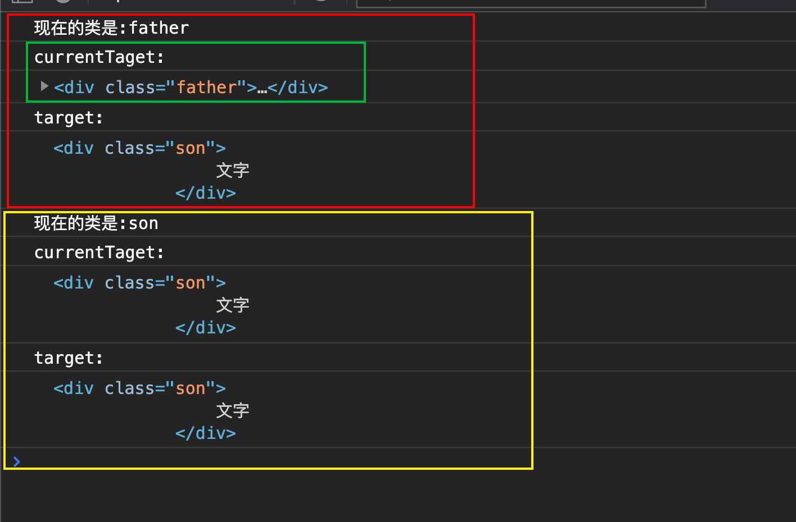

# 事件与事件委托

## 事件

什么是事件。比如说，我点击（click）了一个按钮，点击这个动作就是一个事件。

比较官方的解答如下：

> 事件是您在编程时系统内发生的动作或者发生的事情
>
> ——MDN

我们也可以列举一些常见的事件：

* 用户在某个元素上点击鼠标或悬停光标。
* 用户在键盘中按下某个按键。
* 用户调整浏览器的大小或者关闭浏览器窗口。
* 一个网页停止加载。
* 提交表单。
* 播放、暂停、关闭视频。
* 发生错误。

这个事件有可能是用户操作的，有可能不是用户操作的，总之就是系统内发生的某些事情或操作。

> [web中所有的事件——MDN](https://developer.mozilla.org/en-US/docs/Web/Events)

## 事件模型

简单来说，事件模型就是一个监听函数（listener）对事件作出反应。

### 引入

当然了，光监听了没有用，我们还得对事件作出反应。

那什么时候才作出反应呢？我们来看一个例子

```html
 <div class="grandf">
        <div class="father">
            <div class="son">
                点我
            </div>
        </div>
 </div>
```

如果我们给这三个`div`都加上监听事件（如果你不知道`addEventListener`的话，你可以先假装看懂了）

```js
let fn = function() {
    console.log(`现在的类是:${this.getAttribute('class')}`);
}

grandf.addEventListener.call(grandf ,'click', fn);
father.addEventListener('click', fn);
son.addEventListener('click', fn);
```

当我们点击页面中的`点我`的时候，我们的事件发生的顺序是怎样的呢？

结果：

```js
现在的类是:son
现在的类是:father
现在的类是:grandf
```

我们发现，运行的顺序是从里面到外运行的。

这个时候我们就可以下结论了，对没错，当你点击一个东西的时候，事件就是从最里面开始一直往外走的。

然而实际上并不是。

`addEventListener()`这个函数我们在调用的时候并没有给第三个值，这个值会影响运行的顺序。

```js
// 我们把第三个缺的参数加上
grandf.addEventListener.call(grandf ,'click', fn, true);
father.addEventListener('click', fn, true);
son.addEventListener('click', fn, true);
```

此时的结果是

```js
现在的类是:grandf
现在的类是:father
现在的类是:son
```

这样结果就直接反过来了。

而这样的原因就是因为调用顺序的问题。

### 调用顺序（事件流）

1. 捕获阶段
2. 目标阶段
3. 冒泡阶段




* 一个问题，既然他会从上往下走一次，再从上往下走一次，那么一个监听函数会不会被调用两次

  不会，因为我们在写监听函数的时候就已经规定了他会在哪一个阶段被调用。


下面我们进入正题

### 0级DOM的事件模型

可以直接在HTML中定义某些事件的监听代码

```html
<p onclick="dosomething()">test</p>
```

双引号里面的值一定要是合法的JS语句，所以如果是调用函数必须要有括号。

```js
let dosomething = function (){
    console.log('干点事吧hxd');
}
```

当你点击页面中的`test`文本时，控制台log出`干点事吧hxd`；

**`on-`属性的监听代码，只在冒泡阶段触发。**


>  像这种代码，我们不推荐使用，就和不推荐在HTML当中写样式一样。
>
> JS的逻辑和HTML混在一起了，不利于代码分工也不利于浏览器对其进行解析。


元素节点对象的事件属性，同样可以指定监听函数。

```html
<p>test</p>
```

```js
let p = document.querySelector('p');

p.onclick = () => {
    console.log('oh, god! 你终于来了');
}
```

这种方法的监听函数也只会在冒泡阶段触发。

并且使用这种方法有一个坏处，我们对于一个元素节点只能绑定一个事件，后绑定的事件会覆盖之前绑定的事件。


这就很难受了，所以我们进入新世界。

### 2级DOM的事件模型

**2级DOM的事件传播**

在2级DOM中，当事件发生在节点时，目标元素的事件处理函数就被触发，而且目标的每个祖先节点也有机会处理那个事件。因为2级DOM的事件传播分三个阶段进行。

**第一，在capturing阶段，**事件从Document对象沿着文档树向下传播给节点。如果目标的任何一个祖先专门注册了事件监听函数，那么在事件传播的过程中就会运行这些函数。

**下一个是目标阶段**，它发生在目标节点自身，直接注册在目标上的适合的事件监听函数将运行。

**第三阶段是bubbling阶段**，这个阶段事件将从目标元素向上传播回Document对象（与capturing相反的阶段）。虽然所有事件都受capturing阶段的支配，但并不是所有类型的事件都bubbling。（0级DOM事件模型处理没有capturing阶段）


**2级DOM的事件监听函数注册**

2级事件模型中，可以调用对象的`addEventListener()`方法为元素设置事件监听函数，也就是说通过2级DOM的这个API注册的函数才有可能在上述事件传播三个阶段中任意一个阶段捕捉到事件的发生（如果用0级DOM的2个方法赋值的事件监听函数不能在capturing阶段捕捉到事件）。


### 特殊情况

若对目标元素进行监听，函数执行的顺序与捕获或者冒泡阶段无关，只与代码书写顺序有关系

> 注：下面的html结构都是引入部分的html结构

```js
son.addEventListener.call(son ,'click', () => {
    console.log('我是冒泡');
}, false);

son.addEventListener.call(son ,'click', () => {
    console.log('我是捕获');
}, true);
// father在后面，但是问题不大，只有目标元素才和书写顺序有关系
father.addEventListener.call(father, 'click' , () => {
    console.log('我是爸爸冒泡');
}, false);

father.addEventListener.call(father, 'click' , () => {
    console.log('我是爸爸捕获');
}, true);
```

结果：

```js
我是爸爸捕获
我是儿子冒泡
我是儿子捕获
我是爸爸冒泡
```


### event对象

event对象随着时间的发生而自动的被创建。他会自动的传入操作函数（监听函数的回调函数里面）中当做第一个参数。

```js
son.addEventListener.call(son, 'click', function() {
    console.log(arguments[0]);
    // 或者
    consoloe.log(event);
    // 就很离谱，我明明没有说谁是event, 但是你只要用什么x, z这种没有意义的名字就会说这个变量没定义
})
```

结果：



但是我们要注意一个情况，当我们使用箭头函数的时候，就必须显式的吧`event对象`给写出来。因为箭头函数是没有`arguments`的，因此我们这么写

```js
son.addEventListener.call(son, 'click', (event) => {

    console.log(event);
    // 下面这种写法会报错
    // console.log(e); Uncaught ReferenceError: e is not defined
})
```

还是建议用第二种。简单的明了

### target和currentTarget

`target`表示目标元素

`currentTarget`表示当前正在执行的元素

```js
let fn = function(event) {
    console.log(`现在的类是:${this.getAttribute('class')}`);
    console.log(`currentTaget:`);
    console.log(event.currentTarget);
    console.log(`target:`);
    console.log(event.target);
}

son.addEventListener.call(son, 'click', fn, true);
father.addEventListener.call(father, 'click', fn, true);
```

结果：




### 取消冒泡

我们可以使用`event.stopPropagation()`来取消冒泡。

```js
let fn = function (event) {
    console.log('我还没有被取消!');
}

grandf.addEventListener.call(grandf, 'click', fn);
father.addEventListener.call(father, 'click', (event) =>{
    console.log('你好, 停止你的冒泡行为!');
    event.stopPropagation();
}); // 这里取消冒泡了， 因此granf将不会被监听
son.addEventListener.call(son, 'click', fn);
```

结果：

```js
我还没有被取消!
你好, 停止你的冒泡行为!
```


### 自定义事件

```js
son.addEventListener('click', () => {
    // 创建了一个自定义事件
    const event = new CustomEvent(
        'cat',
        {detail: {name: 'meakle', age:22,}}
    )

    son.dispatchEvent(event);
})

// 监听这个自定义事件。
son.addEventListener('cat', (event) => {
    console.log('cat');
    console.log(even
                t);
})
```


## 事件委托

捕获和冒泡允许我们实现一种被称为 **事件委托** 的强大的事件处理模式。

这个想法是，如果我们有许多以类似方式处理的元素，那么就不必为每个元素分配一个处理程序 —— 而是将单个处理程序放在它们的共同祖先上。


### 场景1

当需要监听很多的元素的时候。

```html
<ul id="ul1">
    <li>1</li>
    <li>2</li>
    <li>3</li>
    <li>4</li>
</ul>

<ul id="ul2">
    <li>1</li>
    <li>2</li>
    <li>3</li>
</ul>
```

当我们要监听单个的`list`的时候，如果我们为每一个`list`都设置一个监听，那么会很费内存，因为每一个监听器都需要重新开辟一个内存空间，这个时候我们就可以通过事件委托来做。

方法就是在`li`标签的父元素上设置监听，这样，当你点击其中的某一个`li`的时候，由于捕获冒泡的存在，我们去到目标元素（`event.target`）的时候，需要从dom树的最上层一路向下走（冒泡的时候就是一路向上走），这个时候当你经过了`li`的父元素时。处理程序就是启动，并且我们可以通过`event.target`来得到当前的目标元素到底是哪一个，这个时候我们就可以对目标元素进行操作了。

### 场景2

当需要监听目前不存在的元素的时候

```html
<div id="div1"></div>

<script>
    let div1 = document.querySelector('#div1');
	
    // 在一秒之后,button才会被创建出来
    setTimeout(() => {
        div1.appendChild(document.createElement('button')).innerText = `text`;
    }, 1000)
    
    // 设置事件委托，监听祖元素，找到了之后进行某些操作
    div1.addEventListener.call(div1, 'click', (event)=>{
        let btn = event.target;
        if(btn.tagName.toLowerCase() === 'button'){
            console.log(1);
        }
        
    });
</script>
```


