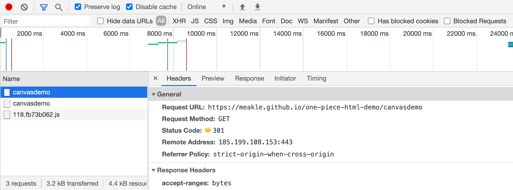

# http状态码

- 100~199 **消息**
- 200-299 **成功**
- 300 -399 **重定向**
- 400-499 **客户端出错**
- 500-599 **服务器出错**

## 消息

`100 Continue`

​	这个临时响应表明，迄今为止的所有内容都是可行的，客户端应该继续请求，如果已经完成，则忽略它。

`101 Switching Protocol`
	该代码是响应客户端的 Upgrade 标头发送的，并且指示服务器也正在切换的协议。

## 成功响应

`200 ok`

​	 请求成功。

`201 created`

​	 该请求已成功，并因此创建了一个新的资源。

## 重定向

URL 重定向，也称为 URL 转发，是一种当实际资源，如单个页面、表单或者整个 Web 应用被迁移到新的 URL 下的时候，保持（原有）链接可用的技术。HTTP 协议提供了一种特殊形式的响应—— HTTP 重定向（HTTP redirects）来执行此类操作。

> 举个例子，就是github的github pages。github提供给我们的域名是`https://username.github.io/`，你可以重定向到自己的域名下。比如我这里
>
> 
>
> 后面重定向到了我的域名下

`301 Moved Permanently`

​	被请求的资源已永久移动到新位置，并且将来任何对此资源的引用都应该使用本响应返回的若干个 URI 之一。

## 客户端响应

`400 Bad Request`

	1. 语义有误，当前请求无法被服务器理解。除非进行修改，否则客户端不应该重复提交这个请求。
 	2. 请求参数有误。

`401 Unauthorized`

​	当前请求需要用户验证。

`403 Forbidden`

​	服务器已经理解请求，但是拒绝执行它。与 401 响应不同的是，身份验证并不能提供任何帮助，而且这个请求也不应该被重复提交。

`404 Not Found`

​	请求失败，请求所希望得到的资源未被在服务器上发现。

`408 Request Timeout`

​	请求超时。客户端没有在服务器预备等待的时间内完成一个请求的发送。

## 服务端响应

`500 Internal Server Error`

​	服务器遇到了不知道如何处理的情况。

