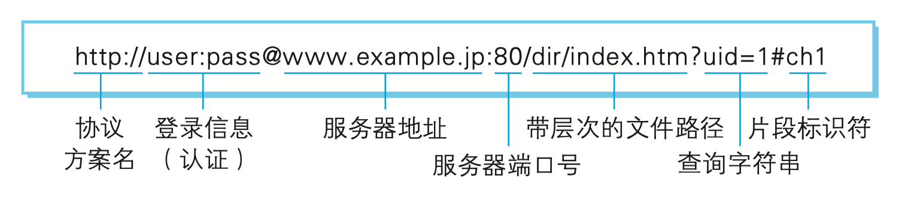

# 跨域

## 什么是同源

如果说两个URL的协议（protocol），端口号（port），主机（host）都是相同的，那么这两个URL就是同源的。

> 图片出自图解http

## 什么是跨域

当两个URL并不是同源的时候，我们如果想让两个URL之间进行通信就需要使用跨域。

有两种比较常用的跨域方法。

### JSONP 跨域

这种方法兼容性好。

如何做？

1. 在html页面中添加一个`<script>`标签。
2. 这个标签向服务器请求一个脚本，格式为`${url}?callback=${random}`
3. 服务器接收到请求之后，就会把JSON数据放到函数名里面去
4. 此时只要定义了回调函数，我们就可能在函数体内获取JSON数据 

### CORS 跨域

CORS 是一个 W3C 标准，全称是“跨域资源共享”（Cross-origin resource sharing）。它允许浏览器向跨域的服务器，发出`XMLHttpRequest`请求，从而克服了 AJAX 只能同源使用的限制。

如何做？

客户端正常请求，在服务端的设置一个请求头`response.setHeader('Access-Control-Allow-Origin', 'url');`。

