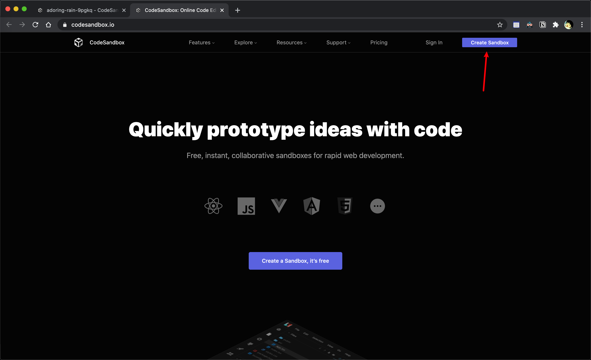
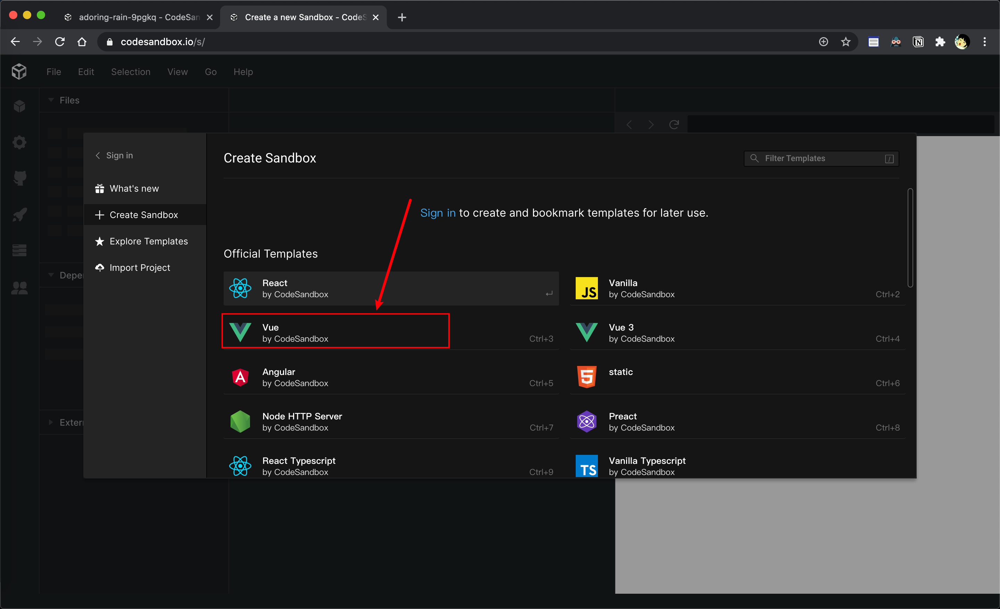
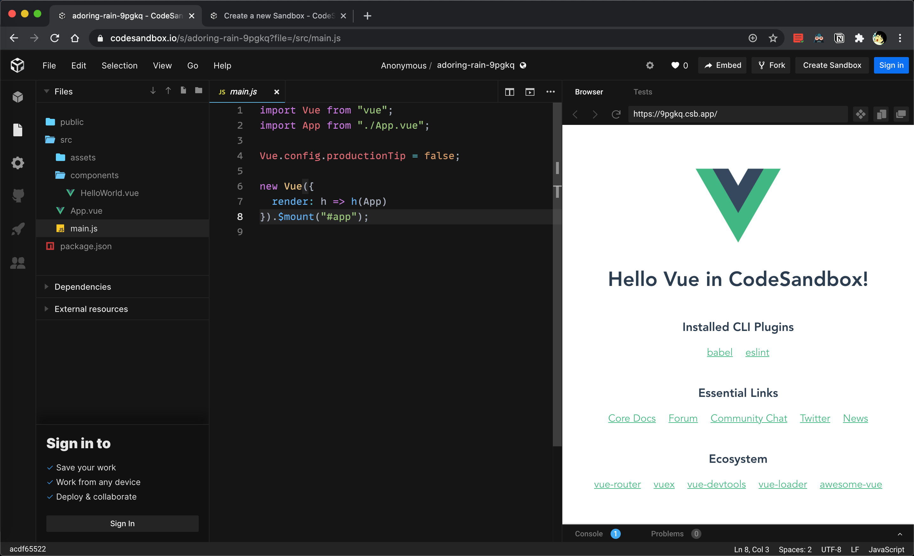

# vue

## vue中的两个版本

vue分为两个版本，完整版和非完整版（只含运行时版）。


两个版本之间的区别是是否含有编译器。运行时版本相比完整版体积要小大约 30%。

| 完整版 | 非完整版（运行时版本） |
| ------ | :--------------------: |
| vue.js |     vue.runtime.js     |


如果我们使用完整版，那么我们就可以实现用`template`来写内容，这样在打完包之后，当客户端运行时，客户端会编译我们的代码，将`template`内的字符串变成`html`里面的内容。

```js
// 需要编译器
new Vue({
  template: '<div>{{ hi }}</div>'
})
```


如果我们使用非完整版（运行时版本），那么在我们使用webpack打包的时候，vue-loader会将`.vue`文件内部的模板编译成为JavaScript。因此最终打包出来的结果我们可以直接使用。

```js
// 不需要编译器
new Vue({
  render (h) {
    return h('div', this.hi) // 用h来创建标签
  }
})
```


## codesandbox.io

进入codesendbox的网站，点击创建。



选择创建vue



开始你的表演




